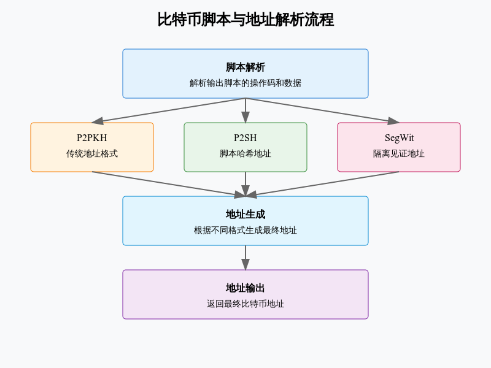

# script2addr 

## 比特币脚本与地址系统分析

### 核心数据结构
#### 1.1 脚本模板定义
```python
# P2PKH 脚本模板
SCRIPTPUBKEY_TEMPLATE_P2PKH = [
    OpCodes.OP_DUP,
    OpCodes.OP_HASH160,
    OPPushDataGeneric(lambda x: x == 20),
    OpCodes.OP_EQUALVERIFY,
    OpCodes.OP_CHECKSIG,
]

# P2SH 脚本模板
SCRIPTPUBKEY_TEMPLATE_P2SH = [
    OpCodes.OP_HASH160,
    OPPushDataGeneric(lambda x: x == 20),
    OpCodes.OP_EQUAL,
]
```
#### 1.2 辅助类
```python
class OPPushDataGeneric:
    """数据推送操作码处理"""
    def check_data_len(self, datalen: int) -> bool:
        return OpCodes.OP_PUSHDATA4 >= datalen >= 0
```
### 2. 主要处理流程
#### 2.1 脚本解析
```python
def script_GetOp(_bytes: bytes):
    """解析脚本操作码和数据"""
    while i < len(_bytes):
        opcode = _bytes[i]
        if opcode <= OpCodes.OP_PUSHDATA4:
            # 处理数据推送操作码
            nSize = _get_push_data_size(opcode, _bytes, i)
            vch = _bytes[i:i + nSize]
```
#### 2.2 地址生成
```python
def hash160_to_b58_address(h160: bytes, addrtype: int) -> str:
    """生成Base58格式地址"""
    s = bytes([addrtype]) + h160
    s = s + sha256d(s)[0:4]  # 添加校验和
    return base_encode(s, base=58)
```
#### 2.3 地址导出
```python
def get_address_from_output_script(_bytes: bytes) -> Optional[str]:
    """从输出脚本提取地址"""
    # 解析脚本
    decoded = [x for x in script_GetOp(_bytes)]
    
    # 匹配不同类型的脚本模板
    if match_script_against_template(decoded, SCRIPTPUBKEY_TEMPLATE_P2PKH):
        return hash160_to_p2pkh(decoded[2][1])
```
### 3. 地址类型支持
#### 3.1 传统地址 (P2PKH)
- Base58编码
- 以1开头
- 20字节公钥哈希
#### 3.2 脚本哈希地址 (P2SH)
- Base58编码
- 以3开头
- 20字节脚本哈希
#### 3.3 隔离见证地址
- Bech32编码
- 以bc1开头
- 支持v0-v16版本
### 4.安全性考虑
#### 4.1 数据验证
```python
def assert_bytes(*args):
    """确保输入为字节类型"""
    for x in args:
        assert isinstance(x, (bytes, bytearray))
```
#### 4.2 错误处理
```python
try:
    decoded = [x for x in script_GetOp(_bytes)]
except MalformedBitcoinScript:
    return None
```
### 5. 使用建议
1. 脚本解析：


 - 验证输入数据
 - 处理特殊操作码
 - 注意数据长度


2. 地址：


 - 选择正确的网络类型
 - 悼念
 - 使用政策编码


3. 错误答案：


验证码格式
处理解析错误
返回正确的错误信息