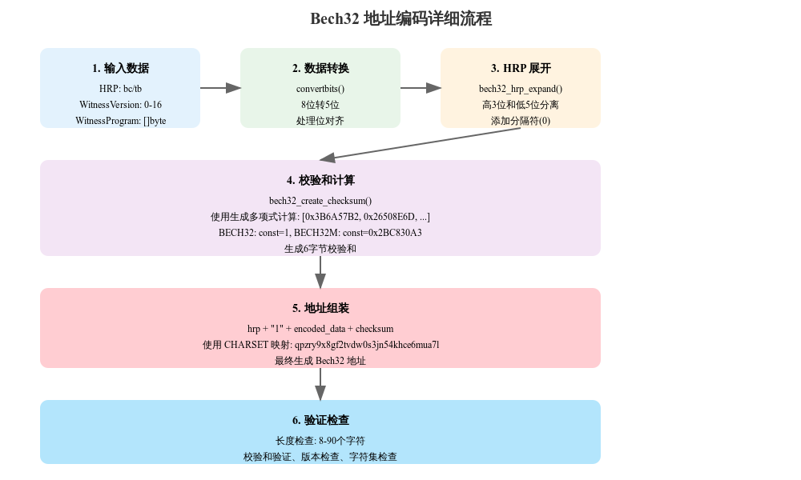

# segwit_addr.md


## Bech32 地址编码解

### 一、整体流程说明
Bech32编码过程包含6个主要步骤：

#### 1. 数据已订正
- HRP（人类可读部分）：通常是“bc”或“tb”
- 见证版本号（见证版本）：0-16
- 见证程序（Witness Program）：字节存储
#### 2. 数据转换
```python
# 8位到5位的转换
converted_data = convertbits(witness_program, 8, 5, pad=True)
```
#### 3. HRP展开处理
```python
# 展开 HRP 用于校验和计算
expanded_hrp = bech32_hrp_expand(hrp)  # 例如："bc" -> [3, 3, 0, 2, 3]
```
#### 4. 校验和计算
```python
# 根据编码类型选择常量
const = BECH32M_CONST if spec == Encoding.BECH32M else 1
checksum = bech32_create_checksum(hrp, data, spec)
```
#### 5. 地址组装
```python
# 组合所有部分形成最终地址
final_address = hrp + "1" + encode_to_charset(data + checksum)
```

#### 6. 验证检查
```python
# 进行多项验证
if not is_valid_length(address) or not is_valid_charset(address):
    return None
```
### 二、关键函数解析
#### 1. convertbits 函数
```python
def convertbits(data, frombits, tobits, pad=True):
    """位数转换函数"""
    acc = 0  # 累加器
    bits = 0  # 当前位数
    ret = []  # 结果数组
    maxv = (1 << tobits) - 1  # 最大值掩码
    
    for value in data:
        # 累积位
        acc = (acc << frombits) | value
        bits += frombits
        # 提取完整的组
        while bits >= tobits:
            bits -= tobits
            ret.append((acc >> bits) & maxv)
    return ret
```
#### 2. 校验和计算
```python
def bech32_create_checksum(hrp, data, spec):
    """计算校验和"""
    values = bech32_hrp_expand(hrp) + data
    const = BECH32M_CONST if spec == Encoding.BECH32M else 1
    polymod = bech32_polymod(values + [0,0,0,0,0,0]) ^ const
    return [(polymod >> 5 * (5 - i)) & 31 for i in range(6)]
```
### 三、注意事项
1. 版本兼容性

- Version 0: 使用 BECH32
- Version 1+: 使用 BECH32M

2. 数据长度限制
```python
if len(decoded) < 2 or len(decoded) > 40:
    return None  # 无效长度
```
3. 字符集验证
```python
if not all(x in CHARSET for x in data):
    return None  # 无效字符
```
4. 校验和验证
```python
if bech32_verify_checksum(hrp, data) is None:
    return None  # 校验和错误
```

### 四、使用示例

1. 编码示例
```python
# 创建一个 SegWit 地址
def create_p2wpkh_address(pubkey_hash):
    """创建 P2WPKH 地址"""
    return encode(
        hrp="bc",           # 主网
        witver=0,           # SegWit v0
        witprog=pubkey_hash # 20字节的公钥哈希
    )
```
2. 解码示例

```python 
# 解析一个 Bech32 地址
def parse_segwit_address(address):
    """解析 SegWit 地址"""
    witver, witprog = decode("bc", address)
    if witver is not None:
        return {
            "version": witver,
            "program": witprog
        }
    return None
```