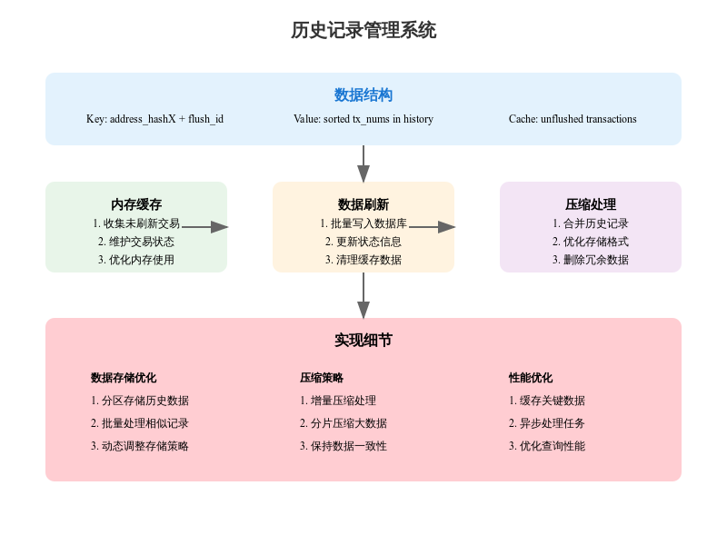

# history
## ElectrumX 历史记录管理系统分析


### 1. 核心数据结构
#### 1.1 基础存储格式 
```python
class History:
    def __init__(self):
        # 未刷新的交易记录缓存
        self.unflushed = defaultdict(bytearray)
        self.unflushed_count = 0
        # 刷新计数器
        self.flush_count = 0
        # 压缩相关状态
        self.comp_flush_count = -1
        self.comp_cursor = -1
```
#### 1.2 关键常量定义
```python
TXNUM_LEN = 5      # 交易号长度
FLUSHID_LEN = 2    # 刷新ID长度
``` 
### 2. 主要功能实现

#### 2.1 添加历史记录
```python
def add_unflushed(self, hashXs_by_tx, first_tx_num):
    """添加未刷新的交易到缓存"""
    unflushed = self.unflushed
    count = 0
    for tx_num, hashXs in enumerate(hashXs_by_tx, start=first_tx_num):
        tx_numb = pack_le_uint64(tx_num)[:TXNUM_LEN]
        hashXs = set(hashXs)
        for hashX in hashXs:
            unflushed[hashX] += tx_numb
        count += len(hashXs)
    self.unflushed_count += count
```

#### 2.2 刷新操作
```python
def flush(self):
    """将缓存中的记录写入数据库"""
    self.flush_count += 1
    flush_id = pack_be_uint32(self.flush_count)
    unflushed = self.unflushed

    with self.db.write_batch() as batch:
        for hashX in sorted(unflushed):
            key = hashX + flush_id
            batch.put(key, bytes(unflushed[hashX]))
        self.write_state(batch)
```

#### 2.3 历史记录压缩
```python 
def _compact_hashX(self, hashX, hist_map, hist_list, write_items, keys_to_delete):
    """压缩单个地址的历史记录"""
    # 计算最大行大小
    max_row_size = self.max_hist_row_entries * TXNUM_LEN
    full_hist = b''.join(hist_list)
    nrows = (len(full_hist) + max_row_size - 1) // max_row_size

    # 处理大规模历史记录
    if nrows > 4:
        self.logger.info(f'hashX {hash_to_hex_str(hashX)} is large: '
                        f'{len(full_hist)//TXNUM_LEN:,d} entries')
```
### 3. 关键工具函数
#### 3.1 状态管理
```python
def write_state(self, batch):
    """写入状态信息到数据库"""
    state = {
        'flush_count': self.flush_count,
        'comp_flush_count': self.comp_flush_count,
        'comp_cursor': self.comp_cursor,
        'db_version': self.db_version,
        'upgrade_cursor': self.upgrade_cursor,
    }
    batch.put(b'state\0\0', repr(state).encode())
```
#### 3.2 查询功能
```python 
def get_txnums(self, hashX, limit=1000):
    """获取地址的交易历史"""
    limit = util.resolve_limit(limit)
    chunks = util.chunks
    txnum_padding = bytes(8 - TXNUM_LEN)
    
    for _key, hist in self.db.iterator(prefix=hashX):
        for tx_numb in chunks(hist, TXNUM_LEN):
            if limit == 0:
                return
            tx_num, = unpack_le_uint64(tx_numb + txnum_padding)
            yield tx_num
            limit -= 1

```

### 4. 优化策略

1. 内存管理

- 使用缓存减少磁盘IO
- 批量处理提高性能
- 合理控制缓存大小

2. 压缩优化

- 分片处理大量数据
- 增量式压缩
- 保持数据一致性

3. 性能考虑

```python
def unflushed_memsize(self):
    """估算未刷新数据的内存占用"""
    return len(self.unflushed) * 180 + self.unflushed_count * TXNUM_LEN
```
### 5. 注意事项

1. 数据完整性

- 保证刷新操作的原子性
- 维护正确的状态信息
- 处理异常情况


2. 版本兼容性

- 支持数据库版本升级
- 保持向后兼容性
- 平滑升级过程


3. 资源管理

- 控制内存使用
- 优化磁盘IO
- 合理调度压缩任务


