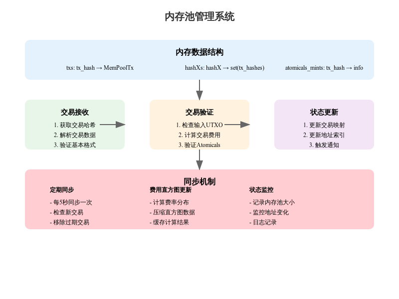

# mempool

## MemPool 内存池实现分析
### 1. 核心数据结构
#### 1.1 基础存储
```python
class MemPool:
    def __init__(self, coin, api):
        self.txs = {}                     # 交易映射
        self.atomicals_mints = {}         # Atomicals铸造记录
        self.hashXs = defaultdict(set)    # 地址索引
        self.cached_compact_histogram = [] # 费用直方图缓存
```
#### 1.2 交易记录结构
```python 
@attr.s(slots=True)
class MemPoolTx:
    prevouts = attr.ib()    # 输入UTXO
    in_pairs = attr.ib()    # 输入对(hashX, value)
    out_pairs = attr.ib()   # 输出对(hashX, value)
    fee = attr.ib()        # 交易费用
    size = attr.ib()       # 交易大小
```
### 2. 主要功能实现
#### 2.1 交易处理
```python
async def _process_mempool(self, all_hashes, touched, mempool_height):
    """处理内存池交易"""
    # 处理消失的交易
    for tx_hash in set(self.txs) - all_hashes:
        self._remove_tx(tx_hash, touched)
    
    # 处理新交易
    new_hashes = list(all_hashes.difference(self.txs))
    if new_hashes:
        await self._fetch_and_accept(new_hashes, all_hashes, touched)
```
#### 2.2 交易验证和接收
```python 
def _accept_transactions(self, tx_map, utxo_map, touched):
    """验证并接受交易"""
    for hash, tx in tx_map.items():
        try:
            # 验证输入
            for prevout in tx.prevouts:
                self._verify_input(prevout, utxo_map)
            
            # 计算费用
            tx.fee = self._calculate_fee(tx)
            
            # 更新状态
            self._update_indexes(tx, hash, touched)
            
        except KeyError:
            continue
```
#### 2.3 直方图维护
```python
def _update_histogram(self, bin_size):
    """更新费用直方图"""
    histogram = defaultdict(int)
    for tx in self.txs.values():
        fee_rate = tx.fee / tx.size
        fee_rate = math.floor(10 * fee_rate) / 10
        histogram[fee_rate] += tx.size
```
### 3. 同步机制
#### 3.1 定期同步
```python
async def _refresh_hashes(self, synchronized_event):
    """同步内存池状态"""
    while True:
        # 获取最新状态
        hex_hashes = await self.api.mempool_hashes()
        height = self.api.cached_height()
        
        # 处理更新
        async with self.lock:
            await self._process_mempool(hashes, touched, height)
            
        # 触发通知
        await self.api.on_mempool(touched, height)
        await sleep(self.refresh_secs)
```
#### 3.2 状态监控
```python
async def _logging(self, synchronized_event):
    """记录内存池状态"""
    while True:
        mempool_size = sum(tx.size for tx in self.txs.values())
        self.logger.info(f"{len(self.txs):,d} txs {mempool_size/1_000_000:.2f} MB")
        await sleep(self.log_status_secs)
```
### 4. 优化策略

1. 性能优化

- 使用异步操作
- 批量处理交易
- 缓存计算结果


2. 内存管理

- 及时清理过期数据
- 高效的数据结构
- 限制缓存大小


3. 同步策略

- 定期同步更新
- 增量式更新
- 原子性操作

### 5. 关键特性
1. Atomicals支持
```python 
def _accept_atomicals_updates(self, atomicals_map):
    """处理Atomicals更新"""
    for atomical_id, datafields in atomicals_map.items():
        tx_hash = atomical_id[:32]
        self.atomicals_mints[tx_hash][atomical_id] = datafields
```
2. 费用直方图
```python
async def compact_fee_histogram(self):
    """获取压缩的费用直方图"""
    return self.cached_compact_histogram
```