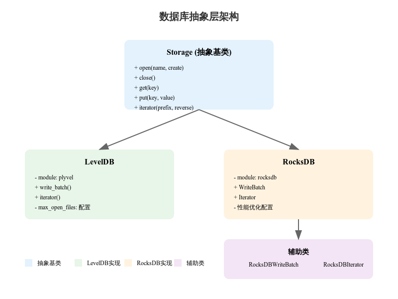

# storage

## 数据库抽象层设计分析

### 1. 架构概述
#### 1.1 基础抽象类
```python
class Storage:
    """数据库后端抽象基类"""
    def __init__(self, name, for_sync):
        self.is_new = not os.path.exists(name)
        self.for_sync = for_sync or self.is_new
        self.open(name, create=self.is_new)
```
#### 1.2 关键接口
```python
class Storage:
    @classmethod
    def import_module(cls):
        """导入数据库引擎模块"""
        raise NotImplementedError

    def write_batch(self):
        """批量写入操作的上下文管理器"""
        raise NotImplementedError
        
    def iterator(self, prefix=b'', reverse=False):
        """返回键值对迭代器"""
        raise NotImplementedError
```
### 2. 具体实现
#### 2.1 LevelDB 实现
```python
class LevelDB(Storage):
    """LevelDB引擎实现"""
    @classmethod
    def import_module(cls):
        import plyvel
        cls.module = plyvel
        
    def open(self, name, create):
        mof = 512 if self.for_sync else 128
        self.db = self.module.DB(name, 
            create_if_missing=create,
            max_open_files=mof)
```
#### 2.2 RocksDB 实现
```python

class RocksDB(Storage):
    """RocksDB引擎实现"""
    def open(self, name, create):
        options = self.module.Options(
            create_if_missing=create,
            use_fsync=True,
            target_file_size_base=33554432,
            max_open_files=mof
        )
        self.db = self.module.DB(name, options)
```

### 3. 辅助类实现
#### 3.1 批量写入
```python
class RocksDBWriteBatch:
    """RocksDB批量写入实现"""
    def __init__(self, db):
        self.batch = RocksDB.module.WriteBatch()
        self.db = db
        
    def __enter__(self):
        return self.batch
        
    def __exit__(self, exc_type, exc_val, exc_tb):
        if not exc_val:
            self.db.write(self.batch)
```
#### 3.2 迭代器
```python
class RocksDBIterator:
    """RocksDB迭代器实现"""
    def __init__(self, db, prefix, reverse):
        self.prefix = prefix
        if reverse:
            self.iterator = reversed(db.iteritems())
        else:
            self.iterator = db.iteritems()
            self.iterator.seek(prefix)
```
### 4. 设计特点

1. 抽象隔离

- 通过抽象基类定义统一接口
- 隐藏具体实现细节
- 支持多种数据库后端


2. 性能优化

- 批量写入支持
- 可配置的文件打开数
- 定制化的迭代器实现


3. 易扩展性

- 支持添加新的数据库实现
- 标准化的接口约定
- 模块化的设计

### 5. 使用示例
```python
# 获取数据库实现
db_class = db_class('leveldb')  # 或 'rocksdb'

# 创建实例
db = db_class('dbname', for_sync=True)

# 基本操作
db.put(b'key', b'value')
value = db.get(b'key')

# 批量写入
with db.write_batch() as batch:
    batch.put(b'key1', b'value1')
    batch.put(b'key2', b'value2')

# 迭代操作
for key, value in db.iterator(prefix=b'prefix'):
    print(key, value)
```

### 6. 注意事项

1. 资源管理

- 正确关闭数据库连接
- 合理配置打开文件数
- 使用上下文管理器


2. 错误处理

- 检查文件存在性
- 处理导入异常
- 批量操作回滚


3. 性能考虑

- 使用批量操作
- 合理配置参数
- 优化迭代方式