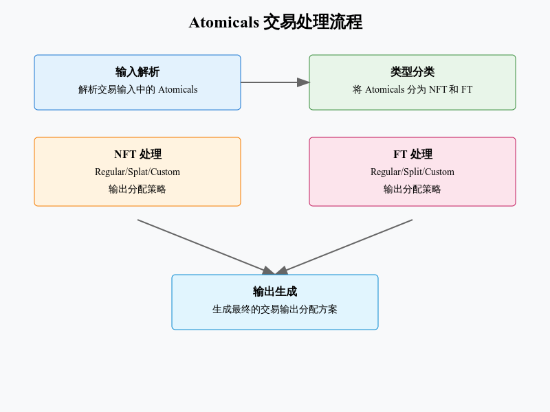

# Atomicals Blueprint Builder 



## 概述
Atomicals Blueprint Builder是一个用于构建和管理Atomicals转账蓝图的核心组件。它主要负责处理NFT和FT(同质化代币)的转账逻辑,包括输出着色、代币分配等功能。

## 主要类


### 1. AtomicalsTransferBlueprintBuilder
    这是整个模块的主类,负责构建转账蓝图。

主要属性:

- logger: 日志记录器

- atomicals_spent_at_inputs: 在输入中花费的atomicals

- atomicals_spent_at_outputs: 在输出中花费的atomicals

- atomicals_spent_at_inputs_and_outputs: 在输入和输出中花费的atomicals

- atomicals_spent_at_inputs_and_outputs_map: 在输入和输出中花费的atomicals的映射

- atomicals_spent_at_inputs_and_outputs_map: 在输入和输出中花费的atomicals的映射

- operations_found_at_inputs: 在输入中发现的操作

- operations_found_at_outputs: 在输出中发现的操作

- operations_found_at_inputs_and_outputs: 在输入和输出中发现的操作

- operations_found_at_inputs_and_outputs_map: 在输入和输出中发现的操作的映射

- operations_found_at_inputs_and_outputs_map: 在输入和输出中发现的操作的映射

- tx_hash: 交易哈希

- tx: 交易对象

- ft_atomicals: 同质化代币信息

### 2. FtColoringSummary 

用于汇总FT着色信息的类。

属性:

- atomical_id_to_expected_outs_map: atomical ID到预期输出的映射

- cleanly_assigned: 是否完全分配

- fts_burned: 被销毁的FTs

- atomicals_list: atomicals列表

### 3. AtomicalInputSummary

用于汇总输入信息的类。

属性:

- atomical_id: atomical ID

- type: atomical类型(NFT/FT) 

- sat_value: sat值

- input_indexes: 输入索引

- mint_info: 铸造信息

- mint_info_map: 铸造信息映射   

## 主要方法


### 1. calculate_output_blueprint

```python
@classmethod
def calculate_output_blueprint(cls, get_atomicals_id_mint_info, tx, nft_atomicals, 
                            ft_atomicals, atomicals_spent_at_inputs,
                            operations_found_at_inputs, sort_fifo, 
                            is_custom_coloring_activated)
```

这是最核心的方法,用于计算输出蓝图。主要功能:
- 分别计算NFT和FT的输出蓝图
- 处理自定义着色逻辑
- 返回NFT和FT的输出分配方案


### 2. color_ft_atomicals_regular

```python
@classmethod
def color_ft_atomicals_regular(cls, ft_atomicals, tx, sort_fifo, 
                             is_custom_coloring_activated)
```
处理常规FT代币的着色逻辑:
- 按FIFO或其他顺序对FT进行排序
- 计算每个输出的着色方案
- 处理代币燃烧情况
### 3. calculate_nft_atomicals_splat

```python
@classmethod 
def calculate_nft_atomicals_splat(cls, nft_atomicals, tx)
```

处理NFT的splat(分散)操作:
- 将NFT分散到不同输出   
- 确保每个输出最多只有一个NFT
- 处理不足输出的情况
## 使用示例

```python
# 创建blueprint builder
builder = AtomicalsTransferBlueprintBuilder(
    logger,
    atomicals_spent_at_inputs,
    operations_found_at_inputs, 
    tx_hash,
    tx,
    get_atomicals_id_mint_info,
    sort_fifo=True,
    is_custom_coloring_activated=False
)

# 获取输出蓝图
nft_blueprint = builder.get_nft_output_blueprint()
ft_blueprint = builder.get_ft_output_blueprint()

# 检查代币是否被销毁
are_fts_burned = builder.get_are_fts_burned()
```
## 关键概念
### 1. 着色(Coloring)
着色是指将特定的atomical分配给特定的输出。有两种着色模式:

- 常规着色: 按照FIFO或其他顺序对FT进行排序,并计算每个输出的着色方案。
- 自定义着色: 根据特定的逻辑(如特定地址的FT)进行着色。

### 2. 蓝图(Blueprint)
蓝图是指输出蓝图和输入蓝图。输出蓝图是指每个输出分配的atomical信息,输入蓝图是指每个输入花费的atomical信息。

### 3. 燃烧(Burning)
燃烧是指将FT销毁的过程。在蓝图中,燃烧的FT会被标记为已销毁。


### 4. FIFO排序
FIFO排序是指按照FIFO顺序对FT进行排序。

- 按输入顺序处理

- 确保公平分配

- 可预测的结果

### 5. Splat操作
Splat操作是指将NFT分散到不同输出。

- 将NFT分散到不同输出

- 确保每个输出最多只有一个NFT

- 处理不足输出的情况

## 错误处理
主要的错误类型:
- AtomicalsTransferBlueprintBuilderError

- AtomicalsValidationError

- AtomicalsBlueprintBuilderError


## 总结
- 提供了完整的atomicals转账方案

- 支持常规着色和自定义着色

- 支持FIFO排序和Splat操作

- 支持错误处理和日志记录


# 类
## `FtColoringSummary` 类定义了一个对象，用于总结与 "Ft Coloring" 相关的元数据和状态

    ```
    class FtColoringSummary(IterableReprMixin):
    def __init__(
        self,
        atomical_id_to_expected_outs_map,
        fts_burned,
        cleanly_assigned,
        atomicals_list,
    ):
        self.atomical_id_to_expected_outs_map = atomical_id_to_expected_outs_map
        self.cleanly_assigned = cleanly_assigned
        self.fts_burned = fts_burned
        self.atomicals_list = atomicals_list

    def __iter__(self):
        yield "atomical_id_to_expected_outs_map", self.atomical_id_to_expected_outs_map
        yield "cleanly_assigned", self.cleanly_assigned
        yield "fts_burned", self.fts_burned
        yield "atomicals_list", self.atomicals_list

    ```

## 类结构与功能

### 1. **继承**
- **`IterableReprMixin`**:
  - 通过继承 `IterableReprMixin`，`FtColoringSummary` 具备了可迭代的能力。
  - 此功能主要便于在调试或输出时，直接将对象的内容表示为字典或其他可读形式。

---

### 2. **初始化方法**

#### **`__init__`**
- **功能**:
  - 初始化对象并设置关键属性。
- **参数**:
  - `atomical_id_to_expected_outs_map`:
    - 一个映射，可能用于存储原子化 ID（`atomical_id`）与预期输出的对应关系。
  - `fts_burned`:
    - 表示燃烧（销毁）的 FTS（可能是某种代币或资源）。
  - `cleanly_assigned`:
    - 布尔值或类似的标志，用于指示是否完成了某种清晰的分配过程。
  - `atomicals_list`:
    - 一个列表，可能包含与原子化相关的对象或 ID。

---

### 3. **迭代方法**

#### **`__iter__`**
- **功能**:
  - 实现迭代协议，使得对象可以直接被迭代，输出键值对。
- **实现**:
  - 通过 `yield` 逐一返回对象的属性及其对应值：
    - `"atomical_id_to_expected_outs_map"`: 映射关系。
    - `"cleanly_assigned"`: 清晰分配标志。
    - `"fts_burned"`: 燃烧的 FTS 数量。
    - `"atomicals_list"`: 原子化列表。
- **用途**:
  - 使对象可以被直接转化为字典或其他迭代形式（如 `dict(FtColoringSummary(...))`）。

---

## `ExpectedOutputSet` 类和相关函数用于处理基于区块链的 "FT (Fungible Tokens)" 的着色逻辑。
    ```

class ExpectedOutputSet(IterableReprMixin):
    """Store the expected output indexes to be colored and the exponent for the outputs to apply"""

    def __init__(self, expected_outputs, expected_values):
        self.expected_outputs = expected_outputs
        self.expected_values = expected_values

    def __iter__(self):
        yield "expected_outputs", self.expected_outputs
        yield "expected_values", self.expected_values


def build_reverse_output_to_atomical_id_exponent_map(atomical_id_to_output_index_map):
    if not atomical_id_to_output_index_map:
        return {}
    reverse_mapped = {}
    for atomical_id, output_info in atomical_id_to_output_index_map.items():
        for out_idx in output_info.expected_outputs:
            reverse_mapped[out_idx] = reverse_mapped.get(out_idx) or {}
            reverse_mapped[out_idx][atomical_id] = output_info.expected_values
    return reverse_mapped


def calculate_outputs_to_color_for_ft_atomical_ids(
    tx, ft_atomicals, sort_by_fifo, is_custom_coloring_activated
) -> Optional[FtColoringSummary]:
    num_fts = len(ft_atomicals.keys())
    if num_fts == 0:
        return None
        # return FtColoringSummary(
        #     potential_atomical_ids_to_output_idxs_map,
        #     fts_burned,
        #     not non_clean_output_slots, atomical_list
        # )
    atomical_list = order_ft_inputs(ft_atomicals, sort_by_fifo)
    next_start_out_idx = 0
    potential_atomical_ids_to_output_idxs_map = {}
    non_clean_output_slots = False
    utxo_cleanly_assigned = True
    fts_burned = {}
    for item in atomical_list:
        atomical_id = item.atomical_id
        # If a target exponent was provided, then use that instead
        (
            cleanly_assigned,
            expected_outputs,
            remaining_value_from_assign,
        ) = AtomicalsTransferBlueprintBuilder.assign_expected_outputs_basic(
            item.atomical_value, tx, next_start_out_idx, is_custom_coloring_activated
        )
        if not cleanly_assigned:
            utxo_cleanly_assigned = False
        if not is_custom_coloring_activated:
            if cleanly_assigned and len(expected_outputs) > 0:
                next_start_out_idx = expected_outputs[-1] + 1
                potential_atomical_ids_to_output_idxs_map[atomical_id] = ExpectedOutputSet(
                    expected_outputs, item.atomical_value
                )
            else:
                # Erase the potential for safety
                potential_atomical_ids_to_output_idxs_map = {}
                non_clean_output_slots = True
                break
        else:
            if remaining_value_from_assign > 0:
                fts_burned[atomical_id] = remaining_value_from_assign
            # no need cleanly_assigned
            if len(expected_outputs) > 0:
                next_start_out_idx = expected_outputs[-1] + 1
                potential_atomical_ids_to_output_idxs_map[atomical_id] = ExpectedOutputSet(
                    expected_outputs, item.atomical_value
                )
            else:
                # if no enable uxto
                potential_atomical_ids_to_output_idxs_map = {}
                non_clean_output_slots = True
                break

    # If the output slots did not fit cleanly, then default to just assigning everything from the 0'th output index
    if non_clean_output_slots:
        potential_atomical_ids_to_output_idxs_map = {}
        for item in atomical_list:
            atomical_id = item.atomical_id
            (
                cleanly_assigned,
                expected_outputs,
                remaining_value_from_assign,
            ) = AtomicalsTransferBlueprintBuilder.assign_expected_outputs_basic(
                item.atomical_value, tx, 0, is_custom_coloring_activated
            )
            potential_atomical_ids_to_output_idxs_map[atomical_id] = ExpectedOutputSet(
                expected_outputs, item.atomical_value
            )
            if remaining_value_from_assign > 0:
                fts_burned[atomical_id] = remaining_value_from_assign
            if not cleanly_assigned:
                utxo_cleanly_assigned = False
        return FtColoringSummary(
            potential_atomical_ids_to_output_idxs_map,
            fts_burned,
            utxo_cleanly_assigned,
            atomical_list,
        )
    return FtColoringSummary(
        potential_atomical_ids_to_output_idxs_map,
        fts_burned,
        utxo_cleanly_assigned,
        atomical_list,
    )
    ```

## 类和函数解析

### 1. **`ExpectedOutputSet` 类**
#### **功能**
- 用于存储期望的输出索引（`expected_outputs`）以及应用于这些输出的值或指数（`expected_values`）。

#### **属性**
- `expected_outputs`:
  - 一个列表，表示期望的输出索引。
- `expected_values`:
  - 与输出索引对应的值，用于描述分配的 FT。

#### **方法**
- `__iter__`:
  - 实现迭代协议，使对象可以被迭代，返回键值对。
  - 输出：
    - `"expected_outputs"`: 索引列表。
    - `"expected_values"`: 值或指数列表。

---

### 2. **`build_reverse_output_to_atomical_id_exponent_map` 函数**
#### **功能**
- 根据 `atomical_id_to_output_index_map` 生成反向映射，关联输出索引与原子化 ID 及其值。
- **参数**:
  - `atomical_id_to_output_index_map`:
    - 一个映射，其中每个原子化 ID 都关联到一个 `ExpectedOutputSet` 对象。
- **返回值**:
  - 一个字典，将输出索引映射到原子化 ID 及其值的嵌套结构。

---

### 3. **`calculate_outputs_to_color_for_ft_atomical_ids` 函数**
#### **功能**
- 为一组 FT 的原子化 ID 分配输出索引，根据输入参数和链上规则生成分配总结。
- **参数**:
  - `tx`:
    - 当前交易。
  - `ft_atomicals`:
    - 一个字典，包含 FT 的原子化 ID 和相关数据。
  - `sort_by_fifo`:
    - 是否按照 FIFO（先进先出）排序处理。
  - `is_custom_coloring_activated`:
    - 是否启用自定义着色规则。
- **返回值**:
  - 一个 `FtColoringSummary` 对象，包含分配的详细信息。

#### **核心逻辑**
1. **初始化**:
   - 计算 FT 的数量。
   - 如果为空，返回 `None`。
   - 排序原子化输入，初始化分配相关变量。

2. **分配输出**:
   - 遍历原子化列表，为每个原子化 ID 分配输出索引：
     - 如果清晰分配（`cleanly_assigned`）失败或发生错误，重置分配并退出循环。
     - 如果启用自定义着色规则，检查剩余值并更新 `fts_burned`。

3. **处理分配失败**:
   - 如果输出插槽未能清晰分配，重新从索引 `0` 开始尝试分配。

4. **生成总结**:
   - 返回 `FtColoringSummary` 对象，包含分配的映射、燃烧的 FT、是否清晰分配，以及处理的原子化列表。

---
## `AtomicalsTransferBlueprintBuilderError` 是一个自定义异常类，专用于处理 Atomicals Blueprint 构建过程中可能发生的错误。

    ```

class AtomicalsTransferBlueprintBuilderError(Exception):
    """Raised when Atomicals Blueprint builder has an error"""
    ```
### 1. **继承**
- **基类**:
  - 继承自 Python 内置的 `Exception` 类，表明此类是一个标准异常类型。

## `AtomicalInputItem` 是一个用于表示输入项的类，包含输入索引、Satoshi 值和原子化值的结构化信息。该类继承了 `IterableReprMixin`，支持迭代器协议，便于将对象表示为键值对的形式。

    ```

class AtomicalInputItem(IterableReprMixin):
    """An input item struct"""

    def __init__(self, txin_index, sat_value: int, atomical_value: int):
        self.txin_index = txin_index
        self.sat_value = sat_value
        self.atomical_value = atomical_value

    def __iter__(self):
        yield "txin_index", self.txin_index
        yield "sat_value", self.sat_value
        yield "atomical_value", self.atomical_value

    ```

### 1. **继承**
- **`IterableReprMixin`**:
  - 提供迭代器协议支持，使对象可以轻松转化为字典或键值对列表，便于调试和日志记录。

---

### 2. **属性**
- **`txin_index`**:
  - 输入的索引，表示当前交易输入在交易列表中的位置。
- **`sat_value`**:
  - 输入的 Satoshi 值（整数类型），表示该输入的比特币价值。
- **`atomical_value`**:
  - 输入的原子化值（整数类型），可能用于表示链上资产或代币的数量。

---

### 3. **方法**

#### **`__init__`**
- **功能**:
  - 初始化 `AtomicalInputItem` 对象，并设置其属性。
- **参数**:
  - `txin_index`:
    - 输入索引。
  - `sat_value`:
    - Satoshi 值。
  - `atomical_value`:
    - 原子化值。

#### **`__iter__`**
- **功能**:
  - 实现迭代器协议，使对象可以通过迭代访问其属性及值。
- **输出**:
  - 键值对，包含：
    - `"txin_index"`: 输入索引。
    - `"sat_value"`: Satoshi 值。
    - `"atomical_value"`: 原子化值。

---
## 概述
`AtomicalInputSummary` 类用于总结一组交易输入的相关信息。它封装了与特定原子化 ID 和资产相关的输入索引、价值（Satoshi 和原子化值）、以及铸币信息（mint_info）。通过迭代器支持，可以轻松查看或调试其属性。


    ```

class AtomicalInputSummary(IterableReprMixin):
    """Summarize a set of inputs for a transaction"""

    def __init__(self, atomical_id, atomical_type, mint_info):
        self.atomical_id = atomical_id
        self.type = atomical_type
        self.sat_value = 0
        self.atomical_value = 0
        self.input_indexes = []
        self.mint_info = mint_info

    def __iter__(self):
        yield "atomical_id", self.atomical_id
        yield "type", self.type
        yield "sat_value", self.sat_value
        yield "atomical_value", self.atomical_value
        yield "input_indexes", self.input_indexes
        yield "mint_info", self.mint_info

    def apply_input(self, tx_in_index, sat_value, atomical_value):
        self.sat_value += sat_value
        # Accumulate the total token value
        self.atomical_value += atomical_value
        # Track the current input index encountered and the details of the input such as
        # sat_value, token_value, exponent, txin index
        self.input_indexes.append(AtomicalInputItem(tx_in_index, sat_value, atomical_value))
    ```


## 类结构与功能

### 1. **继承**
- **`IterableReprMixin`**:
  - 提供迭代器协议支持，使对象能够以键值对的形式被迭代，便于日志记录和调试。

---

### 2. **属性**
- **`atomical_id`**:
  - 关联的原子化 ID，用于唯一标识资产。
- **`type`**:
  - 原子化资产的类型，表示该资产的类别。
- **`sat_value`**:
  - 与交易输入相关的总 Satoshi 值（初始化为 `0`，逐步累加）。
- **`atomical_value`**:
  - 与交易输入相关的总原子化值（初始化为 `0`，逐步累加）。
- **`input_indexes`**:
  - 一个列表，包含与该资产相关的所有输入索引及其详细信息。
- **`mint_info`**:
  - 与资产铸造相关的信息。

---

### 3. **方法**

#### **`__init__`**
- **功能**:
  - 初始化 `AtomicalInputSummary` 对象，并设置初始属性值。
- **参数**:
  - `atomical_id`: 原子化 ID。
  - `atomical_type`: 原子化资产的类型。
  - `mint_info`: 铸币信息。

#### **`__iter__`**
- **功能**:
  - 实现迭代器协议，将对象的属性以键值对形式返回。
- **输出**:
  - 包括以下键值对：
    - `"atomical_id"`: 原子化 ID。
    - `"type"`: 资产类型。
    - `"sat_value"`: 累计的 Satoshi 值。
    - `"atomical_value"`: 累计的原子化值。
    - `"input_indexes"`: 输入索引列表。
    - `"mint_info"`: 铸币信息。

#### **`apply_input`**
- **功能**:
  - 将单个输入的详细信息应用到 `AtomicalInputSummary` 中，并更新累计值和输入索引。
- **参数**:
  - `tx_in_index`: 输入的索引。
  - `sat_value`: 输入的 Satoshi 值。
  - `atomical_value`: 输入的原子化值。
- **实现**:
  - 更新 `sat_value` 和 `atomical_value` 的累计值。
  - 将输入索引及详细信息封装为 `AtomicalInputItem` 对象，并添加到 `input_indexes` 列表中。

---

## 概述
`AtomicalColoredOutput` 是一个用于表示经过着色处理的输出对象的类。它封装了与输出相关的 Satoshi 值、原子化值，以及关联的输入摘要信息（`AtomicalInputSummary`）。通过继承 `IterableReprMixin`，该类支持以键值对的形式查看其属性。

    ```

class AtomicalColoredOutput(IterableReprMixin):
    type: str

    def __init__(
        self,
        sat_value: int,
        atomical_value: int,
        input_summary_info: AtomicalInputSummary,
    ):
        self.sat_value = sat_value
        self.atomical_value = atomical_value
        self.input_summary_info = input_summary_info

    def __iter__(self):
        yield "type", self.type
        yield "sat_value", self.sat_value
        yield "atomical_value", self.atomical_value
        yield "input_summary_info", self.input_summary_info
    ```

## 类结构与功能

### 1. **继承**
- **`IterableReprMixin`**:
  - 提供迭代器协议支持，使对象可以以键值对的形式输出其属性值，便于调试和日志记录。

---

### 2. **属性**
- **`type`**:
  - 输出的类型（字符串类型），通常用于描述输出的分类。
- **`sat_value`**:
  - 与该输出关联的 Satoshi 值（整数类型），表示输出的比特币价值。
- **`atomical_value`**:
  - 与该输出关联的原子化值（整数类型），通常表示链上资产的数量。
- **`input_summary_info`**:
  - 一个 `AtomicalInputSummary` 对象，提供与该输出相关的输入摘要信息。

---

### 3. **方法**

#### **`__init__`**
- **功能**:
  - 初始化 `AtomicalColoredOutput` 对象，并设置其属性值。
- **参数**:
  - `sat_value`: 输出的 Satoshi 值。
  - `atomical_value`: 输出的原子化值。
  - `input_summary_info`: 与该输出相关的输入摘要信息。

#### **`__iter__`**
- **功能**:
  - 实现迭代器协议，使对象的属性以键值对形式输出。
- **输出**:
  - 键值对包括：
    - `"type"`: 输出的类型。
    - `"sat_value"`: 输出的 Satoshi 值。
    - `"atomical_value"`: 输出的原子化值。
    - `"input_summary_info"`: 输入摘要信息。
---
## 概述
`AtomicalColoredOutputFt` 类继承自 `AtomicalColoredOutput`，专门用于表示 Fungible Token (FT) 类型的着色输出。它通过设置默认的 `type` 属性为 `"FT"`，进一步特化了 `AtomicalColoredOutput` 类的功能。
    ```

class AtomicalColoredOutputFt(AtomicalColoredOutput):
    def __init__(self, sat_value: int, atomical_value: int, input_summary_info: AtomicalInputSummary):
        super().__init__(sat_value, atomical_value, input_summary_info)
        self.type = "FT"
    ```

### 1. **继承**
- **父类**: 
  - `AtomicalColoredOutput`:
    - 提供基础的属性和功能，包括 `sat_value`、`atomical_value`、以及输入摘要信息（`input_summary_info`）。
    - 实现了迭代器协议，支持以键值对形式查看对象内容。

---

### 2. **属性**
- **`type`**:
  - 固定为 `"FT"`，标识当前输出为 Fungible Token 类型。

- **从父类继承的属性**:
  - `sat_value`:
    - 输出的 Satoshi 值。
  - `atomical_value`:
    - 输出的原子化值。
  - `input_summary_info`:
    - 输入摘要信息。

---

### 3. **方法**

#### **`__init__`**
- **功能**:
  - 初始化 `AtomicalColoredOutputFt` 对象，并设置 `type` 为 `"FT"`。
- **参数**:
  - `sat_value`: 输出的 Satoshi 值。
  - `atomical_value`: 输出的原子化值。
  - `input_summary_info`: 输入摘要信息（`AtomicalInputSummary` 对象）。
- **实现**:
  - 调用父类的 `__init__` 方法初始化基础属性。
  - 设置 `type` 为 `"FT"`，标识为 FT 类型。

---


## 概述
`AtomicalColoredOutputNft` 是 `AtomicalColoredOutput` 的子类，专用于表示非同质化代币（NFT, Non-Fungible Token）类型的着色输出。通过将 `type` 属性固定为 `"NFT"`，该类进一步特化了基础输出类的功能。

    ```

class AtomicalColoredOutputNft(AtomicalColoredOutput):
    def __init__(self, sat_value: int, atomical_value: int, input_summary_info: AtomicalInputSummary):
        super().__init__(sat_value, atomical_value, input_summary_info)
        self.type = "NFT"
    ```


---

## 类结构与功能

### 1. **继承**
- **父类**: 
  - `AtomicalColoredOutput`:
    - 提供了基础的属性和功能，包括 `sat_value`、`atomical_value` 和 `input_summary_info`。
    - 实现了迭代器协议，支持以键值对形式查看对象内容。

---

### 2. **属性**
- **`type`**:
  - 固定为 `"NFT"`，标识当前输出为 Non-Fungible Token 类型。

- **从父类继承的属性**:
  - `sat_value`:
    - 输出的 Satoshi 值。
  - `atomical_value`:
    - 输出的原子化值。
  - `input_summary_info`:
    - 输入摘要信息，封装了与该输出相关的输入上下文。

---

### 3. **方法**

#### **`__init__`**
- **功能**:
  - 初始化 `AtomicalColoredOutputNft` 对象，并将 `type` 设置为 `"NFT"`。
- **参数**:
  - `sat_value`: 输出的 Satoshi 值。
  - `atomical_value`: 输出的原子化值。
  - `input_summary_info`: 输入摘要信息（`AtomicalInputSummary` 对象）。
- **实现**:
  - 调用父类的 `__init__` 方法初始化基础属性。
  - 设置 `type` 为 `"NFT"`，标识为非同质化代币类型。

---

## 概述
`AtomicalFtOutputBlueprintAssignmentSummary` 是一个数据总结类，用于封装 Fungible Tokens (FT) 输出蓝图的分配结果。该类提供了与分配相关的详细信息，包括分配的输出、燃烧的 FT、是否清晰分配成功，以及第一个 Atomical ID。
    ```

class AtomicalFtOutputBlueprintAssignmentSummary(IterableReprMixin):
    def __init__(self, outputs, fts_burned, cleanly_assigned, first_atomical_id):
        self.outputs: Dict[int, Dict[str, Dict[bytes, AtomicalColoredOutputFt]]] = outputs
        self.fts_burned: dict = fts_burned
        self.cleanly_assigned: bool = cleanly_assigned
        self.first_atomical_id: str = first_atomical_id

    def __iter__(self):
        yield "outputs", self.outputs
        yield "fts_burned", self.fts_burned
        yield "cleanly_assigned", self.cleanly_assigned
        yield "first_atomical_id", self.first_atomical_id
    ```

### 1. **继承**
- **`IterableReprMixin`**:
  - 提供迭代器协议支持，使对象可以以键值对的形式输出其属性，便于调试和日志记录。

---

### 2. **属性**
- **`outputs`**:
  - 类型: `Dict[int, Dict[str, Dict[bytes, AtomicalColoredOutputFt]]]`
  - 描述:
    - 分配的输出字典，按照输出索引（`int`）组织。
    - 每个输出索引包含一个原子化 ID 映射到对应的 FT 输出（`AtomicalColoredOutputFt`）。

- **`fts_burned`**:
  - 类型: `dict`
  - 描述:
    - 表示燃烧的 FT 详细信息，可能包含 Atomical ID 与燃烧数量的映射。

- **`cleanly_assigned`**:
  - 类型: `bool`
  - 描述:
    - 标志是否清晰完成了分配。

- **`first_atomical_id`**:
  - 类型: `str`
  - 描述:
    - 第一个 Atomical ID，可能用于标识分配过程中处理的首个资产。

---

### 3. **方法**

#### **`__init__`**
- **功能**:
  - 初始化 `AtomicalFtOutputBlueprintAssignmentSummary` 对象并设置属性值。
- **参数**:
  - `outputs`: 分配的输出字典。
  - `fts_burned`: 燃烧的 FT 信息。
  - `cleanly_assigned`: 是否清晰分配成功的布尔值。
  - `first_atomical_id`: 第一个 Atomical ID。

#### **`__iter__`**
- **功能**:
  - 实现迭代器协议，将对象的属性以键值对形式输出。
- **输出**:
  - 键值对包括：
    - `"outputs"`: 分配的输出。
    - `"fts_burned"`: 燃烧的 FT 信息。
    - `"cleanly_assigned"`: 分配是否成功。
    - `"first_atomical_id"`: 第一个 Atomical ID。

---

## 概述
`AtomicalNftOutputBlueprintAssignmentSummary` 是一个数据封装类，用于表示非同质化代币（NFT, Non-Fungible Token）的输出蓝图分配结果。它记录了 NFT 分配的详细信息以及可能被销毁的 NFT 数据。
    ```

class AtomicalNftOutputBlueprintAssignmentSummary(IterableReprMixin):
    def __init__(self, outputs, nfts_burned=None):
        self.outputs: Dict[int, Dict[str, Dict[bytes, AtomicalColoredOutputNft]]] = outputs
        self.nfts_burned: Dict[bytes, int] = nfts_burned or {}

    def __iter__(self):
        yield "outputs", self.outputs
        yield "nfts_burned", self.nfts_burned
    ```


### 1. **继承**
- **`IterableReprMixin`**:
  - 提供迭代器协议支持，使对象可以以键值对的形式输出其属性，便于调试和日志记录。

---

### 2. **属性**
- **`outputs`**:
  - 类型: `Dict[int, Dict[str, Dict[bytes, AtomicalColoredOutputNft]]]`
  - 描述:
    - 分配的输出字典，按照输出索引（`int`）组织。
    - 每个输出索引包含一个原子化 ID 映射到对应的 NFT 输出（`AtomicalColoredOutputNft`）。

- **`nfts_burned`**:
  - 类型: `Dict[bytes, int]`
  - 描述:
    - 表示被销毁的 NFT 数据，可能是一个 NFT ID 与销毁数量的映射。
    - 如果未提供，默认初始化为空字典。

---

### 3. **方法**

#### **`__init__`**
- **功能**:
  - 初始化 `AtomicalNftOutputBlueprintAssignmentSummary` 对象，并设置属性值。
- **参数**:
  - `outputs`: 分配的输出字典。
  - `nfts_burned`: 被销毁的 NFT 数据，默认为空字典。

#### **`__iter__`**
- **功能**:
  - 实现迭代器协议，将对象的属性以键值对形式输出。
- **输出**:
  - 键值对包括：
    - `"outputs"`: 分配的输出。
    - `"nfts_burned"`: 被销毁的 NFT 数据。

---


## 概述
`AtomicalsValidation` 类用于封装与某一笔交易相关的原子化验证数据。它记录了交易哈希值、操作输入、原子化资产消耗情况以及 FT 和 NFT 的输出蓝图，方便验证和调试。

    ```

class AtomicalsValidation(IterableReprMixin):
    def __init__(
        self,
        tx_hash: bytes,
        operation_found_at_inputs: dict,
        atomicals_spent_at_inputs: dict,
        ft_output_blueprint: dict,
        nft_output_blueprint: dict,
    ):
        self.tx_hash: bytes = tx_hash
        self.operation_found_at_inputs = operation_found_at_inputs
        self.atomicals_spent_at_inputs = atomicals_spent_at_inputs
        self.ft_output_blueprint = ft_output_blueprint
        self.nft_output_blueprint = nft_output_blueprint

        self.tx_id = hash_to_hex_str(tx_hash)

    def __iter__(self):
        yield "tx_id", self.tx_id
        yield "operation_found_at_inputs", self.operation_found_at_inputs
        yield "atomicals_spent_at_inputs", self.atomicals_spent_at_inputs
        yield "ft_output_blueprint", self.ft_output_blueprint
        yield "nft_output_blueprint", self.nft_output_blueprint
    ```

### 1. **属性**
- **`tx_hash`**:
  - 类型: `bytes`
  - 描述:
    - 交易的哈希值，用于唯一标识交易。

- **`operation_found_at_inputs`**:
  - 类型: `dict`
  - 描述:
    - 在交易输入中发现的操作信息（例如特定原子化操作的元数据）。

- **`atomicals_spent_at_inputs`**:
  - 类型: `dict`
  - 描述:
    - 描述交易中在输入端消耗的原子化资产。

- **`ft_output_blueprint`**:
  - 类型: `dict`
  - 描述:
    - 描述交易中 FT（Fungible Token）输出的蓝图信息。

- **`nft_output_blueprint`**:
  - 类型: `dict`
  - 描述:
    - 描述交易中 NFT（Non-Fungible Token）输出的蓝图信息。

- **`tx_id`**:
  - 类型: `str`
  - 描述:
    - 从 `tx_hash` 转换而来的十六进制字符串，便于调试和日志记录。

---

### 2. **方法**

#### **`__init__`**
- **功能**:
  - 初始化 `AtomicalsValidation` 对象并设置其属性。
- **参数**:
  - `tx_hash`: 交易哈希值。
  - `operation_found_at_inputs`: 交易输入中发现的操作信息。
  - `atomicals_spent_at_inputs`: 交易输入中消耗的原子化资产。
  - `ft_output_blueprint`: FT 输出的蓝图信息。
  - `nft_output_blueprint`: NFT 输出的蓝图信息。
- **实现**:
  - 将 `tx_hash` 转换为十六进制字符串，存储在 `tx_id` 属性中。

#### **`__iter__`**
- **功能**:
  - 实现迭代器协议，将对象的属性以键值对形式输出。
- **输出**:
  - 键值对包括：
    - `"tx_id"`: 交易 ID（十六进制字符串）。
    - `"operation_found_at_inputs"`: 输入中的操作信息。
    - `"atomicals_spent_at_inputs"`: 输入中的原子化资产消耗。
    - `"ft_output_blueprint"`: FT 输出蓝图。
    - `"nft_output_blueprint"`: NFT 输出蓝图。
    ---

## 概述
`AtomicalsValidationError` 是一个自定义异常类，用于在 Atomicals 验证过程中出现错误时抛出。通过定义专用异常类型，可以更清晰地定位问题并进行针对性处理。

```
class AtomicalsValidationError(Exception):
    """Raised when Atomicals Validation Error"""
def order_ft_inputs(ft_atomicals, sort_by_fifo):
    atomical_list = []
    # If sorting is by FIFO, then get the mappng of which FTs are at which inputs
    if sort_by_fifo:
        input_idx_map = {}
        for atomical_id, ft_info in ft_atomicals.items():
            for input_index_for_atomical in ft_info.input_indexes:
                txin_index = input_index_for_atomical.txin_index
                input_idx_map[txin_index] = input_idx_map.get(txin_index) or []
                input_idx_map[txin_index].append(atomical_id)
        # Now for each input, we assign the atomicals, making sure to ignore the ones we've seen already
        seen_atomical_id_map = {}
        for _input_idx, atomicals_array in sorted(input_idx_map.items()):
            for atomical_id in sorted(atomicals_array):
                if seen_atomical_id_map.get(atomical_id):
                    continue
                seen_atomical_id_map[atomical_id] = True
                atomical_list.append(ft_atomicals[atomical_id])
    else:
        for _atomical_id, ft_info in sorted(ft_atomicals.items()):
            atomical_list.append(ft_info)
    return atomical_list

```

### 1. **继承**
- **基类**: `Exception`
  - 继承自 Python 内置的 `Exception` 类，是标准的异常类型。
`order_ft_inputs` 函数用于对 FT (Fungible Tokens) 输入进行排序。根据 `sort_by_fifo` 参数的值，该函数可以按照 FIFO (先进先出) 或默认顺序对输入进行排序，并返回排序后的 FT 列表。
---

### 2. **功能**
- **用途**:
  - 表示 Atomicals 验证过程中出现的特定错误。
  - 为 Atomicals 验证模块提供一致的错误处理机制。

- **文档字符串**:
  - 提供了简短而明确的描述，说明该类用于表示 Atomicals 验证错误。
参数说明
ft_atomicals:

类型: dict
描述:
一个字典，其中键是 FT 的原子化 ID，值是与该 ID 关联的信息（通常为一个对象）。
每个对象包含该原子化 ID 在哪些输入索引中的信息。
sort_by_fifo:

类型: bool
描述:
如果为 True，按照 FIFO 顺序对 FT 输入进行排序。
如果为 False，使用字典的键的默认排序。
返回值
atomical_list:
类型: list
描述:
排序后的 FT 信息列表。
核心逻辑
1. FIFO 排序
如果 sort_by_fifo 为 True:
遍历 ft_atomicals，创建一个映射 input_idx_map:
键为输入索引（txin_index）。
值为在该输入索引处的原子化 ID 列表。
遍历 input_idx_map 中的每个输入索引，按索引排序：
对每个输入索引的原子化 ID 列表按字典顺序排序。
跳过已经处理过的原子化 ID（通过 seen_atomical_id_map 跟踪）。
将未处理过的原子化 ID 添加到结果列表中。
2. 默认排序
如果 sort_by_fifo 为 False:
遍历 ft_atomicals 字典的键值对。
按键（atomical_id）的默认排序将值（ft_info）添加到结果列表中。
##  `AtomicalsTransferBlueprintBuilder` 类用于构建原子化资产的转移蓝图。它根据交易中的输入和操作数据，计算输出的着色方案，并生成 NFT 和 FT 的输出蓝图，便于在区块链交易中管理原子化资产。
```
class AtomicalsTransferBlueprintBuilder:
    """Atomicals transfer blueprint builder for calculating outputs to color"""

    def __init__(
        self,
        logger,
        atomicals_spent_at_inputs,
        operations_found_at_inputs,
        tx_hash,
        tx,
        get_atomicals_id_mint_info,
        sort_fifo,
        is_custom_coloring_activated,
    ):
        self.logger = logger
        self.atomicals_spent_at_inputs = atomicals_spent_at_inputs
        self.operations_found_at_inputs = operations_found_at_inputs
        self.tx_hash = tx_hash
        self.tx = tx
        self.get_atomicals_id_mint_info = get_atomicals_id_mint_info
        self.sort_fifo = sort_fifo
        self.is_custom_coloring_activated = is_custom_coloring_activated
        (
            nft_atomicals,
            ft_atomicals,
            atomical_ids_spent,
        ) = AtomicalsTransferBlueprintBuilder.build_atomical_input_summaries_by_type(
            self.get_atomicals_id_mint_info, atomicals_spent_at_inputs
        )
        self.nft_atomicals = nft_atomicals
        self.ft_atomicals = ft_atomicals
        (
            nft_output_blueprint,
            ft_output_blueprint,
        ) = AtomicalsTransferBlueprintBuilder.calculate_output_blueprint(
            self.get_atomicals_id_mint_info,
            self.tx,
            self.nft_atomicals,
            self.ft_atomicals,
            self.atomicals_spent_at_inputs,
            self.operations_found_at_inputs,
            self.sort_fifo,
            self.is_custom_coloring_activated,
        )
        self.nft_output_blueprint = nft_output_blueprint
        self.ft_output_blueprint = ft_output_blueprint
        # if len(ft_atomicals) > 0 or len(nft_atomicals) > 0:
        #     self.logger.info(
        #         f'tx_hash={hash_to_hex_str(tx_hash)} '
        #         f'atomicals_spent_at_inputs={encode_atomical_ids_hex(atomicals_spent_at_inputs)} '
        #         f'operations_found_at_inputs={operations_found_at_inputs}'
        #     )
        self.fts_burned = ft_output_blueprint.fts_burned
        self.cleanly_assigned = ft_output_blueprint.cleanly_assigned
        self.are_fts_burned = len(ft_output_blueprint.fts_burned) > 0
        self.atomical_ids_spent = atomical_ids_spent
        self.is_mint = is_mint_operation(self.operations_found_at_inputs)

```

## 类结构与功能

### 1. **属性**
- **`logger`**:
  - 日志记录器，用于调试和记录信息。
  
- **`atomicals_spent_at_inputs`**:
  - 描述交易输入中消耗的原子化资产。
  
- **`operations_found_at_inputs`**:
  - 描述在交易输入中发现的操作类型。
  
- **`tx_hash`**:
  - 当前交易的哈希值，用于唯一标识交易。
  
- **`tx`**:
  - 当前交易对象，包含交易的详细信息。
  
- **`get_atomicals_id_mint_info`**:
  - 一个回调函数或方法，用于获取原子化资产的铸造信息。
  
- **`sort_fifo`**:
  - 布尔值，指示是否按照 FIFO (先进先出) 顺序处理 FT。
  
- **`is_custom_coloring_activated`**:
  - 布尔值，指示是否启用自定义着色规则。

- **`nft_atomicals` 和 `ft_atomicals`**:
  - 分别存储交易中涉及的 NFT 和 FT 原子化资产的详细信息。

- **`nft_output_blueprint` 和 `ft_output_blueprint`**:
  - NFT 和 FT 的输出蓝图，描述了资产的分配和输出状态。

- **`fts_burned`**:
  - 描述在交易过程中燃烧的 FT。

- **`cleanly_assigned`**:
  - 布尔值，指示是否成功完成清晰的分配。

- **`are_fts_burned`**:
  - 布尔值，指示是否存在燃烧的 FT。

- **`atomical_ids_spent`**:
  - 描述交易中消耗的所有原子化 ID。

- **`is_mint`**:
  - 布尔值，指示交易是否为铸造操作。

---

### 2. **初始化方法**

#### **`__init__`**
- **功能**:
  - 初始化 `AtomicalsTransferBlueprintBuilder` 对象，并计算 NFT 和 FT 的输入总结与输出蓝图。
  
- **参数**:
  - `logger`: 日志记录器。
  - `atomicals_spent_at_inputs`: 交易中消耗的原子化资产信息。
  - `operations_found_at_inputs`: 在交易输入中发现的操作。
  - `tx_hash`: 当前交易的哈希值。
  - `tx`: 当前交易对象。
  - `get_atomicals_id_mint_info`: 获取原子化资产铸造信息的回调函数。
  - `sort_fifo`: 是否启用 FIFO 排序。
  - `is_custom_coloring_activated`: 是否启用自定义着色规则。
  
- **实现**:
  1. 调用 `build_atomical_input_summaries_by_type` 方法，根据类型生成 NFT 和 FT 的输入总结。
  2. 调用 `calculate_output_blueprint` 方法，生成 NFT 和 FT 的输出蓝图。
  3. 记录燃烧的 FT、分配状态等信息。
  4. 检测交易是否为铸造操作。

---

### 3. **静态方法**

#### **`build_atomical_input_summaries_by_type`**
- **功能**:
  - 根据输入的原子化资产数据，将其分类为 NFT 和 FT。

#### **`calculate_output_blueprint`**
- **功能**:
  - 根据输入总结和交易操作计算 NFT 和 FT 的输出蓝图。

---
## `order_ft_inputs` 是一个类方法，用于对 Fungible Tokens (FT) 的输入进行排序。
```
    @classmethod
    def order_ft_inputs(cls, ft_atomicals, sort_by_fifo):
        """Order the inputs by FIFO or by legacy"""
        atomical_list = []
        # If sorting is by FIFO, then get the mappng of which FTs are at which inputs
        if sort_by_fifo:
            input_idx_map = {}
            for atomical_id, ft_info in ft_atomicals.items():
                for input_index_for_atomical in ft_info.input_indexes:
                    txin_index = input_index_for_atomical.txin_index
                    input_idx_map[txin_index] = input_idx_map.get(txin_index) or []
                    input_idx_map[txin_index].append(
                        {
                            "atomical_id": atomical_id,
                        }
                    )
            # Now for each input, we assign the atomicals, making sure to ignore the ones we've seen already
            seen_atomical_id_map = {}
            for _input_idx, atomicals_array in sorted(input_idx_map.items()):
                for atomical_id_info in sorted(atomicals_array):
                    if seen_atomical_id_map.get(atomical_id_info["atomical_id"]):
                        continue
                    seen_atomical_id_map[atomical_id_info["atomical_id"]] = True
                    atomical_list.append(ft_atomicals[atomical_id_info["atomical_id"]])
        else:
            for _atomical_id, ft_info in sorted(ft_atomicals.items()):
                atomical_list.append(ft_info)
        return atomical_list
```
 - FIFO (先进先出)：按输入索引的顺序排列 FT。
 - 默认顺序：按字典键的顺序排列 FT。
 ### 参数详解
  - **cls**
  - 类型：类引用
  - 描述：指代当前类，用于访问类级别的方法和属性。
  - **ft_atomicals**
    - 类型：dict
    - 描述：
    - 包含 FT 原子化信息的字典。
    - 键：原子化 ID（字符串）。
    - 值：与该 ID 相关的详细信息对象，其中 input_indexes 是一个列表，包含输入索引。
  - **sort_by_fifo**
  - 类型：bool
- 描述：
- 如果为 True，按 FIFO 顺序对 FT 进行排序。
- 如果为 False，按字典键顺序排序。
### 返回值
- **atomical_list**

- 类型：list
- 描述：排序后的 FT 信息列表，内容来自 ft_atomicals 的值。
## `build_nft_input_idx_to_atomical_map` 是一个类方法，用于构建一个输入索引到原子化 ID 的映射表，专注于 Non-Fungible Tokens (NFT)。
```
@classmethod
    def build_nft_input_idx_to_atomical_map(cls, get_atomicals_id_mint_info, atomicals_spent_at_inputs):
        input_idx_to_atomical_ids_map = {}
        for txin_index, atomicals_entry_list in atomicals_spent_at_inputs.items():
            for atomicals_entry in atomicals_entry_list:
                atomical_id = atomicals_entry["atomical_id"]
                atomical_mint_info = get_atomicals_id_mint_info(atomical_id, True)
                if not atomical_mint_info:
                    raise AtomicalsTransferBlueprintBuilderError(
                        f"build_nft_input_idx_to_atomical_map {atomical_id.hex()} not found in mint info. "
                        f"IndexError."
                    )
                if atomical_mint_info["type"] != "NFT":
                    continue
                input_idx_to_atomical_ids_map[txin_index] = input_idx_to_atomical_ids_map.get(txin_index) or {}
                input_idx_to_atomical_ids_map[txin_index][atomical_id] = AtomicalInputSummary(
                    atomical_id, atomical_mint_info["type"], atomical_mint_info
                )
                # Populate the summary information
                value = atomicals_entry["data_value"]["sat_value"]
                # Exponent is always 0 for NFTs
                input_idx_to_atomical_ids_map[txin_index][atomical_id].apply_input(txin_index, value, value)
        return input_idx_to_atomical_ids_map
```
 ### 参数详解
 - **cls**
 - **get_atomicals_id_mint_info** 
-    类型：Callable
 -  描述：
 一个回调函数，用于根据原子化 ID 检索其铸造信息。
- 参数：
 atomical_id：原子化 ID。
True：指示是否需要完整的铸造信息。
- 返回值：
如果找到，则返回与原子化 ID 相关的铸造信息（字典）。
如果找不到，则返回 None。
 - **atomicals_spent_at_inputs** 
 - 类型:dict
 - 描述:
 一个字典，键为输入索引（txin_index），值为与该输入相关的原子化条目列表。
每个条目是一个字典，包含以下字段：
"atomical_id"：原子化 ID。
"data_value"：包含 sat_value 的数据值。
### 返回值
**input_idx_to_atomical_ids_map**
 - 类型:dict
 - 描述:一个字典，键为输入索引（txin_index），值为另一个字典，映射 NFT 的原子化 ID 到其对应的 AtomicalInputSummary 对象。


### 方法概述
 - **calculate_nft_atomicals_regular** 是一个类方法，用于根据 FIFO 或传统方法计算 NFT 原子化资产 的输出映射规则。它会根据交易（tx）的输出以及输入操作，生成一个 NFT 输出蓝图分配摘要（AtomicalNftOutputBlueprintAssignmentSummary）。


```
    @classmethod
    def calculate_nft_atomicals_regular(cls, nft_map, nft_atomicals, tx, operations_found_at_inputs, sort_fifo):
        # Use a simplified mapping of NFTs using FIFO to the outputs
        if sort_fifo:
            next_output_idx = 0
            map_output_idxs_for_atomicals = {}
            # Build a map of input ids to NFTs
            for _input_idx, atomicals_ids_map in nft_map.items():
                found_atomical_at_input = False
                for atomical_id, atomical_summary_info in atomicals_ids_map.items():
                    found_atomical_at_input = True
                    expected_output_index = next_output_idx
                    if (
                        expected_output_index >= len(tx.outputs)
                        or is_unspendable_genesis(tx.outputs[expected_output_index].pk_script)
                        or is_unspendable_legacy(tx.outputs[expected_output_index].pk_script)
                    ):
                        expected_output_index = 0
                    # Also keep them at the 0'th index if the split command was used
                    if is_split_operation(operations_found_at_inputs):
                        expected_output_index = 0
                    map_output_idxs_for_atomicals[expected_output_index] = map_output_idxs_for_atomicals.get(
                        expected_output_index
                    ) or {"atomicals": {}}
                    map_output_idxs_for_atomicals[expected_output_index]["atomicals"][atomical_id] = (
                        AtomicalColoredOutputNft(
                            atomical_summary_info.sat_value, atomical_summary_info.atomical_value, atomical_summary_info
                        )
                    )
                if found_atomical_at_input:
                    next_output_idx += 1
            return AtomicalNftOutputBlueprintAssignmentSummary(map_output_idxs_for_atomicals)
        else:
            map_output_idxs_for_atomicals = {}
            # Assign NFTs the legacy way with 1:1 inputs to outputs
            for atomical_id, atomical_summary_info in nft_atomicals.items():
                expected_output_index = AtomicalsTransferBlueprintBuilder.calculate_nft_output_index_legacy(
                    atomical_summary_info.input_indexes[0].txin_index,
                    tx,
                    operations_found_at_inputs,
                )
                map_output_idxs_for_atomicals[expected_output_index] = map_output_idxs_for_atomicals.get(
                    expected_output_index
                ) or {"atomicals": {}}
                map_output_idxs_for_atomicals[expected_output_index]["atomicals"][atomical_id] = (
                    AtomicalColoredOutputNft(
                        atomical_summary_info.sat_value, atomical_summary_info.atomical_value, atomical_summary_info
                    )
                )
            return AtomicalNftOutputBlueprintAssignmentSummary(map_output_idxs_for_atomicals)
```
## 方法概述
- calculate_nft_atomicals_regular 是一个类方法，用于根据 FIFO 或传统方法计算 NFT 原子化资产 的输出映射规则。它会根据交易（tx）的输出以及输入操作，生成一个 NFT 输出蓝图分配摘要（AtomicalNftOutputBlueprintAssignmentSummary）。
## 参数详解
 - cls
 - 类型：类引用
    描述：指代当前类，用于访问类级别的方法和属性。

    - nft_map
    类型：dict
描述：
包含输入索引到 NFT 原子化 ID 的映射表。
## nft_atomicals
 - 类型：dict
  - 包含所有 NFT 原子化资产的字典。

   -  tx
    - 类型：交易对象
 - 描述：当前交易的完整数据，包含输入和输出。
## operations_found_at_inputs
 - 类型：dict
 -  描述：描述交易输入中发现的操作，用于判断是否执行特定规则（如拆分操作）。
 ## sort_fifo
  - 类型：bool
    描述：指示是否按照 FIFO 顺序分配 NFT 到输出：
    如果为 True，按照 FIFO 顺序处理。
    如果为 False，使用传统 1:1 输入到输出的分配方式。

    ## 返回值
     - AtomicalNftOutputBlueprintAssignmentSummary
      - 类型：AtomicalNftOutputBlueprintAssignmentSummary
- 描述：包含 NFT 输出分配的蓝图摘要，表示每个输出索引对应的 NFT。
##  calculate_nft_atomicals_splat 是一个类方法，用于将所有输入的 NFT 原子化资产（包括同一 UTXO 上的多个 NFT）分配到交易输出中。每个 NFT 都会被分配到单独的输出。
```
    @classmethod
    def calculate_nft_atomicals_splat(cls, nft_atomicals, tx):
        # Splat takes all the NFT atomicals across all inputs (including multiple atomicals at the same utxo) and then
        # separates them into their own distinctive output such that the result of the operation is no two atomicals
        # will share a resulting output. This operation requires that there are at least as many outputs
        # as there are NFT atomicals. If there are not enough, then this is considered a noop and those extra NFTs
        # are assigned to output 0. If there are enough outputs, then the earliest atomical
        # (sorted lexicographically in ascending order) goes to the 0'th output, then the second atomical goes to the
        # 1'st output, etc, until all atomicals are assigned to their own output.
        expected_output_index_incrementing = 0  # Begin assigning splatted atomicals at the 0'th index
        output_colored_map = {}
        for atomical_id, atomical_summary_info in sorted(nft_atomicals.items()):
            expected_output_index = expected_output_index_incrementing
            if (
                expected_output_index_incrementing >= len(tx.outputs)
                or is_unspendable_genesis(tx.outputs[expected_output_index_incrementing].pk_script)
                or is_unspendable_legacy(tx.outputs[expected_output_index_incrementing].pk_script)
            ):
                expected_output_index = 0
            output_colored_map[expected_output_index] = output_colored_map.get(expected_output_index) or {
                "atomicals": {}
            }
            output_colored_map[expected_output_index]["atomicals"][atomical_id] = AtomicalColoredOutputNft(
                atomical_summary_info.sat_value, atomical_summary_info.atomical_value, atomical_summary_info
            )
            expected_output_index_incrementing += 1
        return AtomicalNftOutputBlueprintAssignmentSummary(output_colored_map)
```
### 参数详解
1. cls
类型：类引用
描述：指代当前类，用于访问类级别的方法和属性。
2. nft_atomicals
类型：dict
描述：
包含所有 NFT 原子化资产的字典。
3. tx
类型：交易对象
描述：当前交易的完整数据，包含输入和输出。
### 返回值
- AtomicalNftOutputBlueprintAssignmentSummary
类型：AtomicalNftOutputBlueprintAssignmentSummary
描述：包含 NFT 输出分配的蓝图摘要，表示每个输出索引对应的 NFT。

---
## custom_color_nft_atomicals 是一个类方法，用于根据自定义规则将 NFT 原子化资产 分配到交易输出中。
        ```
    @classmethod
    def custom_color_nft_atomicals(cls, nft_atomicals, operations_found_at_inputs, tx):
        nfts_burned = {}
        output_colored_map = {}
        for atomical_id, atomical_info in sorted(nft_atomicals.items()):
            remaining_value = atomical_info.atomical_value
            for out_idx, tx_out in enumerate(tx.outputs):
                compact_atomical_id = location_id_bytes_to_compact(atomical_id)
                compact_atomical_id_data = {
                    safe_int_conversion(k, -1): safe_int_conversion(v, 0)
                    for k, v in operations_found_at_inputs.get("payload", {}).get(compact_atomical_id, {}).items()
                }
                expected_value = compact_atomical_id_data.get(out_idx, 0)
                if expected_value <= 0 or remaining_value <= 0:
                    continue
                # if payload try to color two or more outputs, it will try to color output 0.
                if len(compact_atomical_id_data.keys()) > 1:
                    expected_output_index = 0
                else:
                    if out_idx not in compact_atomical_id_data.keys():  # if out_idx not in payload keys, skip
                        continue
                    expected_output_index = out_idx
                if not output_colored_map.get(expected_output_index):
                    output_colored_map[expected_output_index] = {"atomicals": {}}
                output_colored_map[expected_output_index]["atomicals"][atomical_id] = AtomicalColoredOutputNft(
                    tx_out.value, expected_value, atomical_info
                )
                remaining_value -= expected_value
            if remaining_value == atomical_info.atomical_value:
                nfts_burned[atomical_id] = remaining_value
        return AtomicalNftOutputBlueprintAssignmentSummary(output_colored_map, nfts_burned)
        ``` 
### 方法概述
1. cls
类型：类引用
描述：指代

2. nft_atomicals
类型：dict
描述：
包含所有 NFT 原子化资产的字典。

3. operations_found_at_inputs
类型：dict
描述：
包含交易输入中发现的操作及其相关的 payload 信息，用于定义输出分配规则。
4. tx
类型：交易对象
描述：当前交易的完整数据，包含输入和输出。
###  返回值
- AtomicalNftOutputBlueprintAssignmentSummary
类型：AtomicalNftOutputBlueprintAssignmentSummary
描述：包含 NFT 的输出分配蓝图摘要和燃烧的 NFT 信息。

---
## calculate_output_blueprint_nfts 是一个类方法，用于根据不同的分配策略生成 NFT 输出蓝图分配摘要。
```
    @classmethod
    def calculate_output_blueprint_nfts(
        cls,
        get_atomicals_id_mint_info,
        tx,
        nft_atomicals,
        atomicals_spent_at_inputs,
        operations_found_at_inputs,
        sort_fifo,
        is_custom_coloring_activated,
    ) -> AtomicalNftOutputBlueprintAssignmentSummary:
        if not nft_atomicals or len(nft_atomicals) == 0:
            return AtomicalNftOutputBlueprintAssignmentSummary({})
        should_splat_nft_atomicals = is_splat_operation(operations_found_at_inputs)
        if should_splat_nft_atomicals and len(nft_atomicals.keys()) > 0:
            return AtomicalsTransferBlueprintBuilder.calculate_nft_atomicals_splat(nft_atomicals, tx)
        should_custom_colored_nft_atomicals = is_custom_coloring_activated and is_custom_colored_operation(
            operations_found_at_inputs
        )
        if should_custom_colored_nft_atomicals and len(nft_atomicals.keys()) > 0:
            return AtomicalsTransferBlueprintBuilder.custom_color_nft_atomicals(
                nft_atomicals, operations_found_at_inputs, tx
            )
        # To sort by fifo for NFTs, we also need to calculate a mapping of the nfts to inputs first
        nft_map = AtomicalsTransferBlueprintBuilder.build_nft_input_idx_to_atomical_map(
            get_atomicals_id_mint_info, atomicals_spent_at_inputs
        )
        return AtomicalsTransferBlueprintBuilder.calculate_nft_atomicals_regular(
            nft_map, nft_atomicals, tx, operations_found_at_inputs, sort_fifo
        )
```
 - 核心逻辑：

1. 如果没有 NFT 或数量为 0，直接返回空蓝图。
2. 如果操作类型为 "splat"，使用 calculate_nft_atomicals_splat 方法。
3. 如果激活了自定义着色规则且操作类型支持自定义着色，使用 custom_color_nft_atomicals 方法。
4. 默认情况下，使用 FIFO 排序或常规分配逻辑计算 NFT 输出蓝图。
- 参数详解
1. cls
 - 类型：类引用
 - 描述：指代当前类，用于访问类级别的方法和属性。
 2. get_atomicals_id_mint_info
  - 类型：Callable
  - 描述：
    用于获取原子化资产的铸造信息。
 - 参数：
atomical_id：NFT 的原子化 ID。
True：指示是否需要完整的铸造信息。
 - 返回值：
如果找到，则返回与 NFT ID 相关的铸造信息（字典）。
如果找不到，则返回 None。
3. tx
- 类型：交易对象
- 描述：当前交易的完整数据，包含输入和输出。
4. nft_atomicals
 - 类型：dict
  - 描述：
包含所有 NFT 原子化资产的字典。

5. atomicals_spent_at_inputs
 - 类型：dict
 - 描述：包含交易中消耗的原子化资产的输入信息。
 6. operations_found_at_inputs
  - 类型：dict
 - 描述：包含交易输入中发现的操作，用于定义分配规则。
 7. sort_fifo
  - 类型：bool
 - 描述：是否按照 FIFO 顺序分配 NFT。

 8. is_custom_coloring_activated
  - 类型：bool
 - 描述：是否激活自定义着色规则。

 ### 返回值


  - AtomicalNftOutputBlueprintAssignmentSummary
 - 类型：AtomicalNftOutputBlueprintAssignmentSummary
 - 描述：包含 NFT 输出分配蓝图和燃烧 NFT 的摘要。
 ---
## calculate_output_blueprint_nfts 是一个类方法，用于根据不同的分配策略生成 NFT 输出蓝图分配摘要。
```
    @classmethod
    def calculate_output_blueprint_fts(
        cls,
        tx,
        ft_atomicals,
        operations_found_at_inputs,
        sort_fifo,
        is_custom_coloring_activated,
    ) -> AtomicalFtOutputBlueprintAssignmentSummary:
        if not ft_atomicals or len(ft_atomicals) == 0:
            return AtomicalFtOutputBlueprintAssignmentSummary({}, {}, True, None)
        # Split apart multiple NFT/FT from a UTXO
        should_split_ft_atomicals = is_split_operation(operations_found_at_inputs)
        if should_split_ft_atomicals:
            return AtomicalsTransferBlueprintBuilder.color_ft_atomicals_split(
                ft_atomicals,
                operations_found_at_inputs,
                tx,
                is_custom_coloring_activated,
            )
        should_custom_colored_ft_atomicals = (
            is_custom_colored_operation(operations_found_at_inputs) and is_custom_coloring_activated
        )
        if should_custom_colored_ft_atomicals:
            return AtomicalsTransferBlueprintBuilder.custom_color_ft_atomicals(
                ft_atomicals, operations_found_at_inputs, tx
            )
        # Normal assignment in all cases including fall through of failure to provide a target exponent
        # in the above resubstantiation
        return AtomicalsTransferBlueprintBuilder.color_ft_atomicals_regular(
            ft_atomicals, tx, sort_fifo, is_custom_coloring_activated
        )
```
### 核心逻辑：

1. 如果没有 NFT 或数量为 0，直接返回空蓝图。
2. 如果操作类型为 "splat"，使用 calculate_nft_atomicals_splat 方法。
3. 如果激活了自定义着色规则且操作类型支持自定义着色，使用 custom_color_nft_atomicals 方法。
4. 默认情况下，使用 FIFO 排序或常规分配逻辑计算 NFT 输出蓝图。

### 参数详解

1. cls
 - 类型：类引用
 - 描述：指代当前类，用于访问类级别的方法和属性。
 2. get_atomicals_id_mint_info
 - 类型：Callable
 - 描述：
    用于获取原子化资产的铸造信息。
 - 参数：
    atomical_id：NFT 的原子化 ID。
    True：指示是否需要完整的铸造信息。
 - 返回值：
        如果找到，则返回与 NFT ID 相关的铸造信息（字典）。
        如果找不到，则返回 None。

3. tx
 - 类型：交易对象
 - 描述：当前交易的完整数据，包含输入和输出。
 4. nft_atomicals
 - 类型：dict
- 描述：
    包含所有 NFT 原子化资产的字典。
5. atomicals_spent_at_inputs
 - 类型：dict
 - 描述：包含交易中消耗的原子化资产的输入信息。
 6. operations_found_at_inputs
 - 类型：dict
 - 描述：包含交易输入中发现的操作，用于定义分配规则。
 7. sort_fifo
 - 类型：bool
 - 描述：是否按照 FIFO 顺序分配 NFT。
 8. is_custom_coloring_activated
 - 类型：bool
 - 描述：是否激活自定义着色规则。
## 返回值
 - AtomicalNftOutputBlueprintAssignmentSummary
 - 类型：AtomicalNftOutputBlueprintAssignmentSummary
 - 描述：包含 NFT 输出分配蓝图和燃烧 NFT 的摘要。
 ---
## custom_color_ft_atomicals 处理"atomicals"在交易系统中的颜色分配的类方法。
```
    @classmethod
    def custom_color_ft_atomicals(cls, ft_atomicals, operations_found_at_inputs, tx):
        output_colored_map = {}
        fts_burned = {}
        cleanly_assigned = True
        first_atomical_id = None
        for atomical_id, atomical_info in sorted(ft_atomicals.items()):
            remaining_value = atomical_info.atomical_value
            for out_idx, txout in enumerate(tx.outputs):
                expected_output_index = out_idx
                compact_atomical_id = location_id_bytes_to_compact(atomical_id)
                compact_atomical_id_data = {
                    safe_int_conversion(k, -1): safe_int_conversion(v, 0)
                    for k, v in operations_found_at_inputs.get("payload", {}).get(compact_atomical_id, {}).items()
                }
                expected_value = compact_atomical_id_data.get(expected_output_index, 0)
                # if expected_value <= 0, ft will burn
                if expected_value <= 0 or remaining_value <= 0:
                    continue
                # if expected_value > txout.value
                # only can assigned txout's value
                # expected_value will equal to txout.value
                if expected_value > txout.value:
                    expected_value = txout.value
                # set cleanly_assigned
                if expected_value < txout.value:
                    cleanly_assigned = False
                output_colored_map[expected_output_index] = output_colored_map.get(expected_output_index) or {
                    "atomicals": {}
                }
                output_colored_map[expected_output_index]["atomicals"][atomical_id] = AtomicalColoredOutputFt(
                    txout.value, expected_value, atomical_info
                )
                remaining_value -= expected_value
            if remaining_value > 0:
                cleanly_assigned = False
                fts_burned[atomical_id] = remaining_value

        if output_colored_map and len(output_colored_map.keys()):
            first_atomical_id = list(list(output_colored_map.values())[0]["atomicals"].keys())[0]
        return AtomicalFtOutputBlueprintAssignmentSummary(
            output_colored_map, fts_burned, cleanly_assigned, first_atomical_id
        )
```
### 参数
 - ft_atomicals: 包含atomical ID和信息的字典
- operations_found_at_inputs: 输入操作数据
 - tx: 包含outputs的交易对象

 ### 主要数据结构:

pythonCopyoutput_colored_map = {}  # 输出索引到atomical分配的映射
fts_burned = {}         # 记录被销毁的atomicals
cleanly_assigned = True # 标记是否完全分配

### 核心处理逻辑:

pythonCopyremaining_value = atomical_info.atomical_value
for out_idx, txout in enumerate(tx.outputs):
    expected_output_index = out_idx
    # ... 获取期望值的逻辑 ...
    if expected_value <= 0 or remaining_value <= 0:
        continue

循环处理每个atomical的剩余值
检查每个交易输出
跳过无效的期望值


### 值分配规则:

pythonCopyif expected_value > txout.value:
    expected_value = txout.value
if expected_value < txout.value:
    cleanly_assigned = False
这部分确保:

分配值不会超过输出值
记录不完全匹配的情况


### 燃烧处理:

pythonCopyif remaining_value > 0:
    cleanly_assigned = False
    fts_burned[atomical_id] = remaining_value

如果有剩余值未分配，标记为未完全分配
将剩余值记录为被销毁的数量


### 返回结果:
返回一个 AtomicalFtOutputBlueprintAssignmentSummary 对象，包含：


颜色输出映射(output_colored_map)
被销毁的FTs(fts_burned)
分配完整性标志(cleanly_assigned)
第一个atomical ID(first_atomical_id)

### 这段代码的主要目的是处理数字资产的分配和跟踪，确保：

正确处理资产的分配
跟踪未完全分配的情况
记录被销毁的资产
维护分配的完整性
---
## color_ft_atomicals_split 处理FT(Fungible Token)类型的atomicals的分割和颜色分配
```

    @classmethod
    def color_ft_atomicals_split(cls, ft_atomicals, operations_found_at_inputs, tx, is_custom_coloring_activated):
        output_colored_map = {}
        fts_burned = {}
        cleanly_assigned = True
        for atomical_id, atomical_info in sorted(ft_atomicals.items()):
            expected_output_indexes = []
            remaining_value = atomical_info.atomical_value
            # The FT type has the 'split' (y) method which allows us to selectively split (skip)
            # a certain total number of token units (satoshis) before beginning to color the outputs.
            # Essentially this makes it possible to "split" out multiple FT's located at the same input
            # If the input at index 0 has the split operation, then it will apply for the atomical token
            # generally across all inputs and the first output will be skipped
            total_amount_to_skip = 0
            # Uses the compact form of atomical id as the keys for developer convenience
            total_amount_to_skip_potential = operations_found_at_inputs and operations_found_at_inputs.get(
                "payload"
            ).get(location_id_bytes_to_compact(atomical_id))
            # Sanity check to ensure it is a non-negative integer
            if isinstance(total_amount_to_skip_potential, int) and total_amount_to_skip_potential >= 0:
                total_amount_to_skip = total_amount_to_skip_potential
            total_skipped_so_far = 0
            # is_custom_coloring logic
            # use if else keep it simple
            if is_custom_coloring_activated:
                for out_idx, txout in enumerate(tx.outputs):
                    # If the first output should be skipped and we have not yet done so, then skip/ignore it
                    if total_amount_to_skip > 0 and total_skipped_so_far < total_amount_to_skip:
                        total_skipped_so_far += txout.value
                        continue
                    expected_output_indexes.append(out_idx)
                    if txout.value <= remaining_value:
                        expected_value = txout.value
                    else:
                        expected_value = remaining_value
                    remaining_value -= txout.value
                    output_colored_map[out_idx] = output_colored_map.get(out_idx) or {"atomicals": {}}
                    output_colored_map[out_idx]["atomicals"][atomical_id] = AtomicalColoredOutputFt(
                        txout.value, expected_value, atomical_info
                    )
                    if remaining_value == 0:
                        break
                    if remaining_value < 0:
                        remaining_value = 0
                        cleanly_assigned = False  # Used to indicate that all was cleanly assigned
                        break
                if remaining_value != 0:
                    cleanly_assigned = False
                    fts_burned[atomical_id] = remaining_value
            else:
                for out_idx, txout in enumerate(tx.outputs):
                    if total_amount_to_skip > 0 and total_skipped_so_far < total_amount_to_skip:
                        total_skipped_so_far += txout.value
                        continue
                    # For all remaining outputs attach colors as long as there is adequate remaining_value left
                    # to cover the entire output value
                    if txout.value <= remaining_value:
                        expected_output_indexes.append(out_idx)
                        remaining_value -= txout.value
                        output_colored_map[out_idx] = output_colored_map.get(out_idx) or {"atomicals": {}}
                        output_colored_map[out_idx]["atomicals"][atomical_id] = AtomicalColoredOutputFt(
                            txout.value, txout.value, atomical_info
                        )
                        # We are done assigning all remaining values
                        if remaining_value == 0:
                            break
                    # Exit case when we have no more remaining_value to assign or the next output
                    # is greater than what we have in remaining_value
                    if txout.value > remaining_value or remaining_value < 0:
                        cleanly_assigned = False  # Used to indicate that all was cleanly assigned
                        fts_burned[atomical_id] = remaining_value
                        break
                if remaining_value != 0:
                    cleanly_assigned = False
                    fts_burned[atomical_id] = remaining_value
        return AtomicalFtOutputBlueprintAssignmentSummary(output_colored_map, fts_burned, cleanly_assigned, None)
```
### 核心逻辑：

1. 根据输入中的操作，确定每个 FT 的跳过金额。
2. 如果启用了自定义着色规则，则按规则分配 FT。
3. 否则，按默认逻辑分配 FT。
4. 如果剩余值无法分配，记录为燃烧的 FT。
### 参数详解
1. ft_atomicals
 - 类型：dict
 - 描述：
包含所有 FT 的字典。
2. operations_found_at_inputs
 - 类型：dict
 - 描述：包含交易输入中发现的操作，用于定义分配规则。
 3. tx
 - 类型：交易对象
 - 描述：当前交易的完整数据，包含输入和输出。

 4. is_custom_coloring_activated
 - 类型：bool
 - 描述：是否启用自定义着色规则。

### 返回值
 - AtomicalFtOutputBlueprintAssignmentSummary
 - 类型：AtomicalFtOutputBlueprintAssignmentSummary
 - 描述：包含 FT 的输出分配蓝图和燃烧的 FT 信息。
 --- 
   ###  calculate_output_blueprint 是一个类方法，用于生成 NFT 和 FT 的输出分配蓝图。

```
    def calculate_output_blueprint(
        cls,
        get_atomicals_id_mint_info,
        tx,
        nft_atomicals,
        ft_atomicals,
        atomicals_spent_at_inputs,
        operations_found_at_inputs,
        sort_fifo,
        is_custom_coloring_activated,
    ) -> Tuple[
        AtomicalNftOutputBlueprintAssignmentSummary,
        AtomicalFtOutputBlueprintAssignmentSummary,
    ]:
        nft_blueprint = AtomicalsTransferBlueprintBuilder.calculate_output_blueprint_nfts(
            get_atomicals_id_mint_info,
            tx,
            nft_atomicals,
            atomicals_spent_at_inputs,
            operations_found_at_inputs,
            sort_fifo,
            is_custom_coloring_activated,
        )
        ft_blueprint = AtomicalsTransferBlueprintBuilder.calculate_output_blueprint_fts(
            tx,
            ft_atomicals,
            operations_found_at_inputs,
            sort_fifo,
            is_custom_coloring_activated,
        )
        return nft_blueprint, ft_blueprint
```

### 参数详解

1. cls
 - 类型：类引用
 - 描述：指代当前类，用于访问类级别的方法和属性。

 2. get_atomicals_id_mint_info
 - 类型：Callable
 - 描述：
  用于获取原子化资产的铸造信息。
 - 参数：
atomical_id：NFT 或 FT 的原子化 ID。
True：指示是否需要完整的铸造信息。
 - 返回值：
如果找到，则返回与 ID 相关的铸造信息（字典）。
如果找不到，则返回 None。
3. tx
 - 类型：交易对象
 - 描述：当前交易的完整数据，包含输入和输出。
4. nft_atomicals
 - 类型：dict
 - 描述：
包含所有 NFT 的字典。

5. ft_atomicals
- 类型：dict
- 描述：
包含所有 FT 的字典。

6. atomicals_spent_at_inputs
 - 类型：dict
- 描述：包含交易中消耗的原子化资产的输入信息。

7. operations_found_at_inputs
 - 类型：dict
- 描述：包含交易输入中发现的操作，用于定义分配规则。
8. sort_fifo
- 类型：bool
- 描述：是否按照 FIFO 顺序分配 NFT 和 FT。

9. is_custom_coloring_activated
- 类型：bool
- 描述：是否启用自定义着色规则。
### 返回值、
```
Tuple[
    AtomicalNftOutputBlueprintAssignmentSummary,
    AtomicalFtOutputBlueprintAssignmentSummary,
]

```
 - NFT 蓝图分配摘要：包含 NFT 的输出分配规则及相关信息。
 - FT 蓝图分配摘要：包含 FT 的输出分配规则及相关信息。
 ---

## build_atomical_input_summaries 是一个类方法，用于构建包含输入原子化资产摘要的字典。
```
  @classmethod
    def build_atomical_input_summaries(
        cls,
        get_atomicals_id_mint_info,
        map_atomical_ids_to_summaries,
        atomicals_entry_list,
        txin_index,
    ):
        atomicals_id_mint_info_map = {}
        # For each input atomical spent at the current input...
        for atomicals_entry in atomicals_entry_list:
            atomical_id = atomicals_entry["atomical_id"]
            sat_value = atomicals_entry["data_value"]["sat_value"]
            atomical_value = atomicals_entry["data_value"]["atomical_value"]
            # Perform a cache lookup for the mint information since we do not want to query multiple times
            # for same input atomical_id
            if not atomicals_id_mint_info_map.get(atomical_id):
                atomical_mint_info = get_atomicals_id_mint_info(atomical_id, True)
                if not atomical_mint_info:
                    raise AtomicalsTransferBlueprintBuilderError(
                        f"build_atomical_input_summaries {atomical_id.hex()} not found in mint info." f"IndexError."
                    )
                atomicals_id_mint_info_map[atomical_id] = atomical_mint_info
            # The first time we encounter the atomical we build the initialization struct
            # it doesn't matter if it's an NFT or FT
            # However note that only FTs will have an exponent >= 0 as NFT will always be exponent = 0
            if not map_atomical_ids_to_summaries.get(atomical_id):
                map_atomical_ids_to_summaries[atomical_id] = AtomicalInputSummary(
                    atomical_id,
                    atomicals_id_mint_info_map[atomical_id]["type"],
                    atomicals_id_mint_info_map[atomical_id],
                )
            # use atomical_value, not value
            # for Partially case
            map_atomical_ids_to_summaries[atomical_id].apply_input(txin_index, sat_value, atomical_value)
        return map_atomical_ids_to_summaries
```
### 核心逻辑：
1. 遍历当前输入的所有原子化资产条目。
2. 查找或缓存与每个原子化资产相关的铸造信息。
3. 初始化或更新原子化资产摘要对象。
4. 返回更新后的摘要字典。

1. cls
 - 类型：类引用
 - 描述：指代当前类，用于访问类级别的方法和属性。

 2. get_atomicals_id_mint_info
 - 类型：Callable
- 描述：
用于获取原子化资产的铸造信息。
- 参数：
atomical_id：原子化资产的 ID。
True：指示是否需要完整的铸造信息。
- 返回值：
如果找到，则返回与 ID 相关的铸造信息（字典）。
如果找不到，则返回 None。
 --- 
 ## 方法概述
 ### build_atomical_input_summaries_by_type 是一个类方法，用于根据类型（NFT 或 FT）分类输入原子化资产，并构建对应的摘要。
 ### 核心逻辑：
 1. 遍历每个交易输入的原子化资产条目，调用 build_atomical_input_summaries 方法构建摘要。
 2. 根据类型（NFT 或 FT）将原子化资产分组。
 3. 返回分类结果和所有处理过的原子化资产的 ID 列表。

```
  @classmethod
    def build_atomical_input_summaries_by_type(cls, get_atomicals_id_mint_info, atomicals_spent_at_inputs):
        map_atomical_ids_to_summaries = {}
        for txin_index, atomicals_entry_list in atomicals_spent_at_inputs.items():
            # Accumulate the total input value by atomical_id
            # The value will be used below to determine the amount of input we can allocate for FT's
            AtomicalsTransferBlueprintBuilder.build_atomical_input_summaries(
                get_atomicals_id_mint_info,
                map_atomical_ids_to_summaries,
                atomicals_entry_list,
                txin_index,
            )
        # Group the atomicals by NFT and FT for easier handling
        nft_atomicals = {}
        ft_atomicals = {}
        for atomical_id, mint_info in map_atomical_ids_to_summaries.items():
            if mint_info.type == "NFT":
                nft_atomicals[atomical_id] = mint_info
            elif mint_info.type == "FT":
                ft_atomicals[atomical_id] = mint_info
            else:
                raise AtomicalsTransferBlueprintBuilderError("color_atomicals_outputs: Invalid type. IndexError")
        atomicals_ids_spent = []
        for atomical_id, _ in nft_atomicals.items():
            atomicals_ids_spent.append(atomical_id)
        for atomical_id, _ in ft_atomicals.items():
            atomicals_ids_spent.append(atomical_id)
        return nft_atomicals, ft_atomicals, atomicals_ids_spent
```
### 参数详解
1. cls
- 类型：类引用
- 描述：指代当前类，用于访问类级别的方法和属性。
2. get_atomicals_id_mint_info
 - 类型：Callable
 - 描述：
用于获取原子化资产的铸造信息。
 - 参数：
atomical_id：原子化资产的 ID。
True：指示是否需要完整的铸造信息。
- 返回值：
如果找到，则返回与 ID 相关的铸造信息（字典）。
如果找不到，则返回 None。

3. map_atomical_ids_to_summaries
- 类型：dict
- 描述：
存储每个原子化资产 ID 对应的输入摘要对象。

4. atomicals_entry_list
- 类型：list
- 描述：
包含当前输入中消耗的原子化资产的条目列表。

5. txin_index
- 类型：int
- 描述：当前输入在交易中的索引。
### 返回值
- 类型 Dict[bytes, AtomicalInputSummary]
### 描述
更新后的原子化资产摘要字典，每个条目对应一个原子化资产的 ID 和其摘要对象。
---
## calculate_nft_output_index_legacy 是一个类方法，用于根据传统逻辑计算 NFT 的预期输出索引。
- 核心逻辑：
1. 检查初始预期输出索引是否有效。
2. 根据输出脚本的状态（不可消费、分割命令等）调整预期输出索引。
3. 返回调整后的输出索引。
```
    @classmethod
    def calculate_nft_output_index_legacy(cls, input_idx, tx, operations_found_at_inputs):
        expected_output_index = input_idx
        # If it was unspendable output, then just set it to the 0th location
        # ...and never allow an NFT atomical to be burned accidentally by having insufficient number of outputs either
        # The expected output index will become the 0'th index if the 'x' extract operation was specified
        # or there are insufficient outputs
        if (
            expected_output_index >= len(tx.outputs)
            or is_unspendable_genesis(tx.outputs[expected_output_index].pk_script)
            or is_unspendable_legacy(tx.outputs[expected_output_index].pk_script)
        ):
            expected_output_index = 0
        # If this was the 'split' (y) command, then also move them to the 0th output
        if is_split_operation(operations_found_at_inputs):
            expected_output_index = 0
        return expected_output_index
```
### 参数详解

2. input_idx
- 类型：int
- 描述：当前输入在交易中的索引。
3. tx
- 类型：交易对象
- 描述：当前交易的完整数据，包含输入和输出。
4. operations_found_at_inputs
- 类型：dict
- 描述：包含交易输入中发现的操作，用于定义分配规则。
### 返回值
- 类型
int
- 描述
返回根据逻辑调整后的 NFT 输出索引。
--- 

## assign_expected_outputs_basic 是一个类方法，用于在交易输出中分配预期的金额。

### 核心逻辑：
1. 从指定的起始输出索引开始，尝试将 total_value_to_assign 分配到交易输出。
2. 检查每个输出是否满足分配条件（如脚本的可消费性、启用自定义着色规则）。
3. 返回分配状态、分配的输出索引列表，以及未分配的剩余金额。

```  @classmethod
    def assign_expected_outputs_basic(cls, total_value_to_assign, tx, start_out_idx, is_custom_coloring_activated):
        expected_output_indexes = []
        remaining_value = total_value_to_assign
        idx_count = 0
        if start_out_idx >= len(tx.outputs):
            return False, expected_output_indexes, 0
        for out_idx, txout in enumerate(tx.outputs):
            # Only consider outputs from the starting index
            if idx_count < start_out_idx:
                idx_count += 1
                continue
            # For all remaining outputs attach colors as long as there is adequate remaining_value left
            # to cover the entire output value
            if is_unspendable_genesis(txout.pk_script) or is_unspendable_legacy(txout.pk_script):
                idx_count += 1
                continue
            if is_custom_coloring_activated:
                # Add out_idx
                expected_output_indexes.append(out_idx)
                remaining_value -= txout.value
                if remaining_value > 0:
                    continue
                if remaining_value == 0:
                    return True, expected_output_indexes, remaining_value
                return False, expected_output_indexes, remaining_value
            else:
                if txout.value <= remaining_value:
                    expected_output_indexes.append(out_idx)
                    remaining_value -= txout.value
                    if remaining_value == 0:
                        # The token input was fully exhausted cleanly into the outputs
                        return True, expected_output_indexes, remaining_value
                # Exit case output is greater than what we have in remaining_value
                else:
                    # There was still some token units left, but the next output was greater than the amount.
                    # Therefore, we burned the remainder tokens.
                    return False, expected_output_indexes, remaining_value
            idx_count += 1
        # There was still some token units left, but there were no more outputs to take the quantity.
        # Tokens were burned.
        return False, expected_output_indexes, remaining_value
```
### 参数详解
2. total_value_to_assign
类型：int
描述：需要分配的总金额。
3. tx
类型：交易对象
描述：当前交易的完整数据，包含输入和输出。
4. start_out_idx
类型：int
描述：分配的起始输出索引。
5. is_custom_coloring_activated
类型：bool
描述：是否启用自定义着色规则。
### 返回值
类型
python
复制代码
Tuple[bool, List[int], int]
描述
分配状态（bool）：指示是否成功分配所有金额。
分配的输出索引列表（List[int]）：已分配金额的输出索引。
未分配的剩余金额（int）：如果分配未完成，返回未分配的金额。
--- 
## get_atomical_id_for_payment_marker_if_found 是一个类方法，用于从交易中查找指定类型的支付标记 (op_return) 的原子化 ID。

### 核心逻辑：
1. 遍历交易输出，检查是否存在有效的支付标记脚本。
2. 如果找到符合条件的脚本，提取并返回原子化 ID、索引和标记类型。
3. 如果未找到任何匹配项，返回 None。
### 参数详解
2. tx
类型：交易对象
描述：包含交易的完整数据，包括所有输出。
### 返回值
```
Tuple[Optional[bytes], Optional[int], Optional[str]]

```
- 描述
原子化 ID（bytes 或 None）：找到的支付标记的原子化 ID。
输出索引（int 或 None）：支付标记所在的输出索引。
标记类型（str 或 None）：支付标记的类型，可能为 subrealm 或 dmitem。
--- 
 ## are_payments_satisfied 是一个实例方法，用于检查交易的输出是否满足预期支付要求。

 
  ```

    def are_payments_satisfied(self, expected_payment_outputs):
        if not isinstance(expected_payment_outputs, dict) or len(expected_payment_outputs.keys()) < 1:
            return False

        # Just in case do not allow payments to be satisfied for split operation as it allows reassigning ARC20
        if self.is_split_operation():
            return False

            # Just in case also ensure there was a payment marker for the current tx
        (
            id_to_pay,
            _,
            _,
        ) = AtomicalsTransferBlueprintBuilder.get_atomical_id_for_payment_marker_if_found(self.tx)
        if not id_to_pay:
            return False

        expected_output_keys_satisfied = {}
        # Set up the expected output scripts to be satisfied for the payments
        for (
            output_script_key,
            output_script_details,
        ) in expected_payment_outputs.items():
            ft_atomical_id = output_script_details.get("id")
            if ft_atomical_id:
                if not is_compact_atomical_id(ft_atomical_id):
                    return False
                # Map the output script hex with the atomical id that it must be colored with
                atomical_id_expected_color_long_from = compact_to_location_id_bytes(ft_atomical_id)
                expected_output_keys_satisfied[output_script_key + atomical_id_expected_color_long_from.hex()] = False
            else:
                # Map the output script hex only
                expected_output_keys_satisfied[output_script_key] = False

        # For each of the outputs, assess whether it matches any of the required payment output expectations
        for idx, txout in enumerate(self.tx.outputs):
            output_script_hex = txout.pk_script.hex()
            # Ensure there is a payment rule for the current output of the tx, or skip it
            expected_output_payment_value_dict = expected_payment_outputs.get(output_script_hex, None)
            if not expected_output_payment_value_dict or not isinstance(expected_output_payment_value_dict, dict):
                continue

            # There is no value defined or the expected payment is below the dust limit, or skip it
            expected_output_payment_value = expected_output_payment_value_dict.get("v", None)
            if (
                not is_integer_num(expected_output_payment_value)
                or expected_output_payment_value < SUBNAME_MIN_PAYMENT_DUST_LIMIT
            ):
                continue

            expected_output_payment_id_type = expected_output_payment_value_dict.get("id", None)
            # If it's a regular satoshi payment, then just check it is at least the amount of the expected payment value
            if not expected_output_payment_id_type:
                # Normal satoshi payment just check the amount of the sats is the expected amount
                if txout.value >= expected_output_payment_value:
                    # Mark that the output was matched at least once
                    expected_output_keys_satisfied[output_script_hex] = True
            else:
                # Otherwise it is a payment in a specific ARC20 fungible token
                expected_output_payment_id_type_long_form = compact_to_location_id_bytes(
                    expected_output_payment_id_type
                )
                # Check in the reverse map if the current output idx is colored with the expected color
                output_summary = (
                    self.ft_output_blueprint.outputs.get(idx, {})
                    .get("atomicals", {})
                    .get(expected_output_payment_id_type_long_form, None)
                )
                if output_summary:
                    # Ensure the normalized atomical_value is greater than
                    # or equal to the expected payment amount in that token type.
                    atomical_value = output_summary.atomical_value
                    if atomical_value >= expected_output_payment_value:
                        # Mark that the output was matched at least once
                        key = output_script_hex + expected_output_payment_id_type_long_form.hex()
                        expected_output_keys_satisfied[key] = True
        # Check if there are any unsatisfied requirements
        for _output_script_not_used, satisfied in expected_output_keys_satisfied.items():
            if not satisfied:
                self.logger.warning(
                    f"are_payments_satisfied "
                    f"is_all_outputs_matched_not_satisfied={expected_output_keys_satisfied} "
                    f"tx_hash={hash_to_hex_str(self.tx_hash)}"
                )
                return False
        # We got this far that means all requirements were satisfied,
        # do one final check to ensure there was at least one payment output required.
        return len(expected_output_keys_satisfied) > 0
        
  ```
## are_payments_satisfied 是一个实例方法，用于检查交易的输出是否满足预期支付要求。
  ### 核心逻辑：
  1. 验证输入支付规则的有效性。
2. 检查是否允许当前交易作为支付交易（无分割操作且存在支付标记）。
3. 遍历所有输出，匹配每个输出是否满足预期规则。
4. 如果所有支付规则均满足，返回 True；否则返回 False。

### 参数详解
2. expected_payment_outputs
- 类型：dict
- 描述：
包含预期支付规则的字典。
结构：

{
    "output_script_hex": {
        "v": int,  # 预期支付金额
        "id": str,  # （可选）支付的原子化 ID
    },
    ...
}
### 返回值
类型
bool
- 描述
True：所有支付规则均满足。
False：至少有一个支付规则未满足。
--- 
 ## validate_ft_transfer_has_no_inflation 是一个实例方法，用于验证某个 Fungible Token (FT) 的转账操作是否存在通胀问题。

 ```   def validate_ft_transfer_has_no_inflation(self, atomical_id_to_expected_outs_map, tx, ft_atomicals):
        sanity_check_sums = {}

        for atomical_id, outputs_to_color in atomical_id_to_expected_outs_map.items():
            sanity_check_sums[atomical_id] = 0
            for expected_output_index in outputs_to_color:
                sanity_check_sums[atomical_id] += tx.outputs[expected_output_index].value

        # Sanity check that there can be no inflation
        for atomical_id, ft_info in sorted(ft_atomicals.items()):
            sum_out_value = sanity_check_sums.get(atomical_id)
            input_value = ft_info["atomical_value"]
            if sum_out_value and sum_out_value > input_value:
                atomical_id_compact = location_id_bytes_to_compact(atomical_id)
                raise AtomicalsTransferBlueprintBuilderError(
                    "validate_ft_transfer_has_no_inflation: "
                    "Fatal error the output sum of outputs is greater than input sum for Atomical: "
                    f"atomical_id={atomical_id_compact} "
                    f"input_value={input_value} "
                    f"sum_out_value={sum_out_value} "
                    f"{hash_to_hex_str(self.tx_hash)} "
                    f"ft_atomicals={ft_atomicals}"
                )
```
### 核心逻辑：

1. 计算每个 atomical_id 的所有预期输出的总和。
2. 检查输出总和是否超过了输入值。
3. 如果存在通胀问题（输出总和大于输入值），则抛出错误。

### 参数详解
1. self
类型：类实例
描述：方法所属类的实例，用于访问实例变量和方法。
2. atomical_id_to_expected_outs_map
类型：dict
描述：
映射每个 atomical_id 到其预期输出索引列表。
结构：
```
{
    atomical_id: [output_index1, output_index2, ...],
    ...
}
```
3. tx
类型：交易对象
描述：当前交易的完整数据，包含所有输入和输出。
4. ft_atomicals
类型：dict
描述：
包含所有 FT 的输入信息。
结构：
```
{
    atomical_id: {
        "atomical_value": int,  # 输入的总值
    },
    ...
}
```
### 返回值
无显式返回值。
如果验证失败，会抛出 AtomicalsTransferBlueprintBuilderError。
