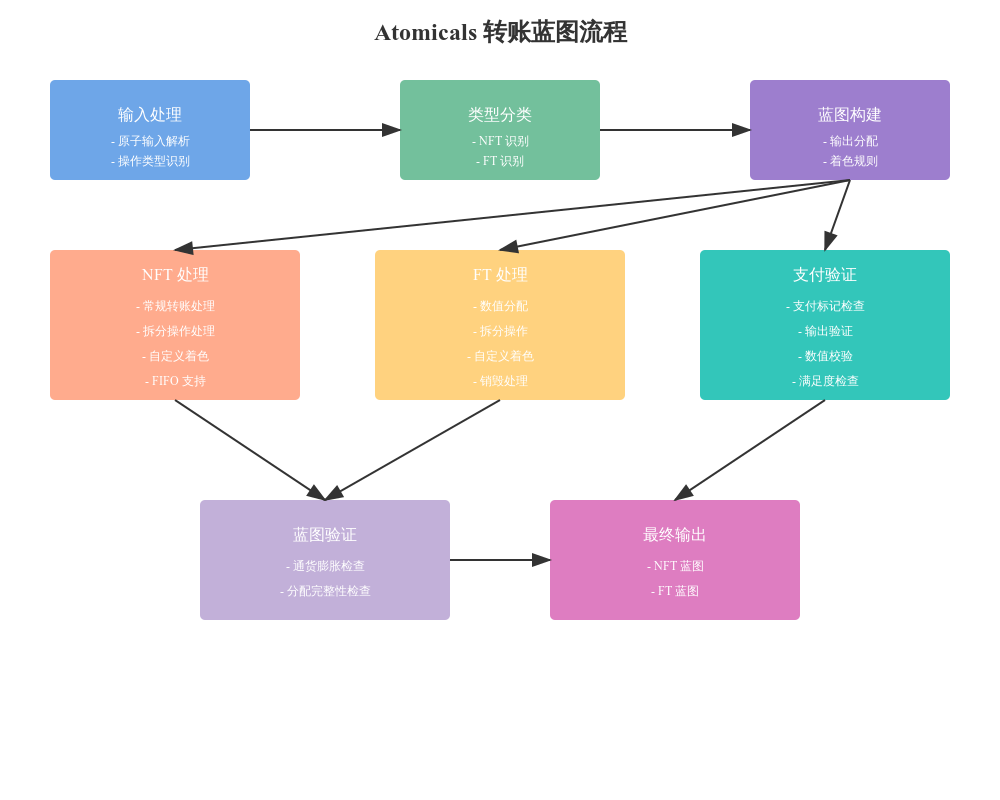

# Atomicals Blueprint Builder 


# Atomicals Transfer Blueprint 代码分析

## 1. 核心数据结构

### 1.1 基本输入结构
```python
class AtomicalInputItem:
    """单个输入项结构"""
    def __init__(self, txin_index, sat_value: int, atomical_value: int):
        self.txin_index = txin_index
        self.sat_value = sat_value
        self.atomical_value = atomical_value
```

### 1.2 汇总结构
```python
class AtomicalInputSummary:
    """输入汇总信息"""
    def __init__(self, atomical_id, atomical_type, mint_info):
        self.atomical_id = atomical_id
        self.type = atomical_type
        self.sat_value = 0
        self.atomical_value = 0
```

## 2. 主要处理流程

### 2.1 Blueprint 生成
```python
def calculate_output_blueprint(cls, get_atomicals_id_mint_info, tx, nft_atomicals, 
    ft_atomicals, atomicals_spent_at_inputs, operations_found_at_inputs, 
    sort_fifo, is_custom_coloring_activated):
    """生成输出blueprint"""
    nft_blueprint = calculate_output_blueprint_nfts(...)
    ft_blueprint = calculate_output_blueprint_fts(...)
    return nft_blueprint, ft_blueprint
```

### 2.2 NFT处理
```python
def calculate_nft_atomicals_regular(cls, nft_map, nft_atomicals, tx, 
    operations_found_at_inputs, sort_fifo):
    """处理常规NFT转移"""
    if sort_fifo:
        # FIFO顺序处理
    else:
        # 传统方式处理
```

### 2.3 FT处理
```python
def color_ft_atomicals_regular(cls, ft_atomicals, tx, sort_fifo, 
    is_custom_coloring_activated):
    """处理常规FT转移"""
    # 计算需要着色的输出
    ft_coloring_summary = calculate_outputs_to_color_for_ft_atomical_ids(...)
```

## 3. 特殊操作处理

### 3.1 Split 操作
```python
def color_ft_atomicals_split(cls, ft_atomicals, operations_found_at_inputs, tx, 
    is_custom_coloring_activated):
    """处理拆分操作"""
    output_colored_map = {}
    for atomical_id, atomical_info in sorted(ft_atomicals.items()):
        # 计算拆分后的分配
```

### 3.2 Custom Coloring
```python
def custom_color_ft_atomicals(cls, ft_atomicals, operations_found_at_inputs, tx):
    """自定义着色处理"""
    output_colored_map = {}
    for atomical_id, atomical_info in sorted(ft_atomicals.items()):
        # 根据自定义规则进行着色
```

## 4. 验证机制

### 4.1 通货膨胀检查
```python
def validate_ft_transfer_has_no_inflation(self, atomical_id_to_expected_outs_map, 
    tx, ft_atomicals):
    """验证FT转移没有通货膨胀"""
    # 检查输入输出值平衡
```

### 4.2 支付验证
```python
def are_payments_satisfied(self, expected_payment_outputs):
    """验证支付是否满足要求"""
    # 检查支付条件和实际输出
```

## 5. 关键功能实现

### 5.1 输出分配
```python
def assign_expected_outputs_basic(cls, total_value_to_assign, tx, 
    start_out_idx, is_custom_coloring_activated):
    """基础输出分配"""
    # 从指定位置开始分配输出
```

### 5.2 输入汇总
```python
def build_atomical_input_summaries(cls, get_atomicals_id_mint_info, 
    map_atomical_ids_to_summaries, atomicals_entry_list, txin_index):
    """构建输入汇总信息"""
    # 处理输入信息并汇总
```

## 6. 特殊处理机制

### 6.1 FIFO 支持
- 支持按输入顺序处理转移
- 维护输入索引到Atomical的映射

### 6.2 支付标记
- 支持识别特殊的支付标记
- 处理subrealm和dmitem支付

## 7. 最佳实践

### 7.1 数据处理
1. 使用有序字典排序
2. 验证输入完整性
3. 处理边界情况

### 7.2 错误处理
1. 明确的错误类型
2. 详细的错误信息
3. 异常传播机制

## 8. 性能考虑

### 8.1 数据结构选择
1. 使用适当的集合类型
2. 高效的查找机制
3. 内存优化

### 8.2 算法优化
1. 减少重复计算
2. 优化循环结构
3. 使用缓存机制