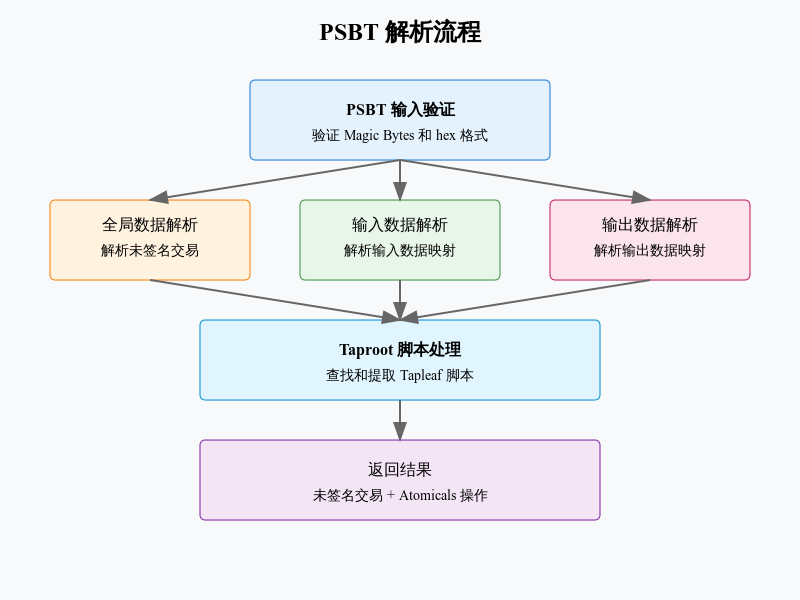

# psbt



## PSBT 解析器实现分析

### 1. 核心功能模块
1.1 辅助函数
```python
def read_bytes(data, offset, length):
    """读取指定长度的字节"""
    if offset + length > len(data):
        raise IndexError(f"Offset out of range while reading bytes at offset {offset}")
    return data[offset:offset + length], offset + length

def read_varint(data, cursor):
    """读取可变长度整数"""
    v = data[cursor]
    cursor += 1
    if v < 0xFD:
        return v, cursor
    elif v == 0xFD:
        return unpack_le_uint16_from(data, cursor)[0], cursor + 2
    # ...更多长度处理
```


1.2 Taproot 脚本处理
```python
def find_tapleaf_scripts(inputs):
    """查找所有 Tapleaf 脚本"""
    tapleaf_scripts = []
    for input_map in inputs:
        for key, value in input_map.items():
            if key[0] == 0x15:  # Tapleaf 脚本类型
                tapleaf_scripts.append(value)
    return tapleaf_scripts
```

### 2. 主要解析流程
2.1 PSBT 格式验证
```python
def parse_psbt_hex_and_operations(psbt_hex: str):
    """解析 PSBT 格式数据"""
    psbt_bytes = bytes.fromhex(psbt_hex)
    # 验证 magic 字节
    if psbt_bytes[:5] != b"\x70\x73\x62\x74\xff":
        raise ValueError("Invalid PSBT magic bytes")
```
2.2 数据映射解析
```python
def parse_map(data, offset):
    """解析键值映射"""
    map = {}
    while offset < len(data) and data[offset] != 0x00:
        # 读取键
        key_len, offset = read_varint(data, offset)
        key, offset = read_bytes(data, offset, key_len)
        
        # 读取值
        value_len, offset = read_varint(data, offset)
        value, offset = read_bytes(data, offset, value_len)
        
        map[key] = value
    return map, offset + 1
```
### 3. 数据结构
3.1 PSBT 格式

- Magic Bytes (5 bytes)
- Global Map
- Input Maps
- Output Maps

3.2 键值映射
```python
global_map = {}  # 全局映射
inputs = []      # 输入映射列表
outputs = []     # 输出映射列表
```
### 4. 错误处理
1. 输入验证
```python
if magic != b"\x70\x73\x62\x74\xff":
    raise ValueError("Invalid PSBT magic bytes")
```
2. 边界检查
```python
if offset + length > len(data):
    raise IndexError("Offset out of range")
```
3. 数据完整性
```python
if unsigned_tx is None:
    raise ValueError("No unsigned transaction found in PSBT")
```
### 5. 主要特点
1. 支持 Taproot 交易
2. 完整的 PSBT 格式解析
3. 可扩展的数据映射处理
4. 严格的错误检查

代码实现了完整的 PSBT 解析功能，重点包括：

基础 PSBT 解析
Taproot 脚本支持
Atomicals 操作提取
错误处理机制