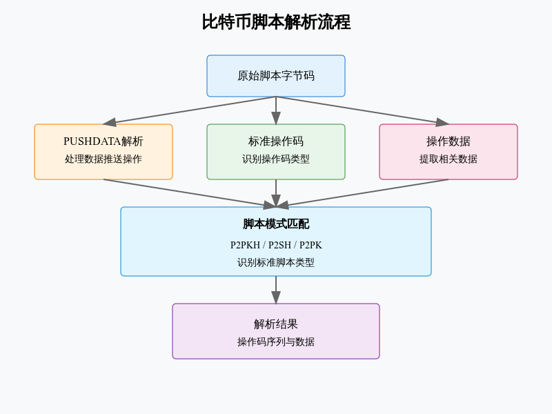

# script



## 核心功能解析# 比特币脚本处理代码分析

## 1. 核心组件

### 1.1 操作码定义
```python
OpCodes = Enumeration('Opcodes', [
    ('OP_0', 0),
    ('OP_PUSHDATA1', 76),
    # ... 其他操作码
])
```
- 定义了比特币脚本中使用的所有操作码
- 包含栈操作、流控制、算术运算等指令

### 1.2 脚本错误处理
```python
class ScriptError(Exception):
    """脚本错误异常类"""
    pass
```

## 2. 脚本类型

### 2.1 ScriptPubKey 类
```python
class ScriptPubKey:
    """输出脚本处理类"""
    TO_ADDRESS_OPS = (
        OpCodes.OP_DUP,
        OpCodes.OP_HASH160,
        -1,  # 数据推送占位符
        OpCodes.OP_EQUALVERIFY,
        OpCodes.OP_CHECKSIG
    )
```

### 2.2 脚本模板
```python
@classmethod
def P2PKH_script(cls, hash160):
    """生成 P2PKH 脚本"""
    return (bytes([OpCodes.OP_DUP, OpCodes.OP_HASH160]) +
            Script.push_data(hash160) +
            bytes([OpCodes.OP_EQUALVERIFY, OpCodes.OP_CHECKSIG]))
```

## 3. 脚本解析

### 3.1 操作码解析
```python
@classmethod
def get_ops(cls, script):
    """解析脚本为操作码序列"""
    ops = []
    n = 0
    while n < len(script):
        op = script[n]
        n += 1
        
        if op <= OpCodes.OP_PUSHDATA4:
            # 处理数据推送操作
            if op < OpCodes.OP_PUSHDATA1:
                dlen = op
            elif op == OpCodes.OP_PUSHDATA1:
                dlen = script[n]
                n += 1
            # ... 其他长度处理
```

### 3.2 数据推送处理
```python
@classmethod
def push_data(cls, data):
    """生成数据推送操作码"""
    n = len(data)
    if n < OpCodes.OP_PUSHDATA1:
        return bytes([n]) + data
    if n < 256:
        return bytes([OpCodes.OP_PUSHDATA1, n]) + data
    # ... 更大长度的处理
```

## 4. 特殊脚本处理

### 4.1 不可花费脚本检查
```python
def is_unspendable_legacy(script):
    """检查是否为不可花费脚本"""
    return (script[:2] == b'\x00\x6a' or 
            (script and script[0] == 0x6A))
```

### 4.2 模式匹配
```python
def _match_ops(ops, pattern):
    """匹配操作码模式"""
    if len(ops) != len(pattern):
        return False
    for op, pop in zip(ops, pattern):
        if pop != op:
            if pop == -1 and isinstance(op, tuple):
                continue
            return False
    return True
```

## 5. 调试功能

### 5.1 操作码名称解析
```python
@classmethod
def opcode_name(cls, opcode):
    """获取操作码的名称"""
    if OpCodes.OP_0 < opcode < OpCodes.OP_PUSHDATA1:
        return f'OP_{opcode:d}'
    try:
        return OpCodes.whatis(opcode)
    except KeyError:
        return f'OP_UNKNOWN:{opcode:d}'
```

### 5.2 脚本转储
```python
@classmethod
def dump(cls, script):
    """打印脚本的可读形式"""
    opcodes, datas = cls.get_ops(script)
    for opcode, data in zip(opcodes, datas):
        name = cls.opcode_name(opcode)
        if data is None:
            print(name)
        else:
            print(f'{name} {data.hex()} ({len(data):d} bytes)')
```

## 6. 安全考虑

### 6.1 合法性验证
```python
# 关键操作码验证
assert OpCodes.OP_DUP == 0x76
assert OpCodes.OP_HASH160 == 0xA9
assert OpCodes.OP_EQUAL == 0x87
# ... 其他验证
```

### 6.2 异常处理
```python
try:
    # 脚本解析代码
except Exception:
    raise ScriptError('truncated script')
```

## 7. 最佳实践

### 7.1 脚本构建
1. 使用预定义模板
2. 验证输入数据
3. 正确处理长度编码

### 7.2 脚本解析
1. 完整性检查
2. 边界条件处理
3. 异常安全处理

## 8. 性能优化

### 8.1 数据处理
1. 使用字节对象
2. 高效的长度编码
3. 优化的模式匹配

### 8.2 内存管理
1. 避免不必要的复制
2. 使用迭代器处理
3. 合理的数据结构选择