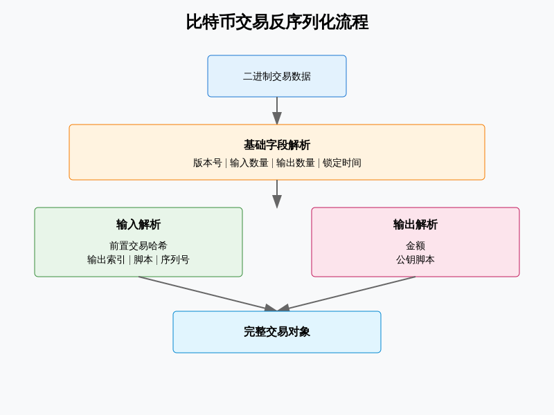

# 比特币交易反序列化代码分析
---


## 1. 核心类结构
#### Deserializer 基类
这是所有反序列化器的基础类，提供了以下核心功能：
```python
class Deserializer:
    def __init__(self, binary, start=0):
        self.binary = binary          # 二进制数据
        self.binary_length = len(binary)  # 数据长度
        self.cursor = start           # 当前读取位置
```
### 关键数据类
1. Tx类 - 基本交易结构
```python
@dataclass
class Tx:
    version: int      # 交易版本号
    inputs: Sequence  # 交易输入列表
    outputs: Sequence # 交易输出列表
    locktime: int     # 锁定时间
```
2. TxInput类 - 交易输入结构
```python
@dataclass
class TxInput:
    prev_hash: bytes  # 前置交易哈希
    prev_idx: int     # 前置交易输出索引
    script: bytes     # 解锁脚本
    sequence: int     # 序列号
```
3. TxOutput类 - 交易输出结构
```python
@dataclass
class TxOutput:
    value: int       # 输出值
    script: bytes     # 锁定脚本
```
## 2. 关键方法解析
#### 读取交易方法
```python
def read_tx(self):
    """反序列化并返回完整交易对象"""
    return Tx(
        self._read_le_int32(),    # 读取版本号
        self._read_inputs(),      # 读取所有输入
        self._read_outputs(),     # 读取所有输出
        self._read_le_uint32(),   # 读取锁定时间
    )
```
#### 辅助读取方法

1. 读取变长整数
```python
def _read_varint(self):
    """读取变长整数"""
    n = self.binary[self.cursor]
    self.cursor += 1
    if n < 253:        # 单字节表示
        return n
    if n == 253:       # 2字节表示
        return self._read_le_uint16()
    if n == 254:       # 4字节表示
        return self._read_le_uint32()
    return self._read_le_uint64() # 8字节表示
```

2. 读取字节序列
```python
def _read_nbytes(self, n):
    """读取指定长度的字节"""
    cursor = self.cursor
    self.cursor = end = cursor + n
    return self.binary[cursor:end]
```
## 3. 扩展功能说明

### SegWit交易支持
代码通过**DeserializerSegWit**类提供了对隔离见证交易的支持：
```python
class TxSegWit:
    version: int      # 版本号
    marker: int       # 标记字节(0x00)
    flag: int         # 标志字节(0x01)
    inputs: Sequence  # 输入列表
    outputs: Sequence # 输出列表
    witness: Sequence # 见证数据
    locktime: int     # 锁定时间
```
### 特殊交易类型支持
代码还支持多种特殊交易类型：

1. 时间戳交易 (TxTime)
2. AuxPow交易 (用于合并挖矿)
3. DCR交易 (Decred币种特有)
4. TokenPay交易 (支持匿名交易)
