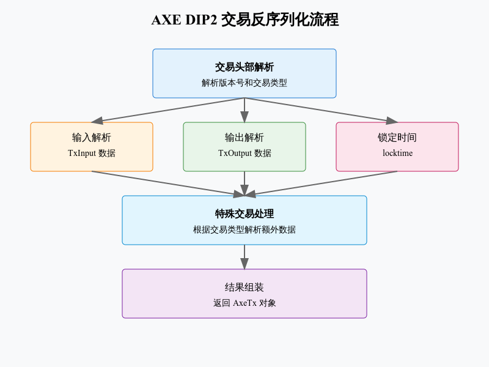

# tx_axe



## AX DIP2交易反序列化实现分析

### 核心数据结构
#### 1.1基础交易结构
```python
class AxeTx(namedtuple):
    """AXE 交易结构"""
    version: int         # 交易版本
    inputs: list        # 交易输入
    outputs: list       # 交易输出
    locktime: int       # 锁定时间
    tx_type: int        # 特殊交易类型
    extra_payload: bytes # 额外数据载荷
```
#### 1.2 特殊交易类型
```python
class DeserializerAxe:
    """支持的特殊交易类型"""
    PRO_REG_TX = 1          # 主节点注册
    PRO_UP_SERV_TX = 2      # 服务更新
    PRO_UP_REG_TX = 3       # 注册更新
    PRO_UP_REV_TX = 4       # 注册撤销
    CB_TX = 5               # 区块奖励
```
### 2. 序列化流程
#### 2.1 交易头部处理
```python
def read_tx(self):
    """读取并解析交易"""
    header = self._read_le_uint32()
    tx_type = header >> 16    # 获取交易类型
    version = header & 0xFFFF # 获取版本号
```
#### 2.2 基础解析
```python
def _read_inputs(self):
    """读取交易输入"""
    return [self._read_input() for _ in range(self._read_varint())]

def _read_outputs(self):
    """读取交易输出"""
    return [self._read_output() for _ in range(self._read_varint())]
```
#### 2.3 特殊交易处理
```python
def _handle_special_tx(self, tx_type):
    """处理特殊交易类型"""
    if tx_type:
        extra_payload_size = self._read_varint()
        spec_tx_class = self.SPEC_TX_HANDLERS.get(tx_type)
        if spec_tx_class:
            return spec_tx_class.read_tx_extra(self)
```

### 3. 特殊交易类型
#### 3.1 主节点注册交易
```python
class AxeProRegTx:
    """主节点注册交易"""
    version: int        # 版本
    type: int          # 类型
    mode: int          # 模式
    collateralOutpoint # 押金输出点
    KeyIdOwner         # 所有者密钥
    PubKeyOperator     # 操作者公钥
```
#### 3.2 区块奖励交易
```python
class AxeCbTx:
    """区块奖励特殊交易"""
    version: int
    height: int            # 区块高度
    merkleRootMNList      # 主节点列表根
    merkleRootQuorums     # 仲裁根(v2+)
```
### 4. 序列化支持
#### 4.1 基础序列
```python
def serialize(self):
    """序列化交易数据"""
    return b''.join([
        pack_le_uint32(self.version),
        pack_varint(len(self.inputs)),
        b''.join(tx_in.serialize() for tx_in in self.inputs),
        pack_varint(len(self.outputs)),
        b''.join(tx_out.serialize() for tx_out in self.outputs),
        pack_le_uint32(self.locktime),
    ])
```
#### 4.2 特殊数据序列化
```python
def _serialize_extra_payload(self):
    """序列化额外数据"""
    spec_tx_class = self.SPEC_TX_HANDLERS.get(self.tx_type)
    if spec_tx_class:
        return pack_varbytes(self.extra_payload.serialize())
```
### 5.主要特点

1. 支持多种特殊交易类型
2. 完整序列化/反序列化
3. 类型安全数据结构
4. 友善机制