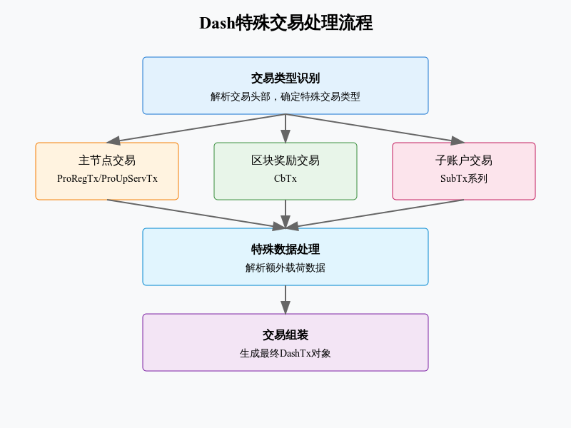

# tx_dash 



## DASH交易反序列化实现分析

### 核心交易类型
#### 1.1 基础交易类
```python
class DashTx(namedtuple):
    """Dash基础交易类"""
    version: int        # 交易版本
    inputs: list       # 交易输入列表
    outputs: list      # 交易输出列表
    locktime: int      # 锁定时间
    tx_type: int       # 特殊交易类型
    extra_payload      # 额外数据载荷
```
#### 1.2 特殊交易类型
```python
class DeserializerDash:
    """支持的特殊交易类型"""
    PRO_REG_TX = 1          # 主节点注册
    PRO_UP_SERV_TX = 2      # 服务更新
    PRO_UP_REG_TX = 3       # 注册更新
    CB_TX = 5               # 区块奖励
    SUB_TX_REGISTER = 8     # 子账户注册
```
### 2. 主要处理流程
#### 2.1 交易类型识别
```python
def read_tx(self):
    """读取交易"""
    header = self._read_le_uint32()
    tx_type = header >> 16    # 提取特殊交易类型
    version = header & 0xFFFF # 提取版本号
```
#### 2.2 主节点交易处理
```python
class DashProRegTx:
    """主节点注册交易"""
    def serialize(self):
        """序列化交易数据"""
        return (
            pack_le_uint16(self.version) +
            pack_le_uint16(self.type) +
            self.collateralOutpoint.serialize()
        )
```
#### 2.3 区块奖励交易
```python
class DashCbTx:
    """区块奖励交易"""
    def serialize(self):
        return (
            pack_le_uint16(self.version) +
            pack_le_uint32(self.height) +
            self.merkleRootMNList
        )
```

### 3. 特殊字段
#### 3.1 交易输出点
```python
class TxOutPoint:
    """交易输出引用"""
    hash: bytes    # 交易哈希
    index: int     # 输出索引
```

#### 3.2 额外数据处理
```python
def _serialize_extra_payload(self):
    """处理额外数据载荷"""
    spec_tx_class = DeserializerDash.SPEC_TX_HANDLERS.get(self.tx_type)
    if spec_tx_class:
        return pack_varbytes(extra.serialize())
```
### 4.安全性考虑
#### 数据存档验证：
```python
assert len(self.merkleRootMNList) == 32
assert len(self.proTxHash) == 32
assert len(self.payloadSig) == 96
```

#### 类型检查：
```python
if not isinstance(extra, spec_tx_class):
    raise ValueError("Invalid tx_type")
```
### 5. 使用建议

- 先检查交易类型
- 根据类型选择处理器
- 验证数据存储库


1.数据处理：


- 使用正确的字节序
- 考虑的方向
- 处理版本差异


2.异常处理：


- 验证数据可用性
- 处理解析错误
- 隨機數據。

#### 该实现提供了完整的 Dash 特殊交易处理支持，包括：

- 主节点管理
- 项目奖励
- 子账户操作

