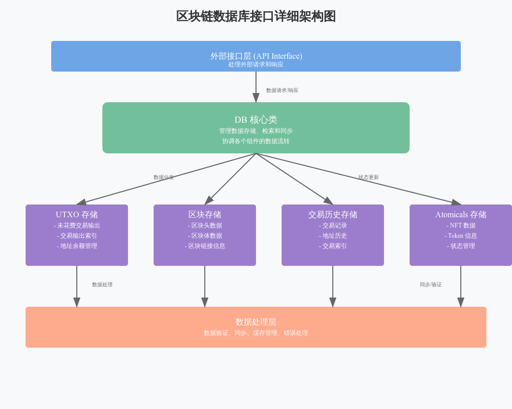

# db


# 区块链数据库接口代码分析

## 1. 核心类和数据结构

### 1.1 DB类
```python
class DB:
    """区块链数据库接口的主要类"""
```
这是整个模块的核心类,负责管理区块链数据的存储和检索。主要功能包括:
- UTXO(未花费交易输出)管理
- 区块头存储
- 交易历史记录
- 原子数据操作

### 1.2 主要数据结构
```python
@dataclass(order=True)
class UTXO:
    tx_num: int      # 链上交易序号
    tx_pos: int      # 交易输出索引
    tx_hash: bytes   # 交易哈希
    height: int      # 区块高度
    value: int       # 价值(聪)
```

### 1.3 缓存刷新数据结构
```python
@attr.s(slots=True)
class FlushData:
    height: int              # 区块高度
    tx_count: int           # 交易计数
    headers: bytes          # 区块头数据
    block_tx_hashes: list   # 区块交易哈希列表
    # ... 其他刷新相关字段
```

## 2. 关键功能模块

### 2.1 数据库初始化和打开
```python
async def open_for_sync(self):
    """打开数据库用于同步"""
    await self._open_dbs(True, False)
```

### 2.2 UTXO管理
```python
async def lookup_utxos(self, prevouts):
    """查找UTXO信息"""
```

### 2.3 区块数据处理
```python
async def read_headers(self, start_height, count):
    """读取区块头数据"""
```

### 2.4 缓存管理
```python
def flush_dbs(self, flush_data, flush_utxos, estimate_txs_remaining):
    """刷新缓存到数据库"""
```

## 3. 数据库索引结构

### 3.1 主要索引前缀
- b'u': UTXO索引
- b'h': 交易哈希索引
- b'tx': 交易号索引
- b'n': 原子编号索引

### 3.2 索引示例
```python
# UTXO索引格式
# key: b'u' + address_hashX + txout_idx + tx_num
# value: UTXO value (64-bit integer)
```

## 4. 关键算法实现

### 4.1 UTXO查找
```python
def lookup_hashX(tx_hash, tx_idx):
    idx_packed = pack_le_uint32(tx_idx)
    prefix = b'h' + tx_hash[:COMP_TXID_LEN] + idx_packed
    # ... 查找逻辑
```

### 4.2 区块遍历
```python
async def fs_block_hashes(self, height, count):
    """获取区块哈希列表"""
    headers_concat, headers_count = await self.read_headers(height, count)
    # ... 处理逻辑
```

## 5. 性能优化特性

### 5.1 批量处理
- 使用write_batch进行批量写入
- 实现缓存预读取
- 异步处理I/O操作

### 5.2 内存管理
- 使用slots优化内存
- 实现精确的垃圾回收
- 缓存大小限制

## 6. 错误处理和恢复

### 6.1 错误类型
```python
class DBError(Exception):
    """数据库错误基类"""
```

### 6.2 恢复机制
- 保存检查点
- 回滚支持
- 数据一致性验证

## 7. 使用建议

### 7.1 最佳实践
- 定期备份数据
- 监控数据库大小
- 优化查询性能

### 7.2 注意事项
- 避免频繁写入
- 合理设置缓存大小
- 正确处理异步操作