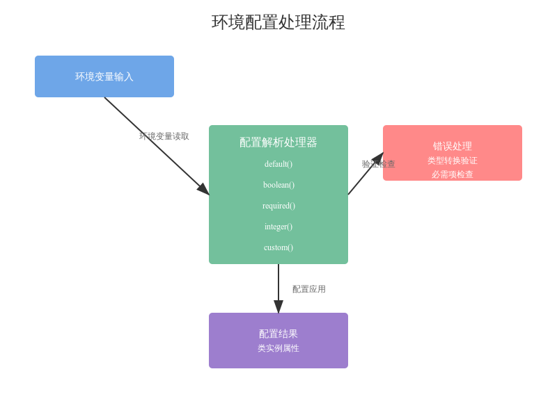

# env_base



# EnvBase 环境配置类分析

## 1. 类的主要功能

EnvBase 类是一个环境配置管理的基础类，主要用于：
- 包装和管理环境变量配置
- 提供类型转换和验证功能
- 处理配置错误和异常情况
- 设置事件循环策略

## 2. 核心方法分析

### 2.1 构造函数
```python
def __init__(self):
    self.logger = class_logger(__name__, self.__class__.__name__)
    self.allow_root = self.boolean("ALLOW_ROOT", False)
    self.loop_policy = self.event_loop_policy()
```
- 初始化日志记录器
- 设置 root 权限控制
- 配置事件循环策略

### 2.2 环境变量处理方法

#### default() 方法
```python
@classmethod
def default(cls, envvar, default):
    return environ.get(envvar, default)
```
- 获取环境变量的基础方法
- 提供默认值支持

#### boolean() 方法
```python
@classmethod
def boolean(cls, envvar, default):
    default = "Yes" if default else ""
    return bool(cls.default(envvar, default).strip())
```
- 处理布尔类型的环境变量
- 转换 "Yes" 为 True

#### required() 方法
```python
@classmethod
def required(cls, envvar):
    value = environ.get(envvar)
    if value is None:
        raise cls.Error(f"required envvar {envvar} not set")
    return value
```
- 处理必需的环境变量
- 缺失时抛出异常

#### integer() 方法
```python
@classmethod
def integer(cls, envvar, default):
    value = environ.get(envvar)
    if value is None:
        return default
    try:
        return int(value)
    except Exception:
        raise cls.Error(f"cannot convert envvar {envvar} value {value} to an integer")
```
- 处理整数类型的环境变量
- 提供类型转换错误处理

## 3. 特殊功能实现

### 3.1 自定义解析
```python
@classmethod
def custom(cls, envvar, default, parse):
    value = environ.get(envvar)
    if value is None:
        return default
    try:
        return parse(value)
    except Exception as e:
        raise cls.Error(f"cannot parse envvar {envvar} value {value}") from e
```
- 支持自定义解析函数
- 灵活处理特殊格式数据

### 3.2 事件循环策略
```python
def event_loop_policy(self):
    policy = self.default("EVENT_LOOP_POLICY", None)
    if policy is None:
        return None
    if policy == "uvloop":
        import uvloop
        return uvloop.EventLoopPolicy()
    raise self.Error(f'unknown event loop policy "{policy}"')
```
- 配置异步事件循环策略
- 支持 uvloop 扩展

## 4. 错误处理机制

### 4.1 错误类定义
```python
class Error(Exception):
    pass
```
- 自定义错误类型
- 用于配置相关异常

### 4.2 废弃配置检查
```python
@classmethod
def obsolete(cls, envvars):
    bad = [envvar for envvar in envvars if environ.get(envvar)]
    if bad:
        raise cls.Error(f"remove obsolete environment variables {bad}")
```
- 检查废弃的环境变量
- 防止使用过时配置

## 5. 最佳实践建议

1. 环境变量命名
   - 使用大写字母
   - 下划线分隔单词
   - 清晰表达配置意图

2. 错误处理
   - 总是提供适当的默认值
   - 对必需配置进行验证
   - 使用 try-except 捕获转换错误

3. 配置管理
   - 集中管理环境变量
   - 及时清理废弃配置
   - 保持向后兼容性

4. 扩展建议
   - 根据需要添加新的解析方法
   - 保持类的单一职责
   - 遵循组合优于继承原则