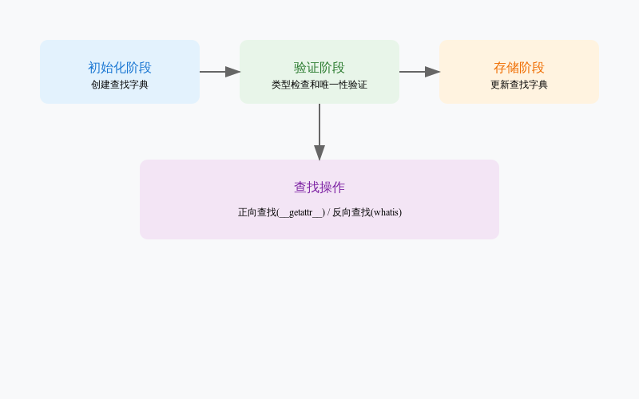

# Python自定义枚举类详解


## 代码概述

这是一个实现了查找功能的自定义枚举类，通过允许名称查找值，也可以通过值反向查找名称。代码源于Python Cookbook，经过优化后提供了更完善的错误处理机制。

## 核心代码解析
### 1. 异常类定义
```python
class EnumError(Exception):
    pass
```
- 用途：定义了自定义异常类EnumError
- 作用：用于处理枚举过程中的特定错误情况
### 2. 枚举类初始化
```python
def __init__(self, name, enumList):
    self.__doc__ = name
    lookup = {}
    reverseLookup = {}
    i = 0
    uniqueNames = set()
    uniqueValues = set()
```
- 参数说明：
  - ```name```：枚举类的名称，实用文档字符串
  - ```enumList```：枚举项列表
- 初始化变量：
  - ```lookup```：正向查找字典（名称 → 值）
  - ```reverseLookup```：反向查找字典（值 → 名称）
  - ```uniqueNames```和```uniqueValues```：用于确保名称和值的唯一性

### 3. 枚举项处理
```python
for x in enumList:
    if isinstance(x, tuple):
        x, i = x
    if not isinstance(x, str):
        raise EnumError("enum name {} not a string".format(x))
    if not isinstance(i, int):
        raise EnumError("enum value {} not an integer".format(i))
```
- 功能：处理每个枚举项
- 验证步骤：
  - 检查是否为元组（支持自定义值）
  - 验证名称是否为字符串
  - 验证值是否为整数
### 4. 唯一性检查
```python
if x in uniqueNames:
    raise EnumError("enum name {} not unique".format(x))
if i in uniqueValues:
    raise EnumError("enum value {} not unique".format(x))
uniqueNames.add(x)
uniqueValues.add(i)
```
- 目的：确保枚举名称和值的唯一性
- 处理方式：使用集合记录已使用的名称和值


### 5. 查找方法实现
```python
def __getattr__(self, attr):
    result = self.lookup.get(attr)
    if result is None:
        raise AttributeError("enumeration has no member {}".format(attr))
    return result

def whatis(self, value):
    return self.reverseLookup[value]
```

- ```getattr```：通过属性访问枚举值实现
- ```whatis```：提供值到名称的反向查找

## 使用示例
```python
# 创建一个颜色枚举
Colors = Enumeration("Colors", [
    ("RED", 1),
    ("GREEN", 2),
    ("BLUE", 3)
])

# 正向查找：通过名称获取值
red_value = Colors.RED  # 返回 1

# 反向查找：通过值获取名称
color_name = Colors.whatis(1)  # 返回 "RED"
```
## 工作原理解释
1. 初始化过程：

- 创建两个用于教会查找的字典
- 使用集合确保名称和值的唯一性
- 处理权限自定义值


2. 查找机制：

- 正向发现通过```__getattr__```魔术方法实现
- 逆向查找通过```whatis```方法实现
- 所有查找都有适当的错误处理


3. 错误答案：

- 类型错误：确保名称为字符串，值为整数
- 唯一性错误：防止重复的名称或值
- 查找错误：处理找到未的情况