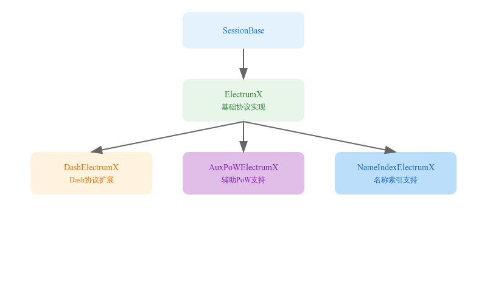

# electrumx_session

## 1. 基础架构概述

ElectrumX 服务器实现了一个层次化的类结构，主要包含以下：组件

- 基础类别：```SessionBase```
- 主要实现：```ElectrumX```
- 特定功能扩展：
  - DashElectrumX: Dash币专用功能
  - AuxPoWElectrumX: 协助工作量证明支持
  - NameIndexElectrumX: 名称索引功能
## 2. 核心功能实现

### 2.1 会话管理

```python
def __init__(self, *args, **kwargs):
    super().__init__(*args, **kwargs)
    self.subscribe_headers = False
    self.connection.max_response_size = self.env.max_send
    self.hashX_subs = {}         # 地址订阅存储
    self.sv_seen = False         # 版本协商标记
    self.mempool_statuses = {}   # 内存池状态
    self.cost = 5.0             # 连接成本
```
### 2.2 请求处理器设置

```python
def set_request_handlers(self, protocols):
    """配置支持的RPC方法处理器"""
    handlers = {
        "server.features": self.server_features_async,
        "blockchain.headers.subscribe": self.ss.headers_subscribe,
        # ... 更多处理器
    }
    self.request_handlers = handlers
```
## 3. 关键功能详解
### 3.1 通知机制
```python
async def notify(self, touched, height_changed):
    """客户端通知包装器"""
    try:
        async with timeout_after(30):  # 30秒超时保护
            await self._notify_inner(touched, height_changed)
    except TaskTimeout:
        await self.close(force_after=1.0)
```
### 3.2 服务器功能信息

```python
@classmethod
def server_features(cls, env):
    """返回服务器特性信息"""
    return {
        "hosts": hosts_dict,
        "protocol_min": min_str,
        "protocol_max": max_str,
        "genesis_hash": env.coin.GENESIS_HASH,
        # ... 其他特性
    }
``` 
## 4.实用工具函数
### 4.1 版本改进

```python
async def server_version(self, client_name="", protocol_version=None):
    """处理客户端版本协商"""
    if self.sv_seen:
        raise RPCError(BAD_REQUEST, "server.version already sent")
    self.sv_seen = True
    # ... 版本检查和协商
```
### 4.2 资源管理

```python
def on_disconnect_due_to_excessive_session_cost(self):
    """处理超出资源限制的会话"""
    remote_addr = self.remote_address()
    ip_addr = remote_addr.host if remote_addr else None
    self.logger.info(f"closing session over res usage. ip: {ip_addr}")
```
## 5. 最佳实践
1. 错误处理
```python
try:
    result = await self.daemon_request("smartrewards", ("current",))
    if result is not None:
        return result
    return None
except DaemonError as e:
    self.logger.error(f"处理出错: {e}")
```
2. 资源限制
- 设置适当的超时时间
- 实施成本控制机制
- 监控连接资源使用
3. 协议义务
- 检查协议版本
- 适当版本降级处理
- 保持相关性
## 6. 调试提示
1. 使用日志跟踪关键操作：
```python
self.logger.info(f"notified of {len(changed):,d} address{es}")
```
2. 监控连接状态：
```python
self.logger.warning("timeout notifying client, closing...")
```
3. 验证输入参数：
```python
if not isinstance(base_height, int):
    raise RPCError(BAD_REQUEST, "expected an int")
```
## 7. 注意事项
1. 始终处理正确的异步操作
2. 实现适当的错误机制处理
3. 注意资源限制和超时控制
4. 保持代码可维护性和必备性
5. 遵循既定的协议规范