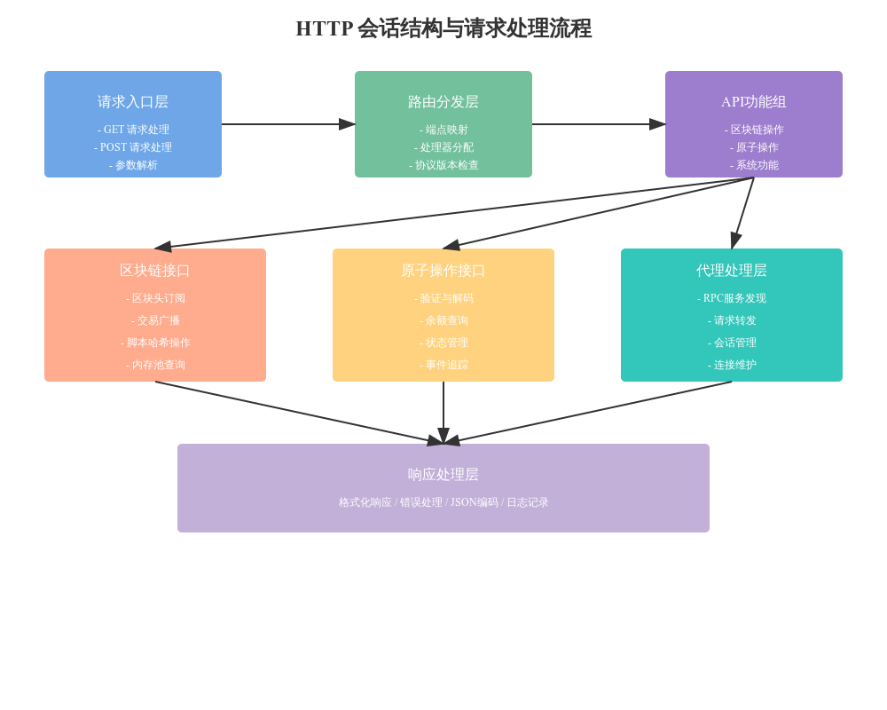

# http_session

# HTTP 会话处理类代码分析

## 1. 核心结构设计

### 1.1 基础组件
```python
class HttpSession(object):
    def __init__(self, session_mgr, db, mempool, peer_mgr, kind):
        # 核心组件初始化
        self.session_mgr = session_mgr
        self.db = db
        self.mempool = mempool
        self.peer_mgr = peer_mgr
```

### 1.2 会话管理
```python
# 共享会话处理
self.ss = SharedSession(
    self.logger,
    self.coin,
    self.session_mgr,
    self.peer_mgr,
    self.client,
)
```

## 2. 请求处理流程

### 2.1 请求格式化
```python
async def formatted_request(self, request: web.Request, call):
    """请求格式化处理"""
    # 提取方法和参数
    method = request.path
    params = self._get_params(request)
    
    # 执行调用并处理结果
    try:
        result = await self._execute_call(call, params)
        return success_resp(result)
    except Exception as e:
        return error_resp(500, e)
```

### 2.2 端点注册
```python
async def add_endpoints(self, router, protocols):
    """注册API端点"""
    handlers = {
        # 服务器信息相关
        "health": self.health,
        "server.features": self.server_features_async,
        
        # 区块链操作
        "blockchain.headers.subscribe": self.ss.headers_subscribe,
        "blockchain.block.header": self.ss.block_header,
        
        # 原子操作
        "blockchain.atomicals.validate": self.ss.transaction_broadcast_validate,
        # ... 更多端点
    }
```

## 3. 功能模块划分

### 3.1 区块链功能
- 区块头订阅和获取
- 交易广播和验证
- 脚本哈希操作
- 费用估算

### 3.2 原子操作功能
- 交易验证与解码
- 余额查询
- 状态管理
- 事件追踪

### 3.3 代理功能
- RPC服务发现
- 请求转发
- 会话管理

## 4. 错误处理机制

### 4.1 异常捕获
```python
try:
    result = call(*params)
    if isinstance(result, Awaitable):
        result = await result
    return success_resp(result)
except Exception as e:
    return error_resp(500, e)
```

### 4.2 日志记录
```python
self.logger.error(
    f"Exception during formatting request: {method} {path}, "
    f"exception: {e}, stack: {s}"
)
```

## 5. 特殊功能实现

### 5.1 代理处理
```python
async def proxy(self, request):
    """代理服务信息"""
    result = {
        "success": True,
        "info": {
            "note": "Atomicals ElectrumX Digital Object Proxy Online",
            # ... 其他信息
        }
    }
    return result
```

### 5.2 健康检查
```python
async def health(self):
    """健康状态检查"""
    result = {"success": True, "health": True}
    return result
```

## 6. 最佳实践建议

### 6.1 请求处理
1. 统一的请求格式化
2. 规范的错误处理
3. 完善的日志记录

### 6.2 端点管理
1. 清晰的功能分类
2. 版本控制支持
3. 灵活的路由配置

### 6.3 性能优化
1. 异步处理
2. 连接复用
3. 资源管理

## 7. 扩展建议

### 7.1 功能扩展
1. 添加更多API端点
2. 增强错误处理
3. 添加监控指标

### 7.2 安全加强
1. 请求验证
2. 访问控制
3. 并发限制