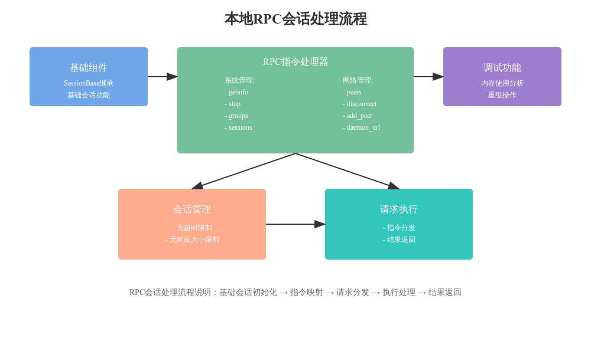

# LocalRPC 会话类代码分析

## 1. 类设计概述

### 1.1 基础架构
```python
class LocalRPC(SessionBase):
    """本地 TCP RPC 服务器会话"""
    processing_timeout = 10**9  # 禁用超时
```

### 1.2 初始化流程
```python
def __init__(self, *args, **kwargs):
    super().__init__(*args, **kwargs)
    self.client = "RPC"
    self.connection.max_response_size = 0  # 无响应大小限制
```

## 2. RPC 指令集

### 2.1 系统信息指令
- `getinfo`: 获取系统信息
- `groups`: 获取分组信息
- `sessions`: 获取会话信息

### 2.2 网络管理指令
- `peers`: 获取对等节点信息
- `add_peer`: 添加对等节点
- `disconnect`: 断开连接
- `daemon_url`: 守护进程 URL 设置

### 2.3 调试和维护指令
- `debug_memusage_list_all_objects`: 列出所有对象的内存使用
- `debug_memusage_get_random_backref_chain`: 获取随机反向引用链
- `reorg`: 重组操作

## 3. 功能特性

### 3.1 会话管理
- 禁用处理超时
- 无响应大小限制
- 本地 TCP 连接

### 3.2 请求处理
```python
request_handlers = {
    "getinfo": self.session_mgr.rpc_getinfo,
    "peers": self.session_mgr.rpc_peers,
    # ... 其他处理器
}
```

## 4. 主要功能实现

### 4.1 系统管理功能
- 系统信息查询
- 会话状态管理
- 系统停止控制

### 4.2 网络管理功能
- 对等节点管理
- 连接控制
- 守护进程配置

### 4.3 调试功能
- 内存使用分析
- 对象引用跟踪
- 系统重组操作

## 5. 性能特点

### 5.1 无限制设计
```python
# 禁用处理超时
processing_timeout = 10**9

# 无响应大小限制
self.connection.max_response_size = 0
```

### 5.2 本地优化
- 专用于本地 TCP 连接
- 简化的协议版本处理
- 直接的会话管理

## 6. 安全考虑

### 6.1 访问控制
- 仅限本地访问
- 管理级别操作
- 敏感指令控制

### 6.2 操作限制
- 系统级指令保护
- 重要操作确认
- 资源访问控制

## 7. 最佳实践

### 7.1 使用建议
1. 仅用于本地管理
2. 谨慎使用调试功能
3. 注意资源消耗

### 7.2 开发建议
1. 保持指令接口简洁
2. 添加新功能时注意权限
3. 维护良好的错误处理

## 8. 扩展性考虑

### 8.1 功能扩展
1. 添加新的管理指令
2. 增强监控能力
3. 扩展调试功能

### 8.2 安全加强
1. 添加访问验证
2. 增加操作日志
3. 完善权限控制

## 9. 使用示例

### 9.1 基础操作
```python
# 获取系统信息
rpc.request_handlers["getinfo"]()

# 管理对等节点
rpc.request_handlers["peers"]()
```

### 9.2 调试操作
```python
# 内存分析
rpc.request_handlers["debug_memusage_list_all_objects"]()

# 系统重组
rpc.request_handlers["reorg"]()
```