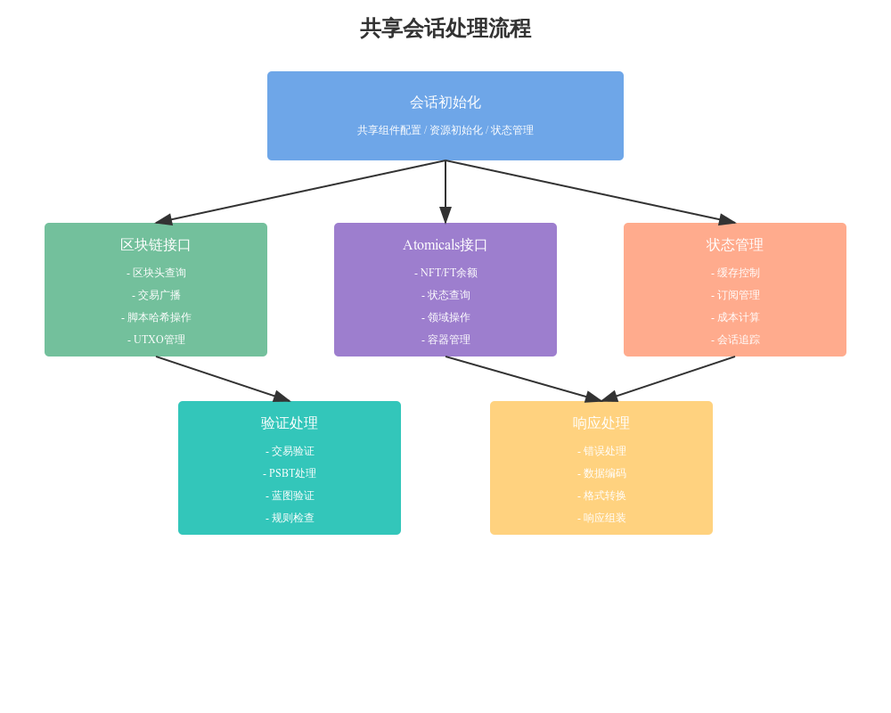

# SharedSession 共享会话类详细分析

## 1. 核心组件设计

### 1.1 初始化结构
```python
class SharedSession(object):
    def __init__(self, logger, coin, session_mgr, peer_mgr, client, maybe_bump_cost=None):
        # 基础组件
        self.logger = logger
        self.coin = coin
        self.session_mgr = session_mgr
        self.peer_mgr = peer_mgr
        self.client = client
        
        # 内部组件引用
        self.bp = session_mgr.bp
        self.daemon_request = session_mgr.daemon_request
        self.db = session_mgr.db
        self.env = session_mgr.env
        self.mempool = session_mgr.mempool
```

### 1.2 状态管理
```python
# 状态追踪
self.subscribe_headers = False
self.mempool_status = {}
self.hash_x_subs = {}
self.txs_sent = 0
self.is_peer = False
```

## 2. API端点实现

### 2.1 区块链基础操作
```python
# 区块头处理
async def block_header(self, height, cp_height=0):
    raw_header_hex = (await self.session_mgr.raw_header(height)).hex()
    
# 交易广播
async def transaction_broadcast(self, raw_tx):
    """广播原始交易到网络"""
    hex_hash = await self.session_mgr.broadcast_transaction_validated(raw_tx, True)

# 脚本哈希操作
async def scripthash_get_balance(self, scripthash):
    """获取脚本哈希的余额"""
```

### 2.2 Atomicals 特性支持
```python
# NFT/FT余额查询
async def atomicals_get_ft_balances(self, scripthash):
    """返回地址的FT余额"""
    
async def atomicals_get_nft_balances(self, scripthash):
    """返回地址的NFT余额"""

# 领域名和容器操作    
async def atomicals_get_realm_info(self, full_name):
    """获取领域信息"""

async def atomicals_get_container_items(self, container, limit, offset):
    """获取容器内的项目"""
```

## 3. 验证机制

### 3.1 交易验证
```python
async def transaction_broadcast_validate(self, raw_tx: str = ""):
    """验证交易的Atomicals规则"""
    try:
        hex_hash = await self.session_mgr.broadcast_transaction_validated(raw_tx, False)
        return hex_hash
    except AtomicalsValidationError as e:
        raise RPCError(ATOMICALS_INVALID_TX, str(e))
```

### 3.2 PSBT处理
```python
def transaction_validate_psbt_blueprint(self, psbt_hex: str):
    """验证PSBT交易蓝图"""
    raw_tx, _ = parse_psbt_hex_and_operations(psbt_hex)
    return self.transaction_validate_tx_blueprint(raw_tx)
```

## 4. 内部辅助功能

### 4.1 成本控制
```python
def bump_cost(self, amount: float):
    """增加操作成本"""
    if self.maybe_bump_cost:
        self.maybe_bump_cost(amount)
```

### 4.2 状态同步
```python
async def address_status(self, hash_x):
    """同步地址状态"""
    db_history = await self.session_mgr.limited_history(hash_x)
    mempool = await self.mempool.transaction_summaries(hash_x)
```

## 5. 数据处理优化

### 5.1 缓存管理
- 使用内存缓存优化查询
- 实现延迟加载
- 缓存失效控制

### 5.2 批量处理
- 合并相关请求
- 优化数据库访问
- 减少网络往返

## 6. 错误处理机制

### 6.1 业务错误
```python
if not items or not isinstance(items, dict):
    raise RPCError(BAD_REQUEST, "无效的输入参数")
```

### 6.2 系统错误
```python
try:
    result = await operation()
except DaemonError as e:
    self.logger.error(f"守护进程错误: {e}")
    raise RPCError(DAEMON_ERROR, str(e))
```

## 7. 扩展性设计

### 7.1 接口扩展
1. 模块化的API组织
2. 统一的请求处理
3. 灵活的响应格式

### 7.2 功能扩展
1. 插件式架构
2. 中间件支持
3. 自定义处理器

## 8. 性能优化建议

### 8.1 查询优化
1. 使用索引
2. 批量处理
3. 异步操作

### 8.2 资源管理
1. 连接池化
2. 内存控制
3. 超时处理

## 9. 安全考虑

### 9.1 输入验证
1. 参数检查
2. 类型验证
3. 边界检查

### 9.2 访问控制
1. 权限验证
2. 资源限制
3. 操作审计