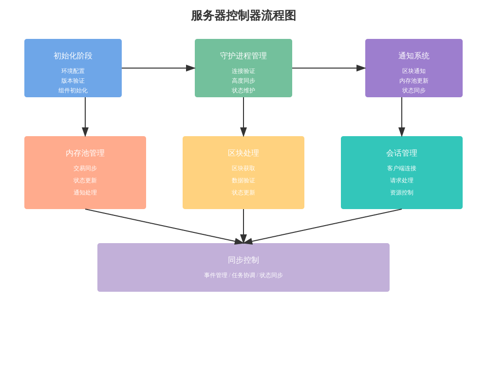

# 控制器和通知系统详细分析

## 1. 通知系统设计

### 1.1 基础结构
```python
class Notifications:
    def __init__(self):
        # 内存池和区块处理的通知跟踪
        self._touched_mp = {}     # 内存池通知
        self._touched_bp = {}     # 区块处理通知
        self._highest_block = -1  # 最高区块高度
```

### 1.2 通知处理
```python
async def _maybe_notify(self):
    """通知处理逻辑"""
    # 处理内存池和区块通知的交集
    tmp, tbp = self._touched_mp, self._touched_bp
    common = set(tmp).intersection(tbp)
    # 确定通知高度
    if common:
        height = max(common)
    elif tmp and max(tmp) == self._highest_block:
        height = self._highest_block
    else:
        return
```

## 2. 控制器实现

### 2.1 服务启动流程
```python
async def serve(self, shutdown_event):
    """启动服务流程"""
    # 版本检查
    if not (0, 23, 0) <= aiorpcx_version < (0, 24):
        raise RuntimeError("aiorpcX version 0.23.x is required")
        
    # 环境初始化
    env = self.env
    notifications = Notifications()
    Daemon = env.coin.DAEMON
    BlockProcessor = env.coin.BLOCK_PROCESSOR
```

### 2.2 组件协调
```python
async def wait_for_catchup():
    """等待同步完成"""
    await caught_up_event.wait()
    await group.spawn(db.populate_header_merkle_cache())
    await group.spawn(mempool.keep_synchronized(mempool_event))
```

## 3. 核心功能模块

### 3.1 区块处理器
```python
bp = BlockProcessor(env, db, daemon, notifications)
# 配置通知接口
notifications.height = daemon.height
notifications.db_height = get_db_height
notifications.cached_height = daemon.cached_height
```

### 3.2 内存池管理
```python
mempool = MemPool(
    env.coin,
    notifications,
    refresh_secs=env.daemon_poll_interval_mempool_msec/1000
)
```

### 3.3 会话管理
```python
session_mgr = SessionManager(
    env, db, bp, daemon, mempool, shutdown_event
)
```

## 4. 事件处理机制

### 4.1 通知事件
```python
async def on_mempool(self, touched, height):
    """内存池更新事件"""
    self._touched_mp[height] = touched
    await self._maybe_notify()

async def on_block(self, touched, height):
    """区块更新事件"""
    self._touched_bp[height] = touched
    self._highest_block = height
    await self._maybe_notify()
```

### 4.2 同步事件
```python
# 同步事件定义
caught_up_event = Event()   # 赶上区块链事件
mempool_event = Event()     # 内存池同步事件
```

## 5. 任务管理

### 5.1 任务组织
```python
async with OldTaskGroup() as group:
    # 服务任务
    await group.spawn(session_mgr.serve(notifications, mempool_event))
    # 区块处理任务
    await group.spawn(bp.fetch_and_process_blocks(caught_up_event))
    # 等待同步任务
    await group.spawn(wait_for_catchup())
```

### 5.2 任务协调
- 使用事件控制任务同步
- 异步任务并发执行
- 资源合理分配

## 6. 异常处理

### 6.1 版本检查
```python
if not (0, 23, 0) <= aiorpcx_version < (0, 24):
    raise RuntimeError("aiorpcX version 0.23.x is required")
```

### 6.2 状态验证
```python
# 守护进程验证
await daemon.height()
```

## 7. 性能优化

### 7.1 通知优化
- 合并重复通知
- 延迟处理机制
- 批量通知处理

### 7.2 资源管理
- 异步任务控制
- 内存使用优化
- 连接池管理

## 8. 扩展建议

### 8.1 功能扩展
1. 监控指标收集
2. 性能统计
3. 日志增强

### 8.2 可靠性提升
1. 故障恢复机制
2. 状态持久化
3. 备份策略

## 9. 使用示例

### 9.1 基本使用
```python
controller = Controller(env)
await controller.serve(shutdown_event)
```

### 9.2 通知处理
```python
notifications = Notifications()
notifications.notify = custom_notify_handler
await notifications.start(height, notify_func)
```