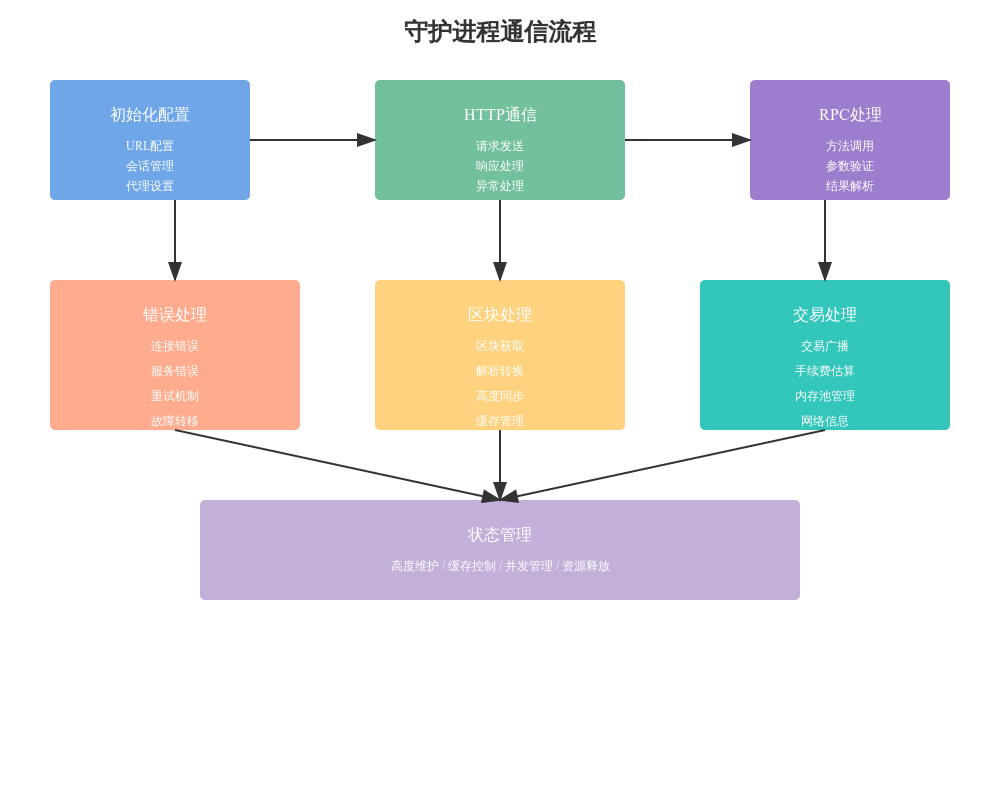

# 守护进程(Daemon)代码详细分析

## 1. 核心组件设计

### 1.1 基础结构
```python
class Daemon:
    """处理与区块链守护进程的异步连接"""
    WARMING_UP = -28
    id_counter = itertools.count()

    def __init__(self, coin, url, *, max_workqueue=10, 
                 init_retry=0.25, max_retry=4.0, proxy_url=None):
        self.coin = coin
        self.url_index = None
        self.urls = []
        self.proxy_url = proxy_url
        self.workqueue_semaphore = asyncio.Semaphore(value=max_workqueue)
```

### 1.2 会话管理
```python
async def __aenter__(self):
    """异步上下文管理器入口"""
    self.session = aiohttp.ClientSession(connector=self.connector())
    return self

async def __aexit__(self, exc_type, exc_value, traceback):
    """异步上下文管理器退出"""
    await self.session.close()
    self.session = None
```

## 2. 通信机制实现

### 2.1 数据发送
```python
async def _send_data(self, data):
    """发送数据到守护进程"""
    async with self.workqueue_semaphore:
        if self.session:
            async with self.session.post(self.current_url(), 
                data=data, proxy=self.proxy_url) as resp:
                kind = resp.headers.get('Content-Type', None)
                if kind == 'application/json':
                    return await resp.json(loads=json_deserialize)
```

### 2.2 请求重试
```python
async def _send(self, payload, processor):
    """处理临时连接问题的发送机制"""
    retry = self.init_retry
    while True:
        try:
            result = await self._send_data(data)
            return processor(result)
        except asyncio.TimeoutError:
            log_error("timeout error")
        await asyncio.sleep(retry)
        retry = max(min(self.max_retry, retry * 2), self.init_retry)
```

## 3. RPC功能实现

### 3.1 单个请求
```python
async def _send_single(self, method, params=None):
    """发送单个RPC请求"""
    payload = {
        'method': method,
        'id': next(self.id_counter)
    }
    if params:
        payload['params'] = params
    return await self._send(payload, processor)
```

### 3.2 批量请求
```python
async def _send_vector(self, method, params_iterable, replace_errs=False):
    """发送多个相同方法的请求"""
    payload = [
        {'method': method, 'params': p, 'id': next(self.id_counter)}
        for p in params_iterable
    ]
    return await self._send(payload, processor)
```

## 4. 区块处理功能

### 4.1 区块获取
```python
async def raw_blocks(self, hex_hashes):
    """获取指定哈希的原始区块数据"""
    params_iterable = ((h, False) for h in hex_hashes)
    blocks = await self._send_vector('getblock', params_iterable)
    return [hex_to_bytes(block) for block in blocks]
```

### 4.2 高度同步
```python
async def height(self):
    """查询守护进程当前高度"""
    self._height = await self._send_single('getblockcount')
    return self._height
```

## 5. 交易处理功能

### 5.1 交易广播
```python
async def broadcast_transaction(self, raw_tx):
    """广播交易到网络"""
    return await self._send_single('sendrawtransaction', (raw_tx,))
```

### 5.2 内存池管理
```python
async def mempool_hashes(self):
    """获取内存池中的交易哈希"""
    return await self._send_single('getrawmempool')
```

## 6. 错误处理机制

### 6.1 异常定义
```python
class DaemonError(Exception):
    """守护进程返回错误时抛出"""

class WarmingUpError(Exception):
    """守护进程预热中时抛出"""

class ServiceRefusedError(Exception):
    """服务拒绝时抛出"""
```

### 6.2 故障转移
```python
def failover(self):
    """切换到下一个守护进程URL"""
    if len(self.urls) > 1:
        self.url_index = (self.url_index + 1) % len(self.urls)
        return True
    return False
```

## 7. 性能优化

### 7.1 并发控制
- 使用信号量控制并发请求数
- 实现请求队列管理
- 优化资源使用

### 7.2 缓存机制
- 网络信息缓存
- 区块高度缓存
- RPC方法可用性缓存

## 8. 扩展功能

### 8.1 特殊实现
- DashDaemon: Dash特定功能支持
- DecredDaemon: Decred特定功能支持
- LegacyRPCDaemon: 旧版RPC支持

### 8.2 模拟功能
- FakeEstimateFeeDaemon: 手续费估算模拟
- FakeEstimateLegacyRPCDaemon: 旧版手续费估算模拟

## 9. 最佳实践

### 9.1 初始化配置
1. 合理设置重试参数
2. 配置适当的并发限制
3. 启用故障转移机制

### 9.2 错误处理
1. 实现优雅的重试机制
2. 合理的故障转移策略
3. 完善的日志记录