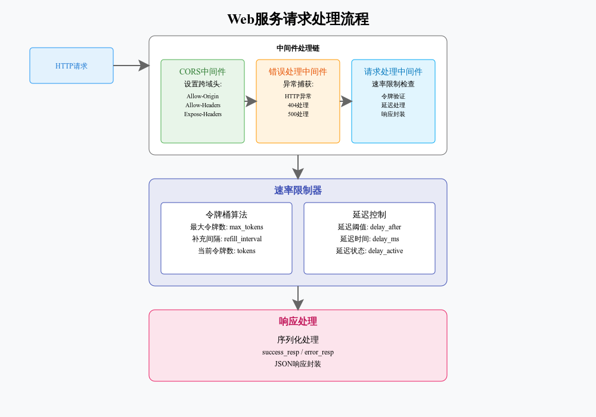

# Web服务中间件与速率限制实现文档

## 目录
1. [系统概述](#系统概述)
2. [核心组件](#核心组件)
3. [详细代码解析](#详细代码解析)
4. [配置说明](#配置说明)
5. [使用指南](#使用指南)

## 系统概述

这是一个基于 aiohttp 的 Web 服务框架实现，主要功能包括：
- 请求速率限制
- 跨域请求处理
- 统一错误处理
- 响应格式规范化

### 技术栈
- Python 3.7+
- aiohttp
- asyncio

## 核心组件

### 1. RateLimiter 类
速率限制器的核心实现，使用令牌桶算法。

```python
class RateLimiter:
    def __init__(self, max_tokens, refill_interval, delay_after, delay_ms):
        self.tokens = int(max_tokens)          # 当前可用令牌数
        self.last_refill = asyncio.get_event_loop().time()  # 上次补充时间
        self.max_tokens = int(max_tokens)      # 最大令牌数
        self.refill_interval = float(refill_interval)  # 补充间隔
        self.delay_after = int(delay_after)    # 延迟触发阈值
        self.delay_ms = float(delay_ms)        # 延迟时间
        self.delay_active = False              # 延迟状态
```

参数说明：
- `max_tokens`: 令牌桶最大容量
- `refill_interval`: 令牌补充时间间隔
- `delay_after`: 触发延迟的请求数阈值
- `delay_ms`: 延迟处理的毫秒数

### 2. 中间件实现

#### CORS中间件
```python
def cors_middleware(self) -> web_middlewares:
    async def factory(app: web.Application, handler):
        async def middleware_handler(request):
            response = await handler(request)
            response.headers["Access-Control-Allow-Origin"] = "*"
            response.headers["Access-Control-Allow-Headers"] = "*"
            response.headers["Access-Control-Expose-Headers"] = "*"
            return response
        return middleware_handler
    return factory
```

功能说明：
- 添加跨域访问所需的响应头
- 允许任意来源的跨域请求
- 支持所有请求头和响应头

#### 错误处理中间件
```python
def error_middleware(self) -> web_middlewares:
    async def factory(app: web.Application, handler):
        async def middleware_handler(request):
            try:
                response = await handler(request)
                if response.status in [404, 400]:
                    return error_resp(response.status, Exception(response.text))
                return response
            except web.HTTPException as ex:
                if ex.status == 404:
                    return error_resp(ex.status, ex)
                raise
            except Exception as e:
                return error_resp(500, e)
        return middleware_handler
    return factory
```

错误处理逻辑：
- 捕获 404/400 状态码
- 处理 HTTP 异常
- 封装统一错误响应
- 记录异常日志

### 3. 响应处理工具

#### 数据序列化
```python
def serialize_data(data):
    if isinstance(data, bytes):
        return base64.b64encode(data).decode("utf-8")
    elif isinstance(data, dict):
        return {key: serialize_data(value) for key, value in data.items()}
    elif isinstance(data, list):
        return [serialize_data(element) for element in data]
    else:
        return data
```

序列化特点：
- 支持字节数据的 Base64 编码
- 递归处理嵌套字典和列表
- 保持其他数据类型不变

## 配置说明

### 环境变量配置

```python
rate_limiter = RateLimiter(
    max_tokens=os.environ.get("MAX_TOKENS", 10000),
    refill_interval=os.environ.get("RATE_LIMIT_WINDOW_SECONDS", 3),
    delay_after=os.environ.get("RATE_LIMIT_DELAY_AFTER", 5),
    delay_ms=os.environ.get("RATE_LIMIT_DELAY_MS", 300),
)
```

配置项说明：
1. `MAX_TOKENS`
   - 默认值：10000
   - 作用：控制并发请求数量
   - 建议：根据服务器性能调整

2. `RATE_LIMIT_WINDOW_SECONDS`
   - 默认值：3
   - 作用：令牌补充周期
   - 建议：按实际吞吐量需求设置

3. `RATE_LIMIT_DELAY_AFTER`
   - 默认值：5
   - 作用：延迟处理触发阈值
   - 建议：观察服务负载情况调整

4. `RATE_LIMIT_DELAY_MS`
   - 默认值：300
   - 作用：请求延迟处理时间
   - 建议：根据用户体验要求调整

## 使用指南

### 1. 基本使用

```python
from aiohttp import web

app = web.Application()
app.middlewares.extend([
    cors_middleware(),
    error_middleware(),
    request_middleware()
])
```

### 2. 速率限制配置

根据实际需求修改环境变量：
```bash
export MAX_TOKENS=5000
export RATE_LIMIT_WINDOW_SECONDS=5
export RATE_LIMIT_DELAY_AFTER=3
export RATE_LIMIT_DELAY_MS=200
```

### 3. 响应处理

成功响应：
```python
return success_resp({
    "data": your_data,
    "message": "操作成功"
})
```

错误响应：
```python
return error_resp(
    status_code=400,
    exception=Exception("参数错误")
)
```

### 4. 最佳实践

1. 速率限制
   - 监控令牌使用情况
   - 适时调整限流参数
   - 添加监控告警

2. 错误处理
   - 提供详细错误信息
   - 记录错误日志
   - 定期检查错误模式

3. 响应格式
   - 统一使用响应工具函数
   - 确保数据正确序列化
   - 保持响应结构一致

## 常见问题

1. 速率限制不生