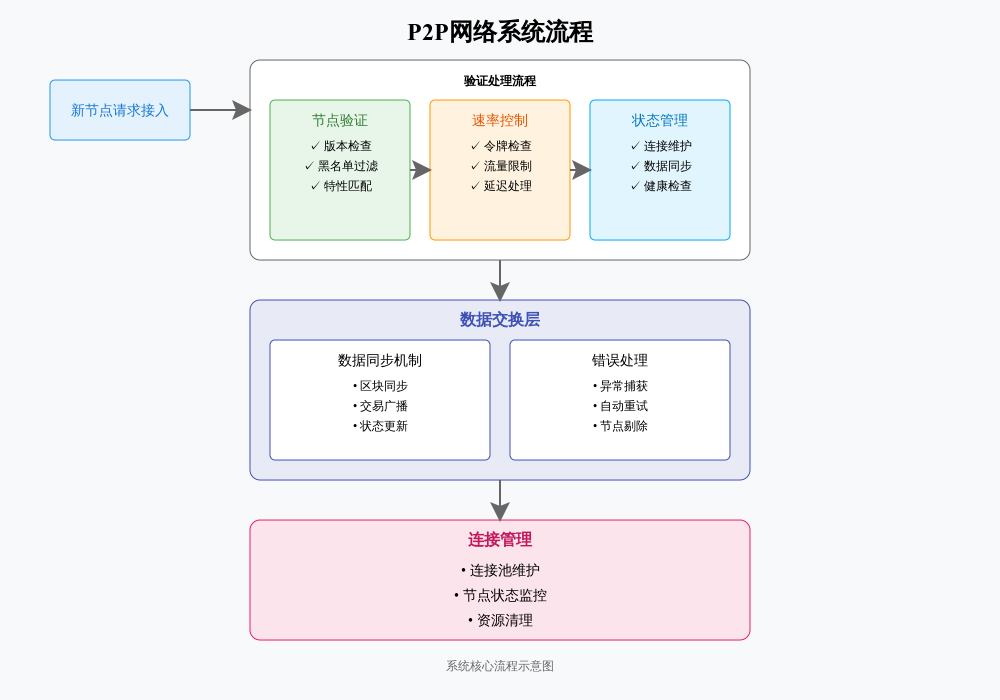

# Peer Management 系统详解

## 1. 系统概述

Peer Management 是一个用于管理和维护点对点网络连接的系统。它主要负责:
- 发现和连接新的节点
- 维护现有节点的连接状态
- 处理节点之间的通信
- 确保网络的稳定性和安全性

## 2. 核心组件

### 2.1 PeerManager 类
```python
class PeerManager:
    def __init__(self, env: "Env", db: "DB"):
        self.peers = set()              # 当前所有的peer集合
        self.proxy = None              # 代理服务器配置
        self.blacklist = set()         # 黑名单列表
```

这是整个系统的核心类，负责:
- 管理所有的 peer 连接
- 处理代理设置
- 维护黑名单
- 控制连接状态

### 2.2 PeerSession 类
```python
class PeerSession(RPCSession):
    async def handle_request(self, request):
        if isinstance(request, Notification):
            if request.method == "blockchain.headers.subscribe":
                pass
        else:
            await handler_invocation(None, request)
```

负责:
- 处理单个 peer 的会话
- 管理 RPC 请求
- 处理订阅通知

## 3. 核心功能详解

### 3.1 Peer 发现机制

```python
async def discover_peers(self):
    """执行 peer 维护，包括：
    1. 忘记无法访问的 peer
    2. 验证新 peer 的连接性
    3. 定期重试旧的 peer
    """
```

工作流程:
1. 检查环境配置
2. 启动代理检测
3. 导入初始 peer
4. 开始发现新的 peer

### 3.2 连接验证机制

```python
async def _verify_peer(self, session, peer):
    # 1. 检查IP地址
    if not peer.is_tor:
        address = session.remote_address()
        
    # 2. 检查黑名单
    if self._is_blacklisted(peer):
        raise BadPeerError("blacklisted")
        
    # 3. 版本验证
    result = await session.send_request("server.version")
```

验证步骤:
1. 检查 peer 的 IP 地址
2. 验证是否在黑名单中
3. 进行版本协商
4. 订阅头部信息
5. 交换服务器特性

### 3.3 速率限制实现

```python
class RateLimiter:
    def __init__(self, max_tokens, refill_interval, delay_after, delay_ms):
        self.tokens = int(max_tokens)          # 当前可用令牌
        self.max_tokens = int(max_tokens)      # 最大令牌数
        self.refill_interval = float(refill_interval)  # 补充间隔
```

关键特性:
- 使用令牌桶算法
- 支持自动补充令牌
- 可配置的延迟处理

## 4. 错误处理机制

### 4.1 异常处理
```python
async def error_middleware(self) -> web_middlewares:
    async def factory(app: web.Application, handler):
        async def middleware_handler(request):
            try:
                response = await handler(request)
                return response
            except Exception as e:
                return error_resp(500, e)
```

处理的异常类型:
- 网络连接错误
- 协议错误
- 验证失败
- 系统异常

### 4.2 错误响应格式
```python
def error_resp(status_code: int, exception: Exception) -> web.Response:
    result = {
        "success": False,
        "code": 1,
        "message": str(exception)
    }
    return web.json_response(data=result, status=status_code)
```

## 5. 配置说明

### 5.1 环境变量
主要配置项:
```python
rate_limiter = RateLimiter(
    max_tokens=os.environ.get("MAX_TOKENS", 10000),
    refill_interval=os.environ.get("RATE_LIMIT_WINDOW_SECONDS", 3),
    delay_after=os.environ.get("RATE_LIMIT_DELAY_AFTER", 5),
    delay_ms=os.environ.get("RATE_LIMIT_DELAY_MS", 300),
)
```

配置说明:
- `MAX_TOKENS`: 最大令牌数量
- `RATE_LIMIT_WINDOW_SECONDS`: 令牌补充时间窗口
- `RATE_LIMIT_DELAY_AFTER`: 延迟处理触发阈值
- `RATE_LIMIT_DELAY_MS`: 延迟处理时间

## 6. 最佳实践建议

### 6.1 配置优化
- 根据服务器性能调整令牌数量
- 适当设置延迟处理参数
- 定期更新黑名单列表

### 6.2 错误处理
- 总是使用 try-except 包装异步操作
- 保持详细的错误日志
- 实现优雅的降级策略

### 6.3 性能优化
- 控制并发连接数量
- 适时清理无效连接
- 监控系统资源使用

## 7. 调试技巧

### 7.1 日志分析
```python
self.logger.info(f"peer discovery: {self.env.peer_discovery}")
self.logger.warning(f"rejected add_peer request from {source}")
```

关注点:
- 连接建立/断开日志
- 错误和警告信息
- 性能相关指标

### 7.2 常见问题排查
1. 连接失败
   - 检查网络配置
   - 验证代理设置
   - 检查防火墙规则

2. 性能问题
   - 检查令牌限制设置
   - 监控连接数量
   - 分析响应时间

## 8. 代码示例

### 8.1 添加新的 Peer
```python
async def add_localRPC_peer(self, real_name):
    """通过本地RPC添加新的peer"""
    await self._note_peers(
        [Peer.from_real_name(real_name, "RPC")],
        check_ports=True
    )
```

### 8.2 Peer 状态检查
```python
def info(self):
    """获取peer数量统计信息"""
    self._set_peer_statuses()
    counter = Counter(peer.status for peer in self.peers)
    return {
        "bad": counter[PEER_BAD],
        "good": counter[PEER_GOOD],
        "never": counter[PEER_NEVER],
        "stale": counter[PEER_STALE],
        "total": len(self.peers),
    }
```

这个系统提供了完整的点对点网络管理功能，通过合理的配置和使用可以构建稳定、高效的分布式网络。