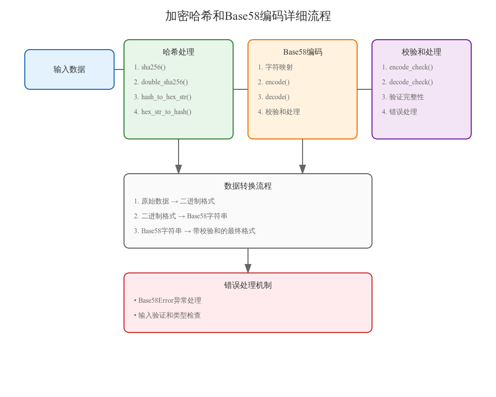

# 加密哈希和Base58编码实现详细解析

## 一、代码结构概述

### 1. 导入的依赖
```python
import hashlib
import hmac
from electrumx.lib.util import bytes_to_int, hex_to_bytes, int_to_bytes
```

这些依赖提供了基础的加密和数据转换功能。

### 2. 全局常量和优化
```python
_sha256 = hashlib.sha256
_new_hash = hashlib.new
_hmac_digest = hmac.digest
HASHX_LEN = 11
```

通过缓存常用函数引用来优化性能。

## 二、核心功能实现

### 1. 基础哈希函数

#### 1.1 单重SHA256
```python
def sha256(x):
    """简单封装的hashlib sha256"""
    return _sha256(x).digest()
```
- 输入：任意二进制数据
- 输出：32字节的哈希值
- 用途：基础的数据哈希计算

#### 1.2 双重SHA256
```python
def double_sha256(x):
    """比特币中使用的双重SHA-256"""
    return sha256(sha256(x))
```
- 输入：任意二进制数据
- 输出：经过两次SHA256的32字节哈希值
- 特点：提供更高的安全性

### 2. 格式转换函数

#### 2.1 哈希值转十六进制
```python
def hash_to_hex_str(x):
    return bytes(reversed(x)).hex()
```
- 功能：将二进制哈希转换为可读的十六进制字符串
- 特点：使用大端序表示

#### 2.2 十六进制转哈希值
```python
def hex_str_to_hash(x):
    return bytes(reversed(hex_to_bytes(x)))
```
- 功能：将十六进制字符串转回二进制哈希
- 特点：处理字节序转换

## 三、Base58编码实现

### 1. Base58类定义
```python
class Base58:
    chars = "123456789ABCDEFGHJKLMNPQRSTUVWXYZabcdefghijkmnopqrstuvwxyz"
    cmap = {c: n for n, c in enumerate(chars)}
```
- 字符集：58个字符，不包含容易混淆的字符
- 映射表：预计算字符到数值的映射

### 2. 核心编码方法

#### 2.1 编码方法
```python
@staticmethod
def encode(be_bytes):
    """将字节数组转换为Base58字符串"""
    value = bytes_to_int(be_bytes)
    txt = ""
    while value:
        value, mod = divmod(value, 58)
        txt += Base58.chars[mod]
    # 处理前导零
    for byte in be_bytes:
        if byte != 0:
            break
        txt += "1"
    return txt[::-1]
```

#### 2.2 解码方法
```python
@staticmethod
def decode(txt):
    """将Base58字符串解码为字节数组"""
    value = 0
    for c in txt:
        value = value * 58 + Base58.char_value(c)
    result = int_to_bytes(value)
    # 处理前导零
    count = 0
    for c in txt:
        if c != "1":
            break
        count += 1
    if count:
        result = bytes(count) + result
    return result
```

### 3. 校验和功能

#### 3.1 编码校验
```python
@staticmethod
def encode_check(payload, *, hash_fn=double_sha256):
    """添加校验和并编码"""
    be_bytes = payload + hash_fn(payload)[:4]
    return Base58.encode(be_bytes)
```

#### 3.2 解码校验
```python
@staticmethod
def decode_check(txt, *, hash_fn=double_sha256):
    """解码并验证校验和"""
    be_bytes = Base58.decode(txt)
    result, check = be_bytes[:-4], be_bytes[-4:]
    if check != hash_fn(result)[:4]:
        raise Base58Error(f"invalid base 58 checksum for {txt}")
    return result
```

## 四、错误处理机制

### 1. 自定义异常类
```python
class Base58Error(Exception):
    """Base58专用异常类"""
```

### 2. 主要错误检查
- 输入类型验证
- 空字符串检查
- 字符有效性验证
- 校验和正确性检查

## 五、性能优化措施

1. 函数引用缓存
2. 字符映射表预计算
3. 静态方法使用
4. 就地字符串构建

## 六、使用注意事项

1. 输入数据要求：
   - Base58编码输入必须是字符串
   - 解码输入必须是有效的Base58字符

2. 错误处理：
   - 捕获Base58Error异常
   - 验证校验和完整性

3. 性能考虑：
   - 大数据量时注意内存使用
   - 考虑批处理机制

4. 安全建议：
   - 使用带校验和的方法
   - 保持加密库更新