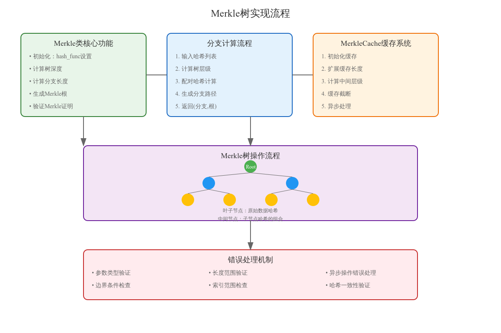

# Merkle树实现详细文档

## 一、核心类设计

### 1. Merkle类
实现了Merkle树的基本操作和计算功能。

```python
class Merkle:
    def __init__(self, hash_func=double_sha256):
        self.hash_func = hash_func
```

#### 1.1 核心方法

##### tree_depth方法
```python
def tree_depth(self, hash_count):
    """计算Merkle树的深度"""
    return self.branch_length(hash_count) + 1
```
- 功能：计算给定哈希数量对应的树深度
- 返回：树的总层数（从叶子到根的层数）

##### branch_length方法
```python
def branch_length(self, hash_count):
    """计算Merkle分支长度"""
    if not isinstance(hash_count, int):
        raise TypeError("hash_count must be an integer")
    if hash_count < 1:
        raise ValueError("hash_count must be at least 1")
    return ceil(log(hash_count, 2))
```
- 功能：计算Merkle分支的长度
- 参数验证：确保输入为正整数
- 实现：使用log2计算所需层数

### 2. MerkleCache类
实现了Merkle树的缓存机制，提高计算效率。

```python
class MerkleCache:
    def __init__(self, merkle, source_func):
        self.merkle = merkle
        self.source_func = source_func
        self.length = 0
        self.level = []
        self.depth_higher = 0
        self.initialized = Event()
```

#### 2.1 缓存管理方法

##### initialize方法
```python
async def initialize(self, length):
    """初始化缓存"""
    self.length = length
    self.depth_higher = self.merkle.tree_depth(length) // 2
    self.level = self._level(await self.source_func(0, length))
    self.initialized.set()
```

##### _extend_to方法
```python
async def _extend_to(self, length):
    """扩展缓存长度"""
    if length <= self.length:
        return
    start = self._leaf_start(self.length)
    hashes = await self.source_func(start, length - start)
    self.level[start >> self.depth_higher:] = self._level(hashes)
    self.length = length
```

## 二、核心算法实现

### 1. 分支和根计算

#### 1.1 branch_and_root方法
```python
def branch_and_root(self, hashes, index, length=None):
    """计算Merkle分支和根"""
    # 基本验证
    if not isinstance(index, int):
        raise TypeError("index must be an integer")
    if not 0 <= index < len(hashes):
        raise ValueError("index out of range")
    
    # 分支计算
    hash_func = self.hash_func
    branch = []
    for _ in range(length):
        if len(hashes) & 1:
            hashes.append(hashes[-1])
        branch.append(hashes[index ^ 1])
        index >>= 1
        hashes = [hash_func(hashes[n] + hashes[n + 1]) 
                 for n in range(0, len(hashes), 2)]
    
    return branch, hashes[0]
```

### 2. Merkle证明验证

#### 2.1 root_from_proof方法
```python
def root_from_proof(self, hash, branch, index):
    """从证明中验证并计算根"""
    hash_func = self.hash_func
    for elt in branch:
        if index & 1:
            hash = hash_func(elt + hash)
        else:
            hash = hash_func(hash + elt)
        index >>= 1
    if index:
        raise ValueError("index out of range for branch")
    return hash
```

## 三、性能优化

### 1. 缓存策略
- 使用MerkleCache类管理中间计算结果
- 实现异步加载和计算
- 智能截断机制避免内存浪费

### 2. 计算优化
1. 位运算优化：
   ```python
   index >>= 1  # 快速除以2
   index ^ 1    # 快速切换相邻索引
   ```
2. 列表推导式优化：
   ```python
   hashes = [hash_func(hashes[n] + hashes[n + 1]) 
            for n in range(0, len(hashes), 2)]
   ```

## 四、错误处理

### 1. 输入验证
```python
if not isinstance(hash_count, int):
    raise TypeError("hash_count must be an integer")
if hash_count < 1:
    raise ValueError("hash_count must be at least 1")
```

### 2. 边界检查
```python
if not 0 <= index < len(hashes):
    raise ValueError("index out of range")
```

### 3. 一致性验证
```python
if leaf_root != level[index]:
    raise ValueError("leaf hashes inconsistent with level")
```

## 五、使用注意事项

### 1. 初始化和配置
- 选择合适的哈希函数
- 正确初始化缓存系统
- 设置适当的树深度

### 2. 性能考虑
- 合理使用缓存机制
- 注意大数据量处理
- 异步操作的正确使用

### 3. 安全性考虑
- 验证所有输入数据
- 检查