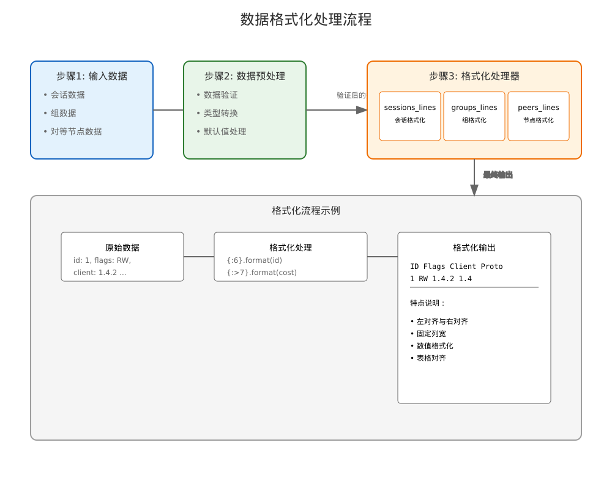

# 数据格式化实现详细文档

## 一、整体设计

代码实现了三个主要的格式化生成器函数，用于处理不同类型的数据：
1. sessions_lines: 处理会话数据
2. groups_lines: 处理组数据
3. peers_lines: 处理对等节点数据

### 1. 通用特性
- 使用生成器模式
- 统一的表格式输出
- 标准化的数值格式化
- 一致的对齐处理

## 二、核心功能实现

### 1. 会话数据格式化
```python
def sessions_lines(data):
    """会话数据格式化生成器"""
    fmt = "{:<6} {:<5} {:>17} {:>5} {:>7} {:>7} {:>5} {:>5} {:>7} {:>7} {:>7} {:>7} {:>7} {:>9} {:>21}"
    
    # 生成表头
    yield fmt.format("ID", "Flags", "Client", "Proto", 
                    "Cost", "XCost", "Reqs", "Txs", "Subs",
                    "Recv", "Recv KB", "Sent", "Sent KB", 
                    "Time", "Peer")
    
    # 格式化数据行
    for (id_, flags, peer, client, proto, cost, extra_cost,
         reqs, txs_sent, subs, recv_count, recv_size,
         send_count, send_size, conn_time) in data:
        yield fmt.format(
            id_, flags, client, proto,
            f"{int(cost):,d}", f"{int(extra_cost):,d}",
            f"{reqs:,d}", f"{txs_sent:,d}", f"{subs:,d}",
            f"{recv_count:,d}", f"{recv_size // 1024:,d}",
            f"{send_count:,d}", f"{send_size // 1024:,d}",
            util.formatted_time(conn_time, sep=""),
            peer
        )
```

格式化说明：
1. `{:<6}`: 左对齐，宽度6
2. `{:>17}`: 右对齐，宽度17
3. `{:,d}`: 添加千位分隔符的整数

### 2. 组数据格式化
```python
def groups_lines(data):
    """组数据格式化生成器"""
    fmt = "{:<14} {:>9} {:>8} {:>8} {:>6} {:>6} {:>8}" \
          "{:>7} {:>9} {:>7} {:>9}"
    
    # 生成表头
    yield fmt.format(
        "Name", "Sessions", "Cost", "Retained",
        "Reqs", "Txs", "Subs", "Recv",
        "Recv KB", "Sent", "Sent KB"
    )
    
    # 格式化数据行
    for (name, session_count, cost, retained_cost,
         reqs, txs_sent, subs, recv_count, recv_size,
         send_count, send_size) in data:
        yield fmt.format(
            name,
            f"{session_count:,d}", f"{int(cost):,d}",
            f"{int(retained_cost):,d}", f"{reqs:,d}",
            f"{txs_sent:,d}", f"{subs:,d}",
            f"{recv_count:,d}", f"{recv_size // 1024:,d}",
            f"{send_count:,d}", f"{send_size // 1024:,d}"
        )
```

### 3. 对等节点数据格式化
```python
def peers_lines(data):
    """对等节点数据格式化生成器"""
    def time_fmt(t):
        """时间格式化辅助函数"""
        if not t:
            return "Never"
        return util.formatted_time(now - t)

    now = time.time()
    fmt = "{:<62} {:<6} {:>5} {:>5} {:<17} {:>4} " \
          "{:>4} {:>8} {:>11} {:>11} {:>5} {:>20} {:<15}"
    
    # 格式化实现...
```

## 三、关键技术点

### 1. 格式化控制符
- `:<` 左对齐
- `:>` 右对齐
- `:,d` 千位分隔的整数
- `//` 整除（用于KB计算）

### 2. 数据处理技巧
```python
# 字节到KB的转换
recv_size // 1024

# 时间格式化
util.formatted_time(conn_time, sep="")

# 条件时间显示
"Never" if not t else util.formatted_time(now - t)
```

### 3. 性能优化
1. 使用生成器而非列表
2. 预编译格式化字符串
3. 复用时间计算结果

## 四、使用示例

### 1. 会话数据格式化
```python
# 使用示例
session_data = [
    (1, "RW", "peer1", "1.4", "tcp", 100, 50, 
     10, 5, 3, 1000, 2048, 500, 1024, 1600000000)
]
for line in sessions_lines(session_data):
    print(line)
```

### 2. 组数据格式化
```python
# 使用示例
group_data = [
    ("default", 10, 1000, 500, 100, 
     50, 20, 5000, 10240, 2500, 5120)
]
for line in groups_lines(group_data):
    print(line)
```

## 五、注意事项

### 1. 数据验证
- 确保输入数据完整性
- 处理可能的空值
- 验证数值类型

### 2. 格式控制
- 保持列宽一致
- 确保对齐正确
- 处理超长字符串

### 3. 性能考虑
- 大数据量处理
- 内存使用控制
- 格式化效率

## 六、最佳实践

### 1. 代码组织
1. 将格式化字符串定义为常量
2. 使用辅助函数处理复杂逻辑
3. 保持代码结构清晰

### 2. 错误处理
1. 处理异常输入
2. 提供合理默认值
3. 记录异常情况

### 3. 维护建议
1. 注释格式化模式
2. 文档化特殊处理
3. 定期检查输出对齐