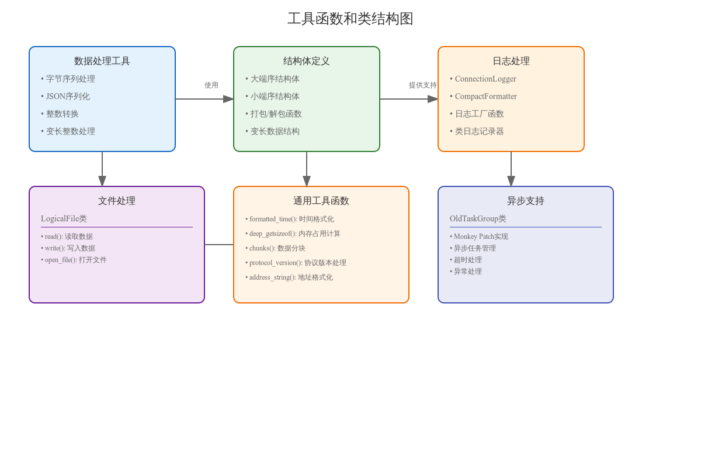

# 工具函数和类实现详细文档

## 一、核心功能模块

### 1. 数据序列化
```python
# JSON处理
try:
    import rapidjson as json
except ImportError:
    try:
        import ujson as json
    except ImportError:
        import json

json_deserialize = json.loads
json_serialize = json.dumps
```

性能优化说明：
- 优先使用rapidjson
- 备选使用ujson
- 最后使用标准库json

### 2. 日志处理

#### 2.1 ConnectionLogger
```python
class ConnectionLogger(logging.LoggerAdapter):
    """为日志消息添加连接标识符"""
    def process(self, msg, kwargs):
        conn_id = self.extra.get("conn_id", "unknown")
        return f"[{conn_id}] {msg}", kwargs
```

#### 2.2 CompactFormatter
```python
class CompactFormatter(logging.Formatter):
    """压缩日志格式，只保留类名"""
    def format(self, record):
        record.name = record.name.rpartition(".")[-1]
        return super().format(record)
```

### 3. 文件处理

#### 3.1 LogicalFile类
```python
class LogicalFile:
    """跨多个物理文件的逻辑二进制文件"""
    
    def __init__(self, prefix, digits, file_size):
        self.filename_fmt = f"{prefix}{{:0{digits:d}d}}"
        self.file_size = file_size
```

主要方法：
- read(): 读取数据
- write(): 写入数据
- open_file(): 打开文件

## 二、工具函数

### 1. 数据转换函数

#### 1.1 字节序列处理
```python
def bytes_to_int(be_bytes):
    """大端字节序列转整数"""
    return int.from_bytes(be_bytes, "big")

def int_to_bytes(value):
    """整数转大端字节序列"""
    return value.to_bytes((value.bit_length() + 7) // 8, "big")
```

#### 1.2 变长整数处理
```python
def pack_varint(n):
    """打包变长整数"""
    if n < 253:
        return pack_byte(n)
    if n < 65536:
        return pack_byte(253) + pack_le_uint16(n)
    if n < 4294967296:
        return pack_byte(254) + pack_le_uint32(n)
    return pack_byte(255) + pack_le_uint64(n)
```

### 2. 格式化函数

#### 2.1 时间格式化
```python
def formatted_time(t, sep=" "):
    """将秒数转换为天、小时、分钟格式"""
    t = int(t)
    fmts = (("{:d}d", 86400), ("{:02d}h", 3600), ("{:02d}m", 60))
    parts = []
    for fmt, n in fmts:
        val = t // n
        if parts or val:
            parts.append(fmt.format(val))
        t %= n
    if len(parts) < 3:
        parts.append(f"{t:02d}s")
    return sep.join(parts)
```

### 3. 协议处理

#### 3.1 版本处理
```python
def protocol_version(client_req, min_tuple, max_tuple):
    """处理协议版本协商"""
    # 实现协议版本协商逻辑...
```

## 三、异步支持

### 1. OldTaskGroup类
```python
class OldTaskGroup(aiorpcx.TaskGroup):
    """自动在join时抛出异常的任务组"""
    async def join(self):
        if self._wait is all:
            exc = False
            try:
                async for task in self:
                    if not task.cancelled():
                        task.result()
            except BaseException:
                exc = True
                raise
            finally:
                if exc:
                    await self.cancel_remaining()
                await super().join()
```

### 2. Monkey Patch实现
- 修复内存泄漏问题
- 优化超时处理机制
- 改进任务取消逻辑

## 四、性能优化

### 1. 数据结构优化
- 使用struct模块预定义结构
- 缓存常用结构实例
- 使用数组提高效率

### 2. 内存管理
```python
def deep_getsizeof(obj):
    """计算Python对象的内存占用"""
    # 实现递归内存计算...
```

## 五、使用注意事项

### 1. 文件操作
- 正确处理文件打开和关闭
- 注意异常处理
- 考虑并发访问

### 2. 日志处理
- 选择合适的日志级别
- 合理使用格式化器
- 注意性能影响

### 3. 异步编程
- 正确处理任务取消
- 注意超时处理
- 避免资源泄露