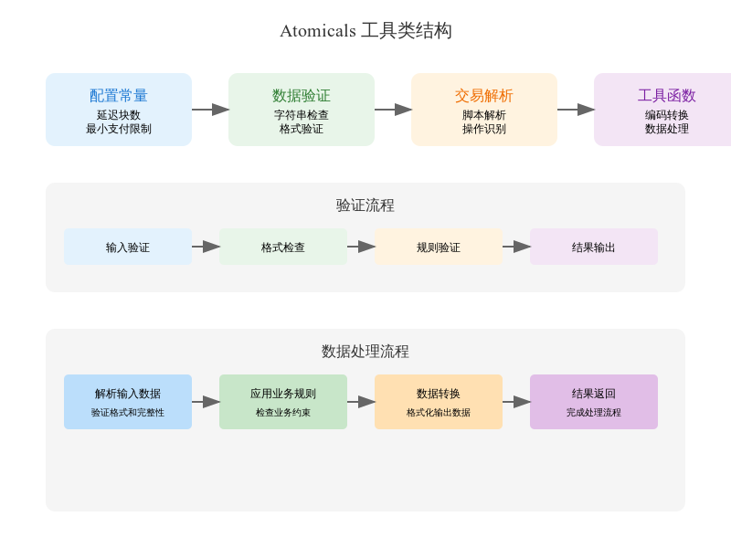

# Atomicals 协议工具类文档

`util_atomicals.py` 是 Atomicals 协议的核心工具类文件,提供了协议所需的基础功能实现。    

## 主要功能模块
### 1. 验证模块
#### 1.1 工作量证明验证
```python
def is_proof_of_work_prefix_match(tx_hash, powprefix, powprefix_ext=None)
```
验证交易哈希是否满足指定的工作量证明要求。
参数:
- tx_hash: 交易哈希 
- powprefix: 工作量证明前缀
- powprefix_ext: 扩展难度值(可选)
返回值:
- bool: 是否满足工作量证明要求
#### 1.2 Bitwork 字符串验证
```python
def is_valid_bitwork_string(bitwork)
```
验证 bitwork 字符串格式是否合法。
参数:
- bitwork: bitwork 字符串
返回值:
- bool: 是否合法
### 2. 名称系统
#### 2.1 Ticker 验证
```python
def is_valid_ticker_string(ticker)
```
验证代币简称(ticker)是否合法。
参数:
- ticker: 代币简称
返回值:
- bool: 是否合法

#### 2.2 Realm 验证
```python
def is_valid_realm_string_name(realm_name)
```
验证 realm 名称是否合法。
参数:
- realm_name: realm 名称
返回值:
- bool: 是否合法

### 3. 状态管理
#### 3.1 状态更新
```python
def apply_set_state_mutation(current_object, state_mutation_map, is_top_level)
```
应用状态变更。
参数:
- current_object: 当前对象
- state_mutation_map: 状态变更映射
- is_top_level: 是否为顶级对象
返回值:
- 更新后的对象
### 4. 操作解析
#### 4.1 协议操作解析
```python
def parse_protocols_operations_from_witness_array(tx, tx_hash, allow_args_bytes)
```
从交易见证数据中解析 Atomicals 协议操作。
参数:
- tx: 交易对象
- tx_hash: 交易哈希
- allow_args_bytes: 是否允许 args_bytes
返回值:
- 解析后的操作列表

## 错误处理
大多数函数在遇到错误时会:
1. 返回 False/None 表示验证失败
2. 抛出异常并附带详细错误信息

## 函数解析

```python
def pad_bytes_n(val, n):
    padlen = n
    if len(val) > padlen:
        raise ValueError("pad_bytes_n input val is out of range")
    new_val = val
    extra_bytes_needed = padlen - len(val)
    new_val = new_val + bytes(extra_bytes_needed)
    return new_val
```
--- 
- pad_bytes_n 函数的作用是将输入的字节序列 val 填充到指定的长度 n。如果 val 的长度超过了 n，则会抛出一个 ValueError。以下是函数的详细解释：
1. 参数：
 - val: 需要填充的字节序列。
 - n: 目标长度，函数会将 val 填充到这个长度。
2. 逻辑：
 - 首先，函数检查 val 的长度是否超过了 n。如果超过，则抛出一个 ValueError，提示输入的字节序列超出了范围。
 - 接着，计算需要填充的字节数 extra_bytes_needed，即 n 减去 val 的当前长度。
 - 然后，使用 bytes(extra_bytes_needed) 创建一个指定长度的空字节序列，并将其附加到 val 的末尾。
 - 最后，返回填充后的字节序列。
 - 这个函数通常用于确保字节序列的长度符合某个特定的要求，例如在加密或数据传输中，可能需要固定长度的字节序列。
--- 

```python
def pad_bytes64(val):
    return pad_bytes_n(val, 64)
```
--- 
- pad_bytes64 函数的作用是将输入的字节序列 val 填充到 64 字节长度。
- 这个函数通常用于确保字节序列的长度符合某个特定的要求，例如在加密或数据传输中，可能需要固定长度的字节序列。
--- 

```python
def unpack_mint_info(mint_info_value):
    if not mint_info_value:
        raise IndexError("unpack_mint_info mint_info_value is null. Index error.")
    return loads(mint_info_value)
```
--- 
- unpack_mint_info 函数的作用是将输入的 mint_info_value 解码为字典。
- 这个函数通常用于将字节序列解码为字典，例如在加密或数据传输中，可能需要将字节序列解码为字典。  
--- 

```python
def is_sanitized_dict_whitelist_only(d: dict, allow_bytes=False):
    if not isinstance(d, dict):
        return False
    for _, v in d.items():
        if isinstance(v, dict):
            return is_sanitized_dict_whitelist_only(v, allow_bytes)
        if not allow_bytes and isinstance(v, bytes):
            return False
```
--- 
- is_sanitized_dict_whitelist_only 函数的作用是检查输入的字典 d 是否只包含允许的键和值类型。
- 这个函数通常用于确保字典中的键和值类型符合某个特定的要求，例如在加密或数据传输中，可能需要确保字典中的键和值类型符合某个特定的要求。
---

```python
def is_integer_num(n):
    if isinstance(n, int):
        return True
    return False
```
---  
- is_integer_num 函数的作用是检查输入的 n 是否为整数。
- 这个函数通常用于确保输入的 n 是整数，例如在加密或数据传输中，可能需要确保输入的 n 是整数。
---  

```python
def is_hex_string(value):
    if not isinstance(value, str):
        return False
    try:
        int(value, 16)  # Throws ValueError if it cannot be validated as hex string
        return True
    except (ValueError, TypeError):
        pass
    return False
```
---
- is_hex_string 函数的作用是检查输入的 value 是否为十六进制字符串。
- 这个函数通常用于确保输入的 value 是十六进制字符串，例如在加密或数据传输中，可能需要确保输入的 value 是十六进制字符串。
--- 

```python
def is_hex_string_regex(value):
    if not isinstance(value, str):
        return False
    m = re.compile(r"^[a-z0-9]+$")
    if m.match(value):
        return True
    return False
```
--- 
- is_hex_string_regex 函数的作用是检查输入的 value 是否为十六进制字符串。
- 这个函数通常用于确保输入的 value 是十六进制字符串，例如在加密或数据传输中，可能需要确保输入的 value 是十六进制字符串。
--- 

```python
def is_atomical_id_long_form_string(value):
    if not value:
        return False
``` 
--- 
- is_atomical_id_long_form_string 函数的作用是检查输入的 value 是否为 Atomical ID 长格式字符串。
- 这个函数通常用于确保输入的 value 是 Atomical ID 长格式字符串，例如在加密或数据传输中，可能需要确保输入的 value 是 Atomical ID 长格式字符串。
--- 

```python
def is_atomical_id_short_form_string(value):
    if not value:
        return False
``` 
--- 
- is_atomical_id_short_form_string 函数的作用是检查输入的 value 是否为 Atomical ID 短格式字符串。
- 这个函数通常用于确保输入的 value 是 Atomical ID 短格式字符串，例如在加密或数据传输中，可能需要确保输入的 value 是 Atomical ID 短格式字符串。
--- 

```python
def is_atomical_id_long_form_bytes(value):
    if not isinstance(value, bytes):
        return False
``` 
--- 
- is_atomical_id_long_form_bytes 函数的作用是检查输入的 value 是否为 Atomical ID 长格式字节序列。
- 这个函数通常用于确保输入的 value 是 Atomical ID 长格式字节序列，例如在加密或数据传输中，可能需要确保输入的 value 是 Atomical ID 长格式字节序列。
--- 

```python
def is_compact_atomical_id(value):
    """Whether this is a compact atomical id or not"""
    if isinstance(value, int):
        return False
``` 
--- 
- is_compact_atomical_id 函数的作用是检查输入的 value 是否为 Atomical ID 短格式字符串。
- 这个函数通常用于确保输入的 value 是 Atomical ID 短格式字符串，例如在加密或数据传输中，可能需要确保输入的 value 是 Atomical ID 短格式字符串。
---

```python
def compact_to_location_id_bytes(value):
    """Convert the 36 byte atomical_id to the compact form with the "i" at the end"""
    if not value:
        raise TypeError("value in compact_to_location_id_bytes is not set")
```
--- 
- compact_to_location_id_bytes 函数的作用是将输入的 value 转换为 Atomical ID 短格式字符串。
- 这个函数通常用于将 Atomical ID 长格式字节序列转换为 Atomical ID 短格式字符串，例如在加密或数据传输中，可能需要将 Atomical ID 长格式字节序列转换为 Atomical ID 短格式字符串。
--- 

```python
def location_id_bytes_to_compact(location_id):
    (digit,) = unpack_le_uint32_from(location_id[32:])
    return f"{hash_to_hex_str(location_id[:32])}i{digit}"
```
--- 
- location_id_bytes_to_compact 函数的作用是将输入的 location_id 转换为 Atomical ID 短格式字符串。
- 这个函数通常用于将 Atomical ID 长格式字节序列转换为 Atomical ID 短格式字符串，例如在加密或数据传输中，可能需要将 Atomical ID 长格式字节序列转换为 Atomical ID 短格式字符串。
--- 

```python
def compact_to_location_id_bytes(value):
    """Convert the 36 byte atomical_id to the compact form with the "i" at the end"""
    if not value:
        raise TypeError("value in compact_to_location_id_bytes is not set")

    index_of_i = value.index("i")
    if index_of_i != 64:
        raise TypeError(f"{value} should be 32 bytes hex followed by i<number>")

    raw_hash = hex_str_to_hash(value[:64])

    if len(raw_hash) != 32:
        raise TypeError(f"{value} should be 32 bytes hex followed by i<number>")

    num = int(value[65:])

    if num < 0 or num > 100000:
        raise TypeError(f"{value} index output number was parsed to be less than 0 or greater than 100000")

    return raw_hash + pack_le_uint32(num)
```
--- 
- compact_to_location_id_bytes 函数的作用是将输入的 value 转换为 Atomical ID 长格式字节序列。
- 这个函数通常用于将 Atomical ID 短格式字符串转换为 Atomical ID 长格式字节序列，例如在加密或数据传输中，可能需要将 Atomical ID 短格式字符串转换为 Atomical ID 长格式字节序列。
--- 

```python
def location_id_bytes_to_compact(location_id):
    (digit,) = unpack_le_uint32_from(location_id[32:])
    return f"{hash_to_hex_str(location_id[:32])}i{digit}"
```
--- 
- location_id_bytes_to_compact 函数的作用是将输入的 location_id 转换为 Atomical ID 短格式字符串。
- 这个函数通常用于将 Atomical ID 长格式字节序列转换为 Atomical ID 短格式字符串，例如在加密或数据传输中，可能需要将 Atomical ID 长格式字节序列转换为 Atomical ID 短格式字符串。
--- 

```python
def get_tx_hash_index_from_location_id(location_id):
    (output_index,) = unpack_le_uint32_from(location_id[32:36])
    return location_id[:32], output_index
```
--- 
- get_tx_hash_index_from_location_id 函数的作用是从输入的 location_id 中提取出 tx_hash 和 output_index。
- 这个函数通常用于从 Atomical ID 短格式字符串中提取出 tx_hash 和 output_index，例如在加密或数据传输中，可能需要从 Atomical ID 短格式字符串中提取出 tx_hash 和 output_index。
--- 

```python
def is_valid_dmt_op_format(tx_hash, dmt_op):
    if not dmt_op or dmt_op["op"] != "dmt" or dmt_op["input_index"] != 0:
        return False, {}
    payload_data = dmt_op["payload"]
    # Just validate the properties are not set, or they are dicts
    # Do nothing with them for a DMT mint
    # This is just a data sanitation concern only
    metadata = payload_data.get("meta", {})
    if not isinstance(metadata, dict):
        return False, {}
    args = payload_data.get("args", {})
    if not isinstance(args, dict):
        return False, {}
    ctx = payload_data.get("ctx", {})
    if not isinstance(ctx, dict):
        return False, {}
    init = payload_data.get("init", {})
    if not isinstance(init, dict):
        return False, {}
    ticker = args.get("mint_ticker", None)
    if is_valid_ticker_string(ticker):
        return True, {"payload": payload_data, "$mint_ticker": ticker}
    return False, {}
```
--- 
- is_valid_dmt_op_format 函数的作用是检查输入的 dmt_op 是否为有效的分布式铸造(dmt)操作。
- 这个函数通常用于确保输入的 dmt_op 是有效的分布式铸造(dmt)操作，例如在加密或数据传输中，可能需要确保输入的 dmt_op 是有效的分布式铸造(dmt)操作。
--- 
    
```python
def is_validate_pow_prefix_string(pow_prefix, pow_prefix_ext):
    if not pow_prefix:
        return False
    m = re.compile(r"^[a-f0-9]{1,64}$")
    if pow_prefix:
        if pow_prefix_ext:
            if isinstance(pow_prefix_ext, int) and pow_prefix_ext >= 0 and pow_prefix_ext <= 15 and m.match(pow_prefix):
                return True
            else:
                return False
        if m.match(pow_prefix):
            return True
    return False
```
--- 
- is_validate_pow_prefix_string 函数的作用是检查输入的 pow_prefix 是否为有效的 Pow 前缀。
- 这个函数通常用于确保输入的 pow_prefix 是有效的 Pow 前缀，例如在加密或数据传输中，可能需要确保输入的 pow_prefix 是有效的 Pow 前缀。
---     

```python
def is_valid_bitwork_string(bitwork):
    if not bitwork:
        return None, None

    if not isinstance(bitwork, str):
        return None, None

    if bitwork.count(".") > 1:
        return None, None

    splitted = bitwork.split(".")
    prefix = splitted[0]
    ext = None
    if len(splitted) > 1:
        ext = splitted[1]
        try:
            ext = int(ext)  # Throws ValueError if it cannot be validated as hex string
        except (ValueError, TypeError):
            return None, None

    if is_validate_pow_prefix_string(prefix, ext):
        return bitwork, {"prefix": prefix, "ext": ext}
    return None, None
```
--- 
- is_valid_bitwork_string 函数的作用是解析输入的 bitwork 字符串，并返回 bitwork 和对应的 prefix 和 ext。
- 这个函数通常用于解析输入的 bitwork 字符串，并返回 bitwork 和对应的 prefix 和 ext，例如在加密或数据传输中，可能需要解析输入的 bitwork 字符串，并返回 bitwork 和对应的 prefix 和 ext。
--- 

```python
def is_bitwork_const(bitwork_val):
    return bitwork_val == "any"
```
--- 
- is_bitwork_const 函数的作用是检查输入的 bitwork_val 是否为常量 "any"。
- 这个函数通常用于检查输入的 bitwork_val 是否为常量 "any"，例如在加密或数据传输中，可能需要检查输入的 bitwork_val 是否为常量 "any"。
---         

```python
def has_requested_proof_of_work(operations_found_at_inputs):    
    if not operations_found_at_inputs:
        return False, None

    payload_dict = operations_found_at_inputs["payload"]
    args = payload_dict.get("args")
    if not isinstance(args, dict):
        return False, None
```
--- 
- has_requested_proof_of_work 函数的作用是检查输入的 operations_found_at_inputs 是否包含 proof of work 请求。
- 这个函数通常用于检查输入的 operations_found_at_inputs 是否包含 proof of work 请求，例如在加密或数据传输中，可能需要检查输入的 operations_found_at_inputs 是否包含 proof of work 请求。
---     
```python
def get_if_parent_spent_in_same_tx(parent_atomical_id_compact, expected_minimum_total_value, atomicals_spent_at_inputs):
    parent_atomical_id = compact_to_location_id_bytes(parent_atomical_id_compact)
    id_to_total_value_map = {}
    for _idx, atomical_entry_list in atomicals_spent_at_inputs.items():
        for atomical_entry in atomical_entry_list:
            atomical_id = atomical_entry["atomical_id"]
            # Only sum up the relevant atomical
            if atomical_id != parent_atomical_id:
                continue
            id_to_total_value_map[atomical_id] = id_to_total_value_map.get(atomical_id) or 0
            input_value = unpack_le_uint64(
                atomical_entry["value"][HASHX_LEN + SCRIPTHASH_LEN : HASHX_LEN + SCRIPTHASH_LEN + 8]
            )
            id_to_total_value_map[atomical_id] += input_value
    total_sum = id_to_total_value_map.get(parent_atomical_id)
    if total_sum is None:
        return False

    if total_sum >= expected_minimum_total_value:
        return True
    else:
        return False
```
--- 
- get_if_parent_spent_in_same_tx 函数的作用是检查输入的 parent_atomical_id_compact 是否在 atomicals_spent_at_inputs 中被花费。
- 这个函数通常用于检查输入的 parent_atomical_id_compact 是否在 atomicals_spent_at_inputs 中被花费，例如在加密或数据传输中，可能需要检查输入的 parent_atomical_id_compact 是否在 atomicals_spent_at_inputs 中被花费。
--- 

```python
def get_mint_info_op_factory(coin, tx, tx_hash, op_found_struct, atomicals_spent_at_inputs, height, logger):
    script_hashX = coin.hashX_from_script
    if not op_found_struct:
        return None, None
```
--- 
- get_mint_info_op_factory 函数的作用是获取输入的 op_found_struct 对应的 mint 信息结构。
- 这个函数通常用于获取输入的 op_found_struct 对应的 mint 信息结构，例如在加密或数据传输中，可能需要获取输入的 op_found_struct 对应的 mint 信息结构。
--- 
```python
def build_base_mint_info(commit_txid, commit_index, reveal_location_txid, reveal_location_index):
    # The first output is always imprinted
    expected_output_index = 0
    txout = tx.outputs[expected_output_index]
    scripthash = double_sha256(txout.pk_script)
        hashX = script_hashX(txout.pk_script)
        output_idx_le = pack_le_uint32(expected_output_index)
        atomical_id = commit_txid + pack_le_uint32(commit_index)
        location = reveal_location_txid + pack_le_uint32(reveal_location_index)
        # sat_value = pack_le_uint64(txout.value)
        # Create the general mint information
        encoder = krock32.Encoder(checksum=False)
        commit_txid_reversed = bytearray(commit_txid)
        commit_txid_reversed.reverse()
        encoder.update(commit_txid_reversed)
        atomical_ref = encoder.finalize() + "i" + str(expected_output_index)
        atomical_ref = atomical_ref.lower()
        return {
            "id": atomical_id,
            "ref": atomical_ref,
            "atomical_id": atomical_id,
            "commit_txid": commit_txid,
            "commit_index": commit_index,
            "commit_location": commit_txid + pack_le_uint32(commit_index),
            "reveal_location_txid": reveal_location_txid,
            "reveal_location_index": reveal_location_index,
            "reveal_location": location,
            "reveal_location_scripthash": scripthash,
            "reveal_location_hashX": hashX,
            "reveal_location_value": txout.value,
            "reveal_location_script": txout.pk_script,
        }
```
--- 
- build_base_mint_info 函数的作用是构建输入的 tx 对应的 mint 信息结构。
- 这个函数通常用于构建输入的 tx 对应的 mint 信息结构，例如在加密或数据传输中，可能需要构建输入的 tx 对应的 mint 信息结构。
--- 
```python
def populate_args_meta_ctx_init(mint_info, op_found_payload):
    # Meta is used for metadata, description, name, links, etc
    meta = op_found_payload.get("meta", {})
    if not isinstance(meta, dict):
        return False
```
--- 
- populate_args_meta_ctx_init 函数的作用是填充输入的 mint_info 的 args、meta 和 ctx 字段。
- 这个函数通常用于填充输入的 mint_info 的 args、meta 和 ctx 字段，例如在加密或数据传输中，可能需要填充输入的 mint_info 的 args、meta 和 ctx 字段。
--- 
```python
   if op_found_struct["op"] == "nft" and op_found_struct["input_index"] == 0:
        mint_info["type"] = "NFT"
        realm = mint_info["args"].get("request_realm")
        subrealm = mint_info["args"].get("request_subrealm")
        container = mint_info["args"].get("request_container")
        dmitem = mint_info["args"].get("request_dmitem")
        # Strings evaulate to falsey when empty
        # Reject any NFT which contains an empty string for any of the requests
        if isinstance(realm, str) and realm == "":
            logger.warning(
                f"NFT request_realm is invalid detected empty request_realm str {hash_to_hex_str(tx_hash)}. Skipping...."
            )
            return None, None
        if isinstance(subrealm, str) and subrealm == "":
            logger.warning(
                f"NFT request_subrealm is invalid detected empty request_subrealm str {hash_to_hex_str(tx_hash)}. Skipping...."
            )
            return None, None
        if isinstance(container, str) and container == "":
            logger.warning(
                f"NFT request_container is invalid detected empty request_container str {hash_to_hex_str(tx_hash)}. Skipping...."
            )
            return None, None
        if isinstance(dmitem, str) and dmitem == "":
            logger.warning(
                f"NFT request_dmitem is invalid detected empty request_dmitem str {hash_to_hex_str(tx_hash)}. Skipping...."
            )
            return None, None

        if realm:
            logger.debug(f"NFT request_realm {hash_to_hex_str(tx_hash)}, {realm}")
            if not isinstance(realm, str) or not is_valid_realm_string_name(realm):
                logger.warning(f"NFT request_realm is invalid {hash_to_hex_str(tx_hash)}, {realm}. Skipping....")
                return None, None
            mint_info["$request_realm"] = realm

        elif subrealm:
            if not isinstance(subrealm, str) or not is_valid_subrealm_string_name(subrealm):
                logger.warning(f"NFT request_subrealm is invalid {hash_to_hex_str(tx_hash)}, {subrealm}. Skipping...")
                return None, None
            # The parent realm id is in a compact form string to make it easier for users and developers
            # Only store the details if the pid is also set correctly
            claim_type = mint_info["args"].get("claim_type")
            if not isinstance(claim_type, str):
                logger.warning(
                    f"NFT request_subrealm claim_type is not a string {hash_to_hex_str(tx_hash)}, {claim_type}. Skipping..."
                )
                return None, None
            if claim_type != "direct" and claim_type != "rule":
                logger.warning(
                    f"NFT request_subrealm claim_type is direct or a rule {hash_to_hex_str(tx_hash)}, {claim_type}. Skipping..."
                )
                return None, None
            mint_info["$claim_type"] = claim_type
            parent_realm_id_compact = mint_info["args"].get("parent_realm")
            if not isinstance(parent_realm_id_compact, str) or not is_compact_atomical_id(parent_realm_id_compact):
                logger.warning(
                    f"NFT request_subrealm parent_realm is invalid {hash_to_hex_str(tx_hash)}, {parent_realm_id_compact}. Skipping..."
                )
                return None, None
            mint_info["$request_subrealm"] = subrealm
            # Save in the compact form to make it easier to understand for developers and users
            # It requires an extra step to convert, but it makes it easier to understand the format
            mint_info["$parent_realm"] = parent_realm_id_compact
        elif dmitem:
            if not isinstance(dmitem, str) or not is_valid_container_dmitem_string_name(dmitem):
                logger.warning(f"NFT request_dmitem is invalid {hash_to_hex_str(tx_hash)}, {dmitem}. Skipping...")
                return None, None
            # The parent container id is in a compact form string to make it easier for users and developers
            # Only store the details if the pid is also set correctly
            parent_container_id_compact = mint_info["args"].get("parent_container")
            if not isinstance(parent_container_id_compact, str) or not is_compact_atomical_id(
                parent_container_id_compact
            ):
                logger.warning(
                    f"NFT request_dmitem parent_container is invalid {hash_to_hex_str(tx_hash)}, {parent_container_id_compact}. Skipping..."
                )
                return None, None
            mint_info["$request_dmitem"] = dmitem
            # Save in the compact form to make it easier to understand for developers and users
            # It requires an extra step to convert, but it makes it easier to understand the format
            mint_info["$parent_container"] = parent_container_id_compact
        elif container:
            if not isinstance(container, str) or not is_valid_container_string_name(container):
                logger.warning(f"NFT request_container is invalid {hash_to_hex_str(tx_hash)}, {container}. Skipping...")
                return None, None
            mint_info["$request_container"] = container
        # containers, realms or subrealms cannot be immutable
        if is_immutable:
            if container or realm or subrealm:
                logger.warning(
                    f"NFT is invalid because container or realm or subrealm cannot be immutable {hash_to_hex_str(tx_hash)}. Skipping..."
                )
                return None, None
            mint_info["$immutable"] = True
```
### 代码解释
在处理NFT请求时，代码首先检查请求的类型是否为"NFT"，并且输入索引是否为0。如果不是，则直接返回None，表示处理失败。

接下来，代码检查请求中是否包含"request_realm"、"request_subrealm"、"request_container"、"request_dmitem"等字段，并对它们进行有效性检查。如果这些字段为空字符串或格式不正确，则记录警告日志，并返回None，表示处理失败。

对于"request_subrealm"和"request_dmitem"，代码还检查了它们的父级ID是否符合要求，并记录了相关的日志信息。

最后，代码检查了是否存在不可变的NFT请求，如果存在，则记录警告日志，并返回None，表示处理失败。

```python
def format_name_type_candidates_to_rpc(raw_entries, atomical_id_to_candidate_info_map):
    reformatted = []
    for entry in raw_entries:
        name_atomical_id = entry["value"]
        txid, idx = get_tx_hash_index_from_location_id(name_atomical_id)
        dataset = atomical_id_to_candidate_info_map[name_atomical_id]
        reformatted.append(
            {
                "tx_num": entry["tx_num"],
                "atomical_id": location_id_bytes_to_compact(name_atomical_id),
                "txid": hash_to_hex_str(txid),
                "commit_height": dataset["commit_height"],
                "reveal_location_height": dataset["reveal_location_height"],
            }
        )
    return reformatted
```
--- 
- format_name_type_candidates_to_rpc 函数的作用是格式化输入的 raw_entries 和 atomical_id_to_candidate_info_map，并返回格式化后的结果。
- 这个函数通常用于格式化输入的 raw_entries 和 atomical_id_to_candidate_info_map，例如在加密或数据传输中，可能需要格式化输入的 raw_entries 和 atomical_id_to_candidate_info_map。
---     

```python
def format_name_type_candidates_to_rpc_for_subname(raw_entries, atomical_id_to_candidate_info_map):
    reformatted = format_name_type_candidates_to_rpc(raw_entries, atomical_id_to_candidate_info_map)
    for base_candidate in reformatted:
        dataset = atomical_id_to_candidate_info_map[compact_to_location_id_bytes(base_candidate["atomical_id"])]
        base_atomical_id = base_candidate["atomical_id"]
        base_candidate["payment"] = dataset.get("payment")
        base_candidate["payment_type"] = dataset.get("payment_type")
        base_candidate["payment_subtype"] = dataset.get("payment_subtype")
        if dataset.get("payment_type") == "applicable_rule":
            # Recommendation to wait MINT_REALM_CONTAINER_TICKER_COMMIT_REVEAL_DELAY_BLOCKS blocks before making a payment
            # The reason is that in case someone else has yet to reveal a competing name request
            # After MINT_REALM_CONTAINER_TICKER_COMMIT_REVEAL_DELAY_BLOCKS blocks from the commit, it is no longer possible for someone else to have an earlier commit
            base_candidate["make_payment_from_height"] = (
                dataset["commit_height"] + MINT_REALM_CONTAINER_TICKER_COMMIT_REVEAL_DELAY_BLOCKS
            )
            base_candidate["payment_due_no_later_than_height"] = (
                dataset["commit_height"] + MINT_SUBNAME_COMMIT_PAYMENT_DELAY_BLOCKS
            )
        applicable_rule = dataset.get("applicable_rule")
        base_candidate["applicable_rule"] = applicable_rule
    return reformatted
```
--- 
- format_name_type_candidates_to_rpc_for_subname 函数的作用是格式化输入的 raw_entries 和 atomical_id_to_candidate_info_map，并返回格式化后的结果。
- 这个函数通常用于格式化输入的 raw_entries 和 atomical_id_to_candidate_info_map，例如在加密或数据传输中，可能需要格式化输入的 raw_entries 和 atomical_id_to_candidate_info_map。
---     

```python
def convert_db_mint_info_to_rpc_mint_info_format(header_hash, mint_info):
    mint_info["atomical_id"] = location_id_bytes_to_compact(mint_info["atomical_id"])
    mint_info["mint_info"]["commit_txid"] = hash_to_hex_str(mint_info["mint_info"]["commit_txid"])
    mint_info["mint_info"]["commit_location"] = location_id_bytes_to_compact(mint_info["mint_info"]["commit_location"])
    mint_info["mint_info"]["reveal_location_txid"] = hash_to_hex_str(mint_info["mint_info"]["reveal_location_txid"])
    mint_info["mint_info"]["reveal_location"] = location_id_bytes_to_compact(mint_info["mint_info"]["reveal_location"])
    mint_info["mint_info"]["reveal_location_blockhash"] = header_hash(
        mint_info["mint_info"]["reveal_location_header"]
    ).hex()
    mint_info["mint_info"]["reveal_location_header"] = mint_info["mint_info"]["reveal_location_header"].hex()
    mint_info["mint_info"]["reveal_location_scripthash"] = hash_to_hex_str(
        mint_info["mint_info"]["reveal_location_scripthash"]
    )
    mint_info["mint_info"]["reveal_location_script"] = mint_info["mint_info"]["reveal_location_script"].hex()
    return mint_info
```
--- 
- convert_db_mint_info_to_rpc_mint_info_format 函数的作用是格式化输入的 mint_info，并返回格式化后的结果。
- 这个函数通常用于格式化输入的 mint_info，例如在加密或数据传输中，可能需要格式化输入的 mint_info。
---     

```python
def is_valid_ticker_string(ticker):
    if not ticker:
        return None
    m = re.compile(r"^[a-z0-9]{1,21}$")
    if m.match(ticker):
        return True
    return False
```
--- 
- is_valid_ticker_string 函数的作用是检查输入的 ticker 是否为有效的 ticker 字符串。
- 这个函数通常用于检查输入的 ticker 是否为有效的 ticker 字符串，例如在加密或数据传输中，可能需要检查输入的 ticker 是否为有效的 ticker 字符串。
---     

```python
def is_valid_namebase_string_name(realm_or_subrealm_name):
    if not realm_or_subrealm_name:
        return False

    if not isinstance(realm_or_subrealm_name, str):
        return False

    if len(realm_or_subrealm_name) > 64 or len(realm_or_subrealm_name) <= 0:
        return False

    if realm_or_subrealm_name[0] == "-":
        return False

    if realm_or_subrealm_name[-1] == "-":
        return False

    return True
```
--- 
- is_valid_namebase_string_name 函数的作用是检查输入的 realm_or_subrealm_name 是否为有效的 realm_or_subrealm_name 字符串。
- 这个函数通常用于检查输入的 realm_or_subrealm_name 是否为有效的 realm_or_subrealm_name 字符串，例如在加密或数据传输中，可能需要检查输入的 realm_or_subrealm_name 是否为有效的 realm_or_subrealm_name 字符串。
---     
```python
def is_valid_realm_string_name(realm_name):
    if not is_valid_namebase_string_name(realm_name):
        return False
    # Realm names must start with an alphabetical character
    m = re.compile(r"^[a-z][a-z0-9\-]{0,63}$")
    if m.match(realm_name):
        return True
    return False
```
--- 
- is_valid_realm_string_name 函数的作用是检查输入的 realm_name 是否为有效的 realm_name 字符串。
- 这个函数通常用于检查输入的 realm_name 是否为有效的 realm_name 字符串，例如在加密或数据传输中，可能需要检查输入的 realm_name 是否为有效的 realm_name 字符串。
---     

```python
def is_valid_subrealm_string_name(subrealm_name):
    if not is_valid_namebase_string_name(subrealm_name):
        return False
    # SubRealm names can start with a number also, unlike top-level-realms
    m = re.compile(r"^[a-z0-9][a-z0-9\-]{0,63}$")
    if m.match(subrealm_name):
        return True
    return False
```
--- 
- is_valid_subrealm_string_name 函数的作用是检查输入的 subrealm_name 是否为有效的 subrealm_name 字符串。
- 这个函数通常用于检查输入的 subrealm_name 是否为有效的 subrealm_name 字符串，例如在加密或数据传输中，可能需要检查输入的 subrealm_name 是否为有效的 subrealm_name 字符串。
---         
```python
def is_valid_container_string_name(container_name):
    if not is_valid_namebase_string_name(container_name):
        return False
    # Collection names can start with any type of character except the hyphen "-"
    m = re.compile(r"^[a-z0-9][a-z0-9\-]{0,63}$")
    if m.match(container_name):
        return True
    return False
```
--- 
- is_valid_container_string_name 函数的作用是检查输入的 container_name 是否为有效的 container_name 字符串。
- 这个函数通常用于检查输入的 container_name 是否为有效的 container_name 字符串，例如在加密或数据传输中，可能需要检查输入的 container_name 是否为有效的 container_name 字符串。
--- 

```python
def is_valid_container_dmitem_string_name(dmitem):
    if not is_valid_namebase_string_name(dmitem):
        return False
    # Collection names can start with any type of character except the hyphen "-"
    m = re.compile(r"^[a-z0-9][a-z0-9\-]{0,63}$")
    if m.match(dmitem):
        return True
    return False
```
--- 
- is_valid_container_dmitem_string_name 函数的作用是检查输入的 dmitem 是否为有效的 dmitem 字符串。
- 这个函数通常用于检查输入的 dmitem 是否为有效的 dmitem 字符串，例如在加密或数据传输中，可能需要检查输入的 dmitem 是否为有效的 dmitem 字符串。
---         

```python
# Parses the push datas from a bitcoin script byte sequence
def parse_push_data(op, n, script):
    data = b""
    if op <= OpCodes.OP_PUSHDATA4:
        # Raw bytes follow
        if op < OpCodes.OP_PUSHDATA1:
            dlen = op
        elif op == OpCodes.OP_PUSHDATA1:
            dlen = script[n]
            n += 1
        elif op == OpCodes.OP_PUSHDATA2:
            (dlen,) = unpack_le_uint16_from(script[n : n + 2])
            n += 2
        elif op == OpCodes.OP_PUSHDATA4:
            (dlen,) = unpack_le_uint32_from(script[n : n + 4])
            n += 4
        if n + dlen > len(script):
            raise IndexError
        data = script[n : n + dlen]
    return data, n + dlen, dlen
```
--- 
- parse_push_data 函数的作用是解析输入的 script 中的 push 数据，并返回解析后的结果。
- 这个函数通常用于解析输入的 script 中的 push 数据，例如在加密或数据传输中，可能需要解析输入的 script 中的 push 数据。
---     

```python
# Parses all of the push datas in a script and then concats/accumulates the bytes together
# It allows the encoding of a multi-push binary data across many pushes
def parse_atomicals_data_definition_operation(script, n):
    """Extract the payload definitions"""
    accumulated_encoded_bytes = b""
    try:
        script_entry_len = len(script)
        while n < script_entry_len:
            op = script[n]
            n += 1
            # define the next instruction type
            if op == OpCodes.OP_ENDIF:
                break
            elif op <= OpCodes.OP_PUSHDATA4:
                data, n, dlen = parse_push_data(op, n, script)
                accumulated_encoded_bytes = accumulated_encoded_bytes + data
        return accumulated_encoded_bytes
    except Exception as e:
        raise ScriptError(f"parse_atomicals_data_definition_operation script error {e}") from None
```
--- 
- parse_atomicals_data_definition_operation 函数的作用是解析输入的 script 中的 push 数据，并返回解析后的结果。
- 这个函数通常用于解析输入的 script 中的 push 数据，例如在加密或数据传输中，可能需要解析输入的 script 中的 push 数据。
---     


```python
# Parses the valid operations in an Atomicals script
def parse_operation_from_script(script, n):
    """Parse an operation"""
    # Check for each protocol operation
    script_len = len(script)
    atom_op_decoded = None
    one_letter_op_len = 2
    two_letter_op_len = 3
    three_letter_op_len = 4

    # check the 3 letter protocol operations
    if n + three_letter_op_len < script_len:
        atom_op = script[n : n + three_letter_op_len].hex()
        if atom_op == "036e6674":
            atom_op_decoded = "nft"  # nft - Mint non-fungible token
        elif atom_op == "03646674":
            atom_op_decoded = "dft"  # dft - Deploy distributed mint fungible token starting point
        elif atom_op == "036d6f64":
            atom_op_decoded = "mod"  # mod - Modify general state
        elif atom_op == "03657674":
            atom_op_decoded = "evt"  # evt - Message response/reply
        elif atom_op == "03646d74":
            atom_op_decoded = "dmt"  # dmt - Mint tokens of distributed mint type (dft)
        elif atom_op == "03646174":
            atom_op_decoded = "dat"  # dat - Store data on a transaction (dat)
        if atom_op_decoded:
            return atom_op_decoded, parse_atomicals_data_definition_operation(script, n + three_letter_op_len)

    # check the 2 letter protocol operations
    if n + two_letter_op_len < script_len:
        atom_op = script[n : n + two_letter_op_len].hex()
        if atom_op == "026674":
            atom_op_decoded = "ft"  # ft - Mint fungible token with direct fixed supply
        elif atom_op == "02736c":
            atom_op_decoded = "sl"  # sl - Seal an NFT and lock it from further changes forever

        if atom_op_decoded:
            return atom_op_decoded, parse_atomicals_data_definition_operation(script, n + two_letter_op_len)

    # check the 1 letter
    if n + one_letter_op_len < script_len:
        atom_op = script[n : n + one_letter_op_len].hex()
        # Extract operation (for NFTs only)
        if atom_op == "0178":
            atom_op_decoded = "x"  # extract - move atomical to 0'th output
        elif atom_op == "0179":
            atom_op_decoded = "y"  # split -
        elif atom_op == "017a":
            atom_op_decoded = "z"
        if atom_op_decoded:
            return atom_op_decoded, parse_atomicals_data_definition_operation(script, n + one_letter_op_len)

    print(f'Invalid Atomicals Operation Code. Skipping... "{script[n : n + 4].hex()}"')
    return None, None
```
--- 
- parse_operation_from_script 函数的作用是解析输入的 script 中的操作码，并返回解析后的结果。
- 这个函数通常用于解析输入的 script 中的操作码，例如在加密或数据传输中，可能需要解析输入的 script 中的操作码。
---     

```python
def is_valid_regex(regex):
    if not regex:
        return False
    if "(" in regex or ")" in regex:
        return False
    try:
        re.compile(rf"{regex}")
        return True
    except Exception as e:
        return False
```
--- 
- is_valid_regex 函数的作用是检查输入的 regex 是否为有效的 regex 字符串。
- 这个函数通常用于检查输入的 regex 是否为有效的 regex 字符串，例如在加密或数据传输中，可能需要检查输入的 regex 是否为有效的 regex 字符串。
---     

```python
# Check for a payment marker and return the potential atomical id being indicate that is paid in current tx
def is_op_return_subrealm_payment_marker_atomical_id(script):
    if not script:
        return None

    # The output script is too short
    if len(script) < (1 + 5 + 2 + 1 + 36):  # 6a04<atom><01>p<atomical_id>
        return None

    # Ensure it is an OP_RETURN
    first_byte = script[:1]
    second_bytes = script[:2]

    if second_bytes != b"\x00\x6a" and first_byte != b"\x6a":
        return None

    start_index = 1
    if second_bytes == b"\x00\x6a":
        start_index = 2

    # Check for the envelope format
    if script[start_index : start_index + 5].hex() != ATOMICALS_ENVELOPE_MARKER_BYTES:
        return None

    # Check the next op code matches b'p' for payment
    if script[start_index + 5 : start_index + 5 + 2].hex() != "0170":
        return None

    # Check there is a 36 byte push data
    if script[start_index + 5 + 2 : start_index + 5 + 2 + 1].hex() != "24":
        return None

    # Return the potential atomical id that the payment marker is associated with
    return script[start_index + 5 + 2 + 1 : start_index + 5 + 2 + 1 + 36]
```
--- 
- is_op_return_subrealm_payment_marker_atomical_id 函数的作用是检查输入的 script 中是否包含 subrealm 支付标记，并返回标记关联的潜在 atomical id。
- 这个函数通常用于检查输入的 script 中是否包含 subrealm 支付标记，并返回标记关联的潜在 atomical id，例如在加密或数据传输中，可能需要检查输入的 script 中是否包含 subrealm 支付标记，并返回标记关联的潜在 atomical id。
---     


```python
# Check for a payment marker and return the potential atomical id being indicate that is paid in current tx
def is_op_return_dmitem_payment_marker_atomical_id(script):
    if not script:
        return None

    # The output script is too short
    if len(script) < (1 + 5 + 2 + 1 + 36):  # 6a04<atom><01>p<atomical_id>
        return None

    # Ensure it is an OP_RETURN
    first_byte = script[:1]
    second_bytes = script[:2]

    if second_bytes != b"\x00\x6a" and first_byte != b"\x6a":
        return None

    start_index = 1
    if second_bytes == b"\x00\x6a":
        start_index = 2

    # Check for the envelope format
    if script[start_index : start_index + 5].hex() != ATOMICALS_ENVELOPE_MARKER_BYTES:
        return None

    # Check the next op code matches b'p' for payment
    if script[start_index + 5 : start_index + 5 + 2].hex() != "0170":
        return None

    # Check there is a 36 byte push data
    if script[start_index + 5 + 2 : start_index + 5 + 2 + 1].hex() != "24":
        return None

    # Return the potential atomical id that the payment marker is associated with
    return script[start_index + 5 + 2 + 1 : start_index + 5 + 2 + 1 + 36]
```
--- 
- is_op_return_dmitem_payment_marker_atomical_id 函数的作用是检查输入的 script 中是否包含 dmitem 支付标记，并返回标记关联的潜在 atomical id。
- 这个函数通常用于检查输入的 script 中是否包含 dmitem 支付标记，并返回标记关联的潜在 atomical id，例如在加密或数据传输中，可能需要检查输入的 script 中是否包含 dmitem 支付标记，并返回标记关联的潜在 atomical id。
---     

```python
# Check for a payment marker and return the potential atomical id being indicate that is paid in current tx
def is_op_return_dmitem_payment_marker_atomical_id(script):
    if not script:
        return None

    # The output script is too short
    if len(script) < (1 + 5 + 2 + 1 + 36):  # 6a04<atom><01>d<atomical_id>
        return None

    # Ensure it is an OP_RETURN
    first_byte = script[:1]
    second_bytes = script[:2]

    if second_bytes != b"\x00\x6a" and first_byte != b"\x6a":
        return None

    start_index = 1
    if second_bytes == b"\x00\x6a":
        start_index = 2

    # Check for the envelope format
    if script[start_index : start_index + 5].hex() != ATOMICALS_ENVELOPE_MARKER_BYTES:
        return None

    # Check the next op code matches b'd' for payment
    if script[start_index + 5 : start_index + 5 + 2].hex() != "0164":
        return None

    # Check there is a 36 byte push data
    if script[start_index + 5 + 2 : start_index + 5 + 2 + 1].hex() != "24":
        return None

    # Return the potential atomical id that the payment marker is associated with
    return script[start_index + 5 + 2 + 1 : start_index + 5 + 2 + 1 + 36]
```
--- 
- is_op_return_dmitem_payment_marker_atomical_id 函数的作用是检查输入的 script 中是否包含 dmitem 支付标记，并返回标记关联的潜在 atomical id。
- 这个函数通常用于检查输入的 script 中是否包含 dmitem 支付标记，并返回标记关联的潜在 atomical id，例如在加密或数据传输中，可能需要检查输入的 script 中是否包含 dmitem 支付标记，并返回标记关联的潜在 atomical id。
---     


```python
# Parses and detects valid Atomicals protocol operations in a witness script
# Stops when it finds the first operation in the first input
def parse_protocols_operations_from_witness_for_input(txinwitness):
    """Detect and parse all operations across the witness input arrays from a tx"""
    atomical_operation_type_map = {}
    for i, script in enumerate(txinwitness):
        n = 0
        script_entry_len = len(script)
        if script_entry_len < 39 or script[0] != 0x20:
            continue
        found_operation_definition = False
        while n < script_entry_len - 5:
            op = script[n]
            n += 1
            # Match the pubkeyhash
            if op == 0x20 and n + 32 <= script_entry_len:
                n = n + 32
                while n < script_entry_len - 5:
                    op = script[n]
                    n += 1
                    # Get the next if statement
                    if op == OpCodes.OP_IF:
                        if ATOMICALS_ENVELOPE_MARKER_BYTES == script[n : n + 5].hex():
                            found_operation_definition = True
                            # Parse to ensure it is in the right format
                            operation_type, payload = parse_operation_from_script(script, n + 5)
                            if operation_type is not None:
                                return operation_type, payload, i
                            break
                if found_operation_definition:
                    break
            else:
                break
    return None, None, None
```
--- 
- parse_protocols_operations_from_witness_for_input 函数的作用是解析输入的 txinwitness 中的 Atomicals 协议操作，并返回解析后的结果。
- 这个函数通常用于解析输入的 txinwitness 中的 Atomicals 协议操作，例如在加密或数据传输中，可能需要解析输入的 txinwitness 中的 Atomicals 协议操作。
---     


```python
# Parses and detects the witness script array and detects the Atomicals operations
def parse_protocols_operations_from_witness_array(tx, tx_hash, allow_args_bytes) -> Dict:
    """Detect and parse all operations of atomicals across the witness input arrays (inputs 0 and 1) from a tx"""
    if not hasattr(tx, "witness"):
        return {}
    txin_idx = 0
    for txinwitness in tx.witness:
        # All inputs are parsed but further upstream most operations will only function if placed in the 0'th input
        op_name, payload, _ = parse_protocols_operations_from_witness_for_input(txinwitness)
        if not op_name:
            continue
        if payload:
            # Ensure that the payload is cbor encoded dictionary or empty
            try:
                decoded_object = loads(payload)
                if not isinstance(decoded_object, dict):
                    print(
                        f"parse_protocols_operations_from_witness_array found {op_name} but decoded CBOR payload is not a dict for {tx}. Skipping tx input..."
                    )
                    continue
            except Exception as e:
                print(
                    f"parse_protocols_operations_from_witness_array found {op_name} but CBOR payload parsing failed for {tx}. Skipping tx input...{e}"
                )
                continue
            # Also enforce that if there are meta, args, or ctx fields that they must be dicts
            # This is done to ensure that these fields are always easily parseable and do not contain unexpected data which could cause parsing problems later
            # Ensure that they are not allowed to contain bytes like objects
            if (
                not is_sanitized_dict_whitelist_only(decoded_object.get("meta", {}))
                or not is_sanitized_dict_whitelist_only(decoded_object.get("args", {}), allow_args_bytes)
                or not is_sanitized_dict_whitelist_only(decoded_object.get("ctx", {}))
                or not is_sanitized_dict_whitelist_only(decoded_object.get("init", {}), True)
            ):
                print(
                    f"parse_protocols_operations_from_witness_array found {op_name} but decoded CBOR payload has an args, meta, ctx, or init that has not permitted data type {tx} {decoded_object}. Skipping tx input..."
                )
                continue

            # Return immediately at the first successful parse of the payload
            # It doesn't mean that it will be valid when processed, because most operations require the txin_idx=0
            # Nonetheless we return it here and it can be checked uptstream
            # Special care must be taken that someone does not maliciously create an invalid CBOR/payload and then allows it to 'fall through'
            # This is the reason that most mint operations require input_index=0
            associated_txin = tx.inputs[txin_idx]
            prev_tx_hash = associated_txin.prev_hash
            prev_idx = associated_txin.prev_idx
            return {
                "op": op_name,
                "payload": decoded_object,
                "payload_bytes": payload,
                "input_index": txin_idx,
                "commit_txid": prev_tx_hash,
                "commit_index": prev_idx,
                "commit_location": prev_tx_hash + pack_le_uint32(prev_idx),
                "reveal_location_txid": tx_hash,
                "reveal_location_index": 0,  # Always assume the first output is the first location
            }
        txin_idx = txin_idx + 1
    return {}
```
--- 
- parse_protocols_operations_from_witness_array 函数的作用是解析输入的 tx 中的 Atomicals 协议操作，并返回解析后的结果。
- 这个函数通常用于解析输入的 tx 中的 Atomicals 协议操作，例如在加密或数据传输中，可能需要解析输入的 tx 中的 Atomicals 协议操作。
---     


```python
def parse_atomicals_operations_from_tap_leafs(scripts, allow_args_bytes: bool) -> Dict:
    # All inputs are parsed but further upstream most operations will only function if placed in the 0'th input
    op_name, payload, index = parse_protocols_operations_from_witness_for_input(scripts)
    if not op_name:
        return {}
    if payload:
        # Ensure that the payload is cbor encoded dictionary or empty
        try:
            decoded_object = loads(payload)
            if not isinstance(decoded_object, dict):
                return {}
        except Exception as e:
            print(
                f"parse_atomicals_operations_from_tap_leafs found {op_name} "
                f"but CBOR payload parsing failed for {scripts}. "
                f"Skipping tx input...{e}"
            )
            return {}
        # Also enforce that if there are meta, args, or ctx fields that they must be dicts
        # This is done to ensure that these fields are always easily parseable and do not contain unexpected data
        # which could cause parsing problems later.
        # Ensure that they are not allowed to contain bytes like objects
        if (
            not is_sanitized_dict_whitelist_only(decoded_object.get("meta", {}))
            or not is_sanitized_dict_whitelist_only(decoded_object.get("args", {}), allow_args_bytes)
            or not is_sanitized_dict_whitelist_only(decoded_object.get("ctx", {}))
            or not is_sanitized_dict_whitelist_only(decoded_object.get("init", {}), True)
        ):
            return {}
        return {
            "op": op_name,
            "payload": decoded_object,
            "input_index": index,
        }
    return {}
```
--- 
- parse_atomicals_operations_from_tap_leafs 函数的作用是解析输入的 scripts 中的 Atomicals 协议操作，并返回解析后的结果。
- 这个函数通常用于解析输入的 scripts 中的 Atomicals 协议操作，例如在加密或数据传输中，可能需要解析输入的 scripts 中的 Atomicals 协议操作。
---     

```python
def encode_atomical_ids_hex(state):
    if isinstance(state, bytes):
        if is_atomical_id_long_form_bytes(state):
            return location_id_bytes_to_compact(state)
        else:
            return state.hex()

    if not isinstance(state, dict) and not isinstance(state, list):
        return state

    if isinstance(state, list):
        reformatted_list = []
        for item in state:
            reformatted_list.append(encode_atomical_ids_hex(item))
        return reformatted_list

    cloned_state = {}
    for key, value in state.items():
        cloned_state[encode_atomical_ids_hex(key)] = encode_atomical_ids_hex(value)
    return cloned_state
```
--- 
- encode_atomical_ids_hex 函数的作用是编码输入的 state 中的 atomical id，并返回编码后的结果。
- 这个函数通常用于编码输入的 state 中的 atomical id，例如在加密或数据传输中，可能需要编码输入的 state 中的 atomical id。
---     

```python
def encode_tx_hash_hex(state):
    if isinstance(state, bytes):
        return hash_to_hex_str(state)

    if not isinstance(state, dict) and not isinstance(state, list):
        return state

    if isinstance(state, list):
        reformatted_list = []
        for item in state:
            reformatted_list.append(encode_tx_hash_hex(item))
        return reformatted_list

    cloned_state = {}
    for key, value in state.items():
        cloned_state[encode_tx_hash_hex(key)] = encode_tx_hash_hex(value)
    return cloned_state
```
--- 
- encode_tx_hash_hex 函数的作用是编码输入的 state 中的 tx hash，并返回编码后的结果。
- 这个函数通常用于编码输入的 state 中的 tx hash，例如在加密或数据传输中，可能需要编码输入的 state 中的 tx hash。
---     


```python
# Auto encodes data into structured bytes data.
def auto_encode_bytes_elements(state):
    if isinstance(state, bytes):
        return {"$b": state.hex(), "$len": sys.getsizeof(state), "$auto": True}

    if isinstance(state, CBORTag):
        dumped_bytes = dumps(state)
        return auto_encode_bytes_elements(dumped_bytes)

    if isinstance(state, list):
        reformatted_list = []
        for item in state:
            reformatted_list.append(auto_encode_bytes_elements(item))
        return reformatted_list

    if isinstance(state, dict):
        for key, value in state.items():
            state[key] = auto_encode_bytes_elements(value)

    return state
```
--- 
- auto_encode_bytes_elements 函数的作用是自动编码输入的 state 中的字节数据，并返回编码后的结果。
- 这个函数通常用于自动编码输入的 state 中的字节数据，例如在加密或数据传输中，可能需要自动编码输入的 state 中的字节数据。
---     

```python
# Auto-detect any bytes keys and values and encoded it.
def auto_encode_bytes_items(state):
    if isinstance(state, bytes):
        return {"$b": state.hex(), "$len": sys.getsizeof(state), "$auto": True}

    if isinstance(state, CBORTag):
        dumped_bytes = dumps(state)
        return auto_encode_bytes_elements(dumped_bytes)

    if isinstance(state, list):
        reformatted_list = []
        for item in state:
            reformatted_list.append(auto_encode_bytes_elements(item))
        return reformatted_list

    cloned_state = {}
    try:
        if isinstance(state, dict):
            items = state.items()
        else:
            items = state.__dict__.items()
    except AttributeError:
        return state
    for key, value in items:
        if isinstance(key, bytes):
            cloned_state[key.hex()] = auto_encode_bytes_items(value)
        else:
            cloned_state[auto_encode_bytes_items(key)] = auto_encode_bytes_items(value)

    return cloned_state
```
--- 
- auto_encode_bytes_items 函数的作用是自动编码输入的 state 中的字节数据，并返回编码后的结果。
- 这个函数通常用于自动编码输入的 state 中的字节数据，例如在加密或数据传输中，可能需要自动编码输入的 state 中的字节数据。
---     

```python
# Base atomical commit to reveal delay allowed
def is_within_acceptable_blocks_for_general_reveal(commit_height, reveal_location_height):
    return commit_height >= reveal_location_height - MINT_GENERAL_COMMIT_REVEAL_DELAY_BLOCKS
```
--- 
- is_within_acceptable_blocks_for_general_reveal 函数的作用是检查输入的 commit_height 和 reveal_location_height 是否在允许的范围内。
- 这个函数通常用于检查输入的 commit_height 和 reveal_location_height 是否在允许的范围内，例如在加密或数据传输中，可能需要检查输入的 commit_height 和 reveal_location_height 是否在允许的范围内。
---     


```python
# A realm, ticker, or container reveal is valid as long as it is within MINT_REALM_CONTAINER_TICKER_COMMIT_REVEAL_DELAY_BLOCKS of the reveal and commit
def is_within_acceptable_blocks_for_name_reveal(commit_height, reveal_location_height):
    return commit_height >= reveal_location_height - MINT_REALM_CONTAINER_TICKER_COMMIT_REVEAL_DELAY_BLOCKS
```
--- 
- is_within_acceptable_blocks_for_name_reveal 函数的作用是检查输入的 commit_height 和 reveal_location_height 是否在允许的范围内。
- 这个函数通常用于检查输入的 commit_height 和 reveal_location_height 是否在允许的范围内，例如在加密或数据传输中，可能需要检查输入的 commit_height 和 reveal_location_height 是否在允许的范围内。
---     


```python
# A payment for a subrealm is acceptable as long as it is within MINT_SUBNAME_COMMIT_PAYMENT_DELAY_BLOCKS of the commit_height
def is_within_acceptable_blocks_for_sub_item_payment(commit_height, current_height):
    return current_height <= commit_height + MINT_SUBNAME_COMMIT_PAYMENT_DELAY_BLOCKS
```
--- 
- is_within_acceptable_blocks_for_sub_item_payment 函数的作用是检查输入的 current_height 是否在允许的范围内。
- 这个函数通常用于检查输入的 current_height 是否在允许的范围内，例如在加密或数据传输中，可能需要检查输入的 current_height 是否在允许的范围内。
---     


```python
# Log an item with a prefix
def print_subrealm_calculate_log(item):
    print(f"calculate_subrealm_rules_list_as_of_height {item}")
```
--- 
- print_subrealm_calculate_log 函数的作用是打印输入的 item 。
- 这个函数通常用于打印输入的 item，例如在加密或数据传输中，可能需要打印输入的 item。
---     


```python
# Validate subrealm rules outputs format
def validate_subrealm_rules_outputs_format(outputs):
    # Validate all of the outputs
    if not isinstance(outputs, dict) or len(outputs.keys()) <= 0:
        print_subrealm_calculate_log("validate_subrealm_rules_outputs_format: outputs is not a dict or is empty")
        return False
    for expected_output_script, expected_output_value in outputs.items():
        # Check that expected_output_value value is a dict
        if not isinstance(expected_output_value, dict):
            print_subrealm_calculate_log("validate_subrealm_rules_outputs_format: invalid expected output dict")
            return False  # Reject if one of the entries expects less than the minimum payment amount
        expected_output_id = expected_output_value.get("id")
        expected_output_qty = expected_output_value.get("v")
        if not is_integer_num(expected_output_qty) or expected_output_qty < SUBNAME_MIN_PAYMENT_DUST_LIMIT:
            print_subrealm_calculate_log("validate_subrealm_rules_outputs_format: invalid expected output value")
            return False  # Reject if one of the entries expects less than the minimum payment amount
        # If there is a type restriction on the payment type then ensure it is a valid atomical id
        if expected_output_id:
            if not isinstance(expected_output_id, str) or not is_compact_atomical_id(expected_output_id):
                print_subrealm_calculate_log("validate_subrealm_rules_outputs_format: invalid expected id value")
                return False
        # script must be paid to mint a subrealm
        if not is_hex_string(expected_output_script):
            print_subrealm_calculate_log(
                "validate_subrealm_rules_outputs_format: expected output script is not a valid hex string"
            )
            return False  # Reject if one of the payment output script is not a valid hex
    return True
```
--- 
- validate_subrealm_rules_outputs_format 函数的作用是验证输入的 outputs 是否符合格式。
- 这个函数通常用于验证输入的 outputs 是否符合格式，例如在加密或数据传输中，可能需要验证输入的 outputs 是否符合格式。
---     


```python
def apply_set_state_mutation(current_object, state_mutation_map, is_top_level):
    if not isinstance(state_mutation_map, dict):
        return
    # For each property apply the state set update
    for prop, value in state_mutation_map.items():
        # Do nothing for parameter $a
        if prop == "$a":
            continue
        if is_top_level:
            if prop == "args":
                continue
        # Key not found, set it
        if not current_object.get(prop):
            current_object[prop] = value
        else:
            # key is found, set it if it's a scalar
            if not isinstance(current_object[prop], dict):
                current_object[prop] = value
            else:
                # There already exists a dictionary at this level, we recurse to set the properties below
                apply_set_state_mutation(current_object[prop], value, False)
    return current_object
``` 
--- 
- apply_set_state_mutation 函数的作用是应用输入的 state_mutation_map 到输入的 current_object 中。
- 这个函数通常用于应用输入的 state_mutation_map 到输入的 current_object 中，例如在加密或数据传输中，可能需要应用输入的 state_mutation_map 到输入的 current_object 中。
---     


```python
def apply_delete_state_mutation(current_object, state_mutation_map, is_top_level):
    if not isinstance(state_mutation_map, dict):
        return
    # For each property apply the state delete the key
    for prop, value in state_mutation_map.items():
        # Do nothing for parameter $a
        if prop == "$a":
            continue
        if is_top_level:
            if prop == "args":
                continue
        # The property value is a boolean true, which means to delete the field
        if isinstance(value, bool) and value == True:
            current_object.pop(prop, None)
        elif isinstance(value, dict) and isinstance(current_object.get(prop, None), dict):
            # It is a dictionary key, we recurse underneath to delete the properties below
            apply_delete_state_mutation(current_object[prop], value, False)
    return current_object
```
--- 
- apply_delete_state_mutation 函数的作用是应用输入的 state_mutation_map 到输入的 current_object 中。
- 这个函数通常用于应用输入的 state_mutation_map 到输入的 current_object 中，例如在加密或数据传输中，可能需要应用输入的 state_mutation_map 到输入的 current_object 中。
---     


```python
def calculate_latest_state_from_mod_history(mod_history):
    # Ensure it is sorted in ascending order
    mod_history.sort(key=lambda x: x["tx_num"], reverse=False)
    current_object_state = {}
    for element in mod_history:
        has_action_prop = element["data"].get("$a")
        action_to_perform = 0  # Set/update = 0
        # We assume there is only the default $action (which can explicitly be indicated with 'set') and 'delete'
        # If omitted we just assume
        if has_action_prop and isinstance(has_action_prop, int) and has_action_prop == 1:  # delete = 1
            apply_delete_state_mutation(current_object_state, element["data"], True)
        else:
            apply_set_state_mutation(current_object_state, element["data"], True)
    else:
        return current_object_state
```
--- 
- calculate_latest_state_from_mod_history 函数的作用是计算输入的 mod_history 中的最新状态。
- 这个函数通常用于计算输入的 mod_history 中的最新状态，例如在加密或数据传输中，可能需要计算输入的 mod_history 中的最新状态。
---     


```python
def validate_rules_data(namespace_data):
    if not namespace_data or not isinstance(namespace_data, dict):
        return None
    return validate_rules(namespace_data)
```
--- 
- validate_rules_data 函数的作用是验证输入的 namespace_data 是否符合格式。
- 这个函数通常用于验证输入的 namespace_data 是否符合格式，例如在加密或数据传输中，可能需要验证输入的 namespace_data 是否符合格式。
---     


```python
# Validate the rules array data for subrealm mints
def validate_rules(namespace_data):
    rules = namespace_data.get("rules", None)
    if not rules or not isinstance(rules, list) or len(rules) <= 0:
        print_subrealm_calculate_log("rules not found")
        return None

    # There is a path rules that exists
    if not isinstance(rules, list):
        print_subrealm_calculate_log("value is not a list")
        return None  # Reject if the rules is not a list
    if len(rules) <= 0 or len(rules) > MAX_SUBNAME_RULE_ENTRIES:
        print_subrealm_calculate_log("rules must have between 1 and 100 entries")
        return None  # Reject since the rules list is empty
    # Now populate the regex price list
    # Make sure to REJECT the entire rule set if any of the rules entries is invalid in some way
    # It's better to be strict in validation and reject any subrealm mints until the parent realm owner can fix the problem and make the rules
    # function as they are intended to function.
    validated_rules_list = []
    for rule_set_entry in rules:  # will not be empty since it is checked above
        # Ensure that the price entry is a list (pattern, price, output)
        if not isinstance(rule_set_entry, dict):
            print_subrealm_calculate_log("rule_set_entry is not a dict")
            return None
        # regex is the first pattern that will be checked to match for minting a subrealm
        regex_pattern = rule_set_entry.get("p")
        if not isinstance(regex_pattern, str):
            print_subrealm_calculate_log("regex pattern is not a string")
            return None
        if len(regex_pattern) > MAX_SUBNAME_RULE_SIZE_LEN or len(regex_pattern) < 1:
            print_subrealm_calculate_log("rule empty or too large")
            return None  # Reject if the rule has more than MAX_SUBNAME_RULE_SIZE_LEN chars
        # Output is the output script that must be paid to mint the subrealm
        outputs = rule_set_entry.get("o")
        bitworkc = rule_set_entry.get("bitworkc")
        bitworkr = rule_set_entry.get("bitworkr")
        if not regex_pattern:
            return None

        if "(" in regex_pattern or ")" in regex_pattern:
            return None

        # Check that regex is a valid regex pattern
        try:
            re.compile(rf"{regex_pattern}")
        except Exception as e:
            print_subrealm_calculate_log(f"Regex compile error {e}")
            return None  # Reject if one of the regexe's could not be compiled.
        # Build the price point (ie: could be paid in sats, ARC20 or bitwork)
        price_point = {"p": regex_pattern}
        # There must be at least one rule type for minting
        if not outputs and not bitworkc and not bitworkr:
            return None
        # Sanity check that bitworkc and bitworkr must be at least well formatted if they are set
        if bitworkc:
            valid_str, bitwork_parts = is_valid_bitwork_string(bitworkc)
            if valid_str:
                price_point["bitworkc"] = valid_str
            elif is_bitwork_const(bitworkc):
                price_point["bitworkc"] = bitworkc
            else:
                return None
        if bitworkr:
            valid_str, bitwork_parts = is_valid_bitwork_string(bitworkr)
            if valid_str:
                price_point["bitworkr"] = valid_str
            elif is_bitwork_const(bitworkr):
                price_point["bitworkr"] = bitworkr
            else:
                return None
        if outputs:
            # check for a list of outputs
            if not isinstance(outputs, dict) or len(outputs.keys()) < 1:
                print_subrealm_calculate_log("outputs is not a dict or is empty")
                return None  # Reject if one of the payment outputs is not a valid list

            if not validate_subrealm_rules_outputs_format(outputs):
                return None
            price_point["o"] = outputs
            validated_rules_list.append(price_point)
        elif bitworkc or bitworkr:
            # Also accepted if there was just bitwork (the bitworkc and bitworkr are added above)
            validated_rules_list.append(price_point)
        else:
            print_subrealm_calculate_log("list element does not p or o fields")
            return None
    # If we got this far, it means there is a valid rule as of the requested height, return the information
    return validated_rules_list
```
--- 
- validate_rules 函数的作用是验证输入的 namespace_data 是否符合格式。
- 这个函数通常用于验证输入的 namespace_data 是否符合格式，例如在加密或数据传输中，可能需要验证输入的 namespace_data 是否符合格式。
---     


```python
# Get the candidate name request status for tickers, containers and realms (not subrealms though)
# Base Status Values:
#
# expired_revealed_late - Atomical was revealed beyond the permissible delay, therefore it is not eligible to claim the name
# verified - Atomical has been verified to have successfully claimed the name (realm, container, or ticker).
# claimed_by_other - Failed to claim for current Atomical because it was claimed first by another Atomical
def get_name_request_candidate_status(atomical_info, status, candidate_id, name_type):
    MAX_BLOCKS_STR = str(MINT_REALM_CONTAINER_TICKER_COMMIT_REVEAL_DELAY_BLOCKS)
    # Check if the candidates are different or for the current atomical requested
    mint_info = atomical_info["mint_info"]
    if not is_within_acceptable_blocks_for_name_reveal(mint_info["commit_height"], mint_info["reveal_location_height"]):
        return {
            "status": "expired_revealed_late",
            "note": f"The maximum number of blocks between commit and reveal is {MAX_BLOCKS_STR} blocks.",
        }
    candidate_id_compact = None
    if candidate_id:
        candidate_id_compact = location_id_bytes_to_compact(candidate_id)

    # There is already a verified candidate, find out if it's the current atomical or another one
    if status == "verified":
        # The verified candidate is ourselves
        if atomical_info["atomical_id"] == candidate_id:
            return {
                "status": "verified",
                "verified_atomical_id": candidate_id_compact,
                "note": f"Successfully verified and claimed {name_type} for current Atomical.",
            }
        else:
            # The verified candidate is another one
            return {
                "status": "claimed_by_other",
                "claimed_by_atomical_id": candidate_id_compact,
                "note": f"Failed to claim {name_type} for current Atomical "
                f"because it was claimed first by another Atomical.",
            }
    # If there is a pending candidate and it's not a subrealm or dmitem, then it must be a 'top level' name type
    # What that means is we can know for sure the status and not depend on payments or anything of that sort
    if (name_type != "subrealm" and name_type != "dmitem") and status == "pending":
        if atomical_info["atomical_id"] == candidate_id:
            return {
                "status": "pending_candidate",
                "pending_candidate_atomical_id": candidate_id_compact,
                "note": f"The current Atomical is the leading candidate for the {name_type}. "
                f"Wait the {MAX_BLOCKS_STR} blocks after commit to achieve confirmation.",
            }
        else:
            return {
                "status": "pending_claimed_by_other",
                "pending_claimed_by_atomical_id": candidate_id_compact,
                "note": f"Failed to claim {name_type} for current Atomical "
                f"because it was claimed first by another Atomical.",
            }
    # The status is different or this is a subrealm or dmitem
    return {"status": status, "pending_candidate_atomical_id": candidate_id_compact}
```
--- 
- get_name_request_candidate_status 函数的作用是获取输入的 atomical_info 的候选状态。
- 这个函数通常用于获取输入的 atomical_info 的候选状态，例如在加密或数据传输中，可能需要获取输入的 atomical_info 的候选状态。
---     


```python
def get_subname_request_candidate_status(current_height, atomical_info, status, candidate_id, entity_type):
    max_blocks_str = str(MINT_REALM_CONTAINER_TICKER_COMMIT_REVEAL_DELAY_BLOCKS)

    base_status = get_name_request_candidate_status(atomical_info, status, candidate_id, entity_type)
    # Return the base status if it is common also to entity_type
    if base_status["status"] == "verified" or base_status["status"] == "expired_revealed_late":
        return base_status

    # The following logic determines the derived status for the entity_type and atomical
    candidate_id_compact = None
    if candidate_id:
        candidate_id_compact = location_id_bytes_to_compact(candidate_id)

    info_id = atomical_info["atomical_id"]
    current_candidate_atomical = None
    # check if the current atomical required a payment and if so it's expired
    for candidate in atomical_info[f"${entity_type}_candidates"]:
        if candidate["atomical_id"] != location_id_bytes_to_compact(info_id):
            continue
        current_candidate_atomical = candidate
        break
    if not current_candidate_atomical:
        return {
            "status": "invalid_request_fault_current_atomical_not_in_candidate_list",
            "note": "The current Atomical should not have been classified as the sub-type.",
        }

    payment_type = current_candidate_atomical.get("payment_type")
    applicable_rule = current_candidate_atomical.get("applicable_rule")
    # Catch the scenario where it was not parent initiated, but there also was no valid applicable rule
    if payment_type and payment_type != "mint_initiated" and applicable_rule is None:
        return {"status": "invalid_request_no_matched_applicable_rule"}

    if status == "verified":
        if info_id == candidate_id:
            return {
                "status": "verified",
                "verified_atomical_id": candidate_id_compact,
                "note": "Successfully verified and claimed for current Atomical.",
            }
        else:
            return {
                "status": "claimed_by_other",
                "claimed_by_atomical_id": candidate_id_compact,
                "note": "Claimed first by another Atomical.",
            }

    if status == "pending_previous_candidate_payment":
        if info_id == candidate_id:
            return {
                "status": status,
                "note": "Previous candidates might get the item if they can made the payment.",
            }
        else:
            return {
                "status": "pending_by_other",
                "pending_by_atomical_id": candidate_id_compact,
                "note": "Previous candidates already paid for the item which can claim the item.",
            }

    payment = current_candidate_atomical.get("payment")
    payment_due_no_later_than_height = current_candidate_atomical.get("payment_due_no_later_than_height")
    # The scenario where there is an applicable rule, but the payment was not received in time
    if payment_type == "applicable_rule" and payment is None and current_height > payment_due_no_later_than_height:
        return {
            "status": "expired_payment_not_received",
            "note": 'A valid payment was not received before the "payment_due_no_later_than_height" limit.',
        }

    # It is still less than the minimum required blocks for the reveal delay
    if (
        current_height - current_candidate_atomical["commit_height"]
        < MINT_REALM_CONTAINER_TICKER_COMMIT_REVEAL_DELAY_BLOCKS
    ):
        # But some users perhaps made a payment nonetheless, we should show them a suitable status
        if payment_type == "applicable_rule" and payment is not None:
            return {
                "status": "pending_awaiting_confirmations_payment_received_prematurely",
                "pending_candidate_atomical_id": candidate_id_compact,
                "note": f"The minimum delay of {max_blocks_str} blocks has not yet elapsed to declare a winner.",
            }
        elif payment_type == "applicable_rule":
            return {
                "status": "pending_awaiting_confirmations_for_payment_window",
                "pending_candidate_atomical_id": candidate_id_compact,
                "note": 'Await until the "make_payment_from_height" block height for the payment window to be open.',
            }
        elif payment_type == "mint_initiated":
            return {
                "status": "pending_awaiting_confirmations",
                "pending_candidate_atomical_id": candidate_id_compact,
                "note": f"Await {max_blocks_str} blocks has elapsed to verify.",
            }
    elif status == "pending_awaiting_payment":  # The amount has elapsed
        block = str(payment_due_no_later_than_height)
        if info_id == candidate_id:
            note = f"The payment must be received before block height {block} to claim successfully."
        else:
            note = (
                f"Candidates ranked before you are leading for claiming before block height {block}. "
                f"It is recommended to pay to claim if they have not done so already."
            )
        return {
            "status": status,
            "pending_candidate_atomical_id": candidate_id_compact,
            "note": note,
        }
    return {"status": status, "pending_candidate_atomical_id": candidate_id_compact}
```
--- 
- get_subname_request_candidate_status 函数的作用是获取输入的 atomical_info 的候选状态。
- 这个函数通常用于获取输入的 atomical_info 的候选状态，例如在加密或数据传输中，可能需要获取输入的 atomical_info 的候选状态。
---     


```python
def get_next_bitwork_full_str(bitwork_vec, current_prefix_len):
    base_bitwork_padded = bitwork_vec.ljust(32, "0")
    if current_prefix_len >= 31:
        return base_bitwork_padded
    return base_bitwork_padded[: current_prefix_len + 1]
```
--- 
- get_next_bitwork_full_str 函数的作用是获取输入的 bitwork_vec 的下一个 bitwork。
- 这个函数通常用于获取输入的 bitwork_vec 的下一个 bitwork，例如在加密或数据传输中，可能需要获取输入的 bitwork_vec 的下一个 bitwork。
---     


```python
# Whether txid is valid for the current and next bitwork
def is_txid_valid_for_perpetual_bitwork(
    txid,
    bitwork_vec,
    actual_mints,
    max_mints,
    target_increment,
    starting_target,
    allow_higher,
):
    expected_minimum_bitwork = calculate_expected_bitwork(
        bitwork_vec, actual_mints, max_mints, target_increment, starting_target
    )
    if is_mint_pow_valid(txid, expected_minimum_bitwork):
        return True, expected_minimum_bitwork
    # If we allow the next bitwork also to be accepted
    if allow_higher:
        bitwork_str, parts = is_valid_bitwork_string(expected_minimum_bitwork)
        prefix = parts["prefix"]
        next_full_bitwork_prefix = get_next_bitwork_full_str(bitwork_vec, len(prefix))
        if is_mint_pow_valid(txid, next_full_bitwork_prefix):
            return True, next_full_bitwork_prefix
    return False, None
```
--- 
- is_txid_valid_for_perpetual_bitwork 函数的作用是验证输入的 txid 是否符合格式。
- 这个函数通常用于验证输入的 txid 是否符合格式，例如在加密或数据传输中，可能需要验证输入的 txid 是否符合格式。
---     


```python
def calculate_expected_bitwork(bitwork_vec, actual_mints, max_mints, target_increment, starting_target):
    if starting_target < 64 or starting_target > 256:
        raise Exception(f"Invalid starting target {starting_target}")
    if max_mints < 1 or max_mints > 100000:
        raise Exception(f"Invalid max_mints {starting_target}")
    if target_increment < 1 or target_increment > 64:
        raise Exception(f"Invalid target_increment {target_increment}")
    target_steps = int(math.floor(actual_mints / max_mints))
    current_target = starting_target + (target_steps * target_increment)
    return derive_bitwork_prefix_from_target(bitwork_vec, current_target)
```
--- 
- calculate_expected_bitwork 函数的作用是计算输入的 bitwork_vec 的预期 bitwork。
- 这个函数通常用于计算输入的 bitwork_vec 的预期 bitwork，例如在加密或数据传输中，可能需要计算输入的 bitwork_vec 的预期 bitwork。
---     


```python
def derive_bitwork_prefix_from_target(base_bitwork_prefix, target):
    if target < 16:
        raise Exception(f"increments must be at least 16. Provided: {target}")
    base_bitwork_padded = base_bitwork_prefix.ljust(32, "0")
    multiples = target / 16
    full_amount = int(math.floor(multiples))
    modulo = target % 16
    bitwork_prefix = base_bitwork_padded
    if full_amount < 32:
        bitwork_prefix = base_bitwork_padded[:full_amount]
    if modulo > 0:
        return bitwork_prefix + "." + str(modulo)
    return bitwork_prefix
```
--- 
- derive_bitwork_prefix_from_target 函数的作用是计算输入的 base_bitwork_prefix 的预期 bitwork。
- 这个函数通常用于计算输入的 base_bitwork_prefix 的预期 bitwork，例如在加密或数据传输中，可能需要计算输入的 base_bitwork_prefix 的预期 bitwork。
---     


```python
def decode_bitwork_target_from_prefix(bitwork_string):
    fullstr, parts = is_valid_bitwork_string(bitwork_string)
    if not fullstr:
        raise Exception(f"Invalid bitwork string {bitwork_string}")
    return len(parts["prefix"]) * 16 + int(parts["ext"] or 0)
```
--- 
- decode_bitwork_target_from_prefix 函数的作用是计算输入的 bitwork_string 的预期 bitwork。
- 这个函数通常用于计算输入的 bitwork_string 的预期 bitwork，例如在加密或数据传输中，可能需要计算输入的 bitwork_string 的预期 bitwork。
---     


```python
def is_bitwork_subset(first_bitwork, second_bitwork):
    first_fullstr, first_parts = is_valid_bitwork_string(first_bitwork)
    if not first_fullstr:
        raise Exception(f"Invalid bitwork string {first_bitwork}")
    second_fullstr, second_parts = is_valid_bitwork_string(second_bitwork)
    if not second_fullstr:
        raise Exception(f"Invalid bitwork string {second_bitwork}")

    if second_parts["prefix"].startswith(first_parts["prefix"]):
        print(f"second_parts={second_parts} first_parts={first_parts}")
        if len(second_parts["prefix"]) > len(first_parts["prefix"]):
            return True
        if len(second_parts["prefix"]) == len(first_parts["prefix"]) and (
            (second_parts["ext"] or 0) >= (first_parts["ext"] or 0)
        ):
            return True
    return False
```
--- 
- is_bitwork_subset 函数的作用是验证输入的 first_bitwork 是否是输入的 second_bitwork 的子集。
- 这个函数通常用于验证输入的 first_bitwork 是否是输入的 second_bitwork 的子集，例如在加密或数据传输中，可能需要验证输入的 first_bitwork 是否是输入的 second_bitwork 的子集。
---     


```python
def is_mint_pow_valid(txid, mint_pow_commit):
    valid_commit_str, bitwork_commit_parts = is_valid_bitwork_string(mint_pow_commit)
    if not valid_commit_str:
        return False
    mint_bitwork_prefix = bitwork_commit_parts["prefix"]
    mint_bitwork_ext = bitwork_commit_parts["ext"]
    if is_proof_of_work_prefix_match(txid, mint_bitwork_prefix, mint_bitwork_ext):
        return True
    return False
```
--- 
- is_mint_pow_valid 函数的作用是验证输入的 txid 是否符合格式。
- 这个函数通常用于验证输入的 txid 是否符合格式，例如在加密或数据传输中，可能需要验证输入的 txid 是否符合格式。
---     


```python
def expand_spend_utxo_data(data):
    (sat_value,) = unpack_le_uint64(data[HASHX_LEN + SCRIPTHASH_LEN : HASHX_LEN + SCRIPTHASH_LEN + 8])
    (atomical_value,) = unpack_le_uint64_from(data[HASHX_LEN + SCRIPTHASH_LEN + 8 : HASHX_LEN + SCRIPTHASH_LEN + 8 + 8])
    return {"sat_value": sat_value, "atomical_value": atomical_value}
```
--- 
- expand_spend_utxo_data 函数的作用是计算输入的 data 的预期 sat_value 和 atomical_value。
- 这个函数通常用于计算输入的 data 的预期 sat_value 和 atomical_value，例如在加密或数据传输中，可能需要计算输入的 data 的预期 sat_value 和 atomical_value。
---     


```python
def validate_dmitem_mint_args_with_container_dmint(mint_args, mint_data_payload, dmint):
    args = mint_args
    proof = args.get("proof")
    if not proof or not isinstance(proof, list) or len(proof) == 0:
        print("validate_dmitem_mint_args_with_container_dmint: proof is not valid list")
        return False
    else:
        for proof_item in proof:
            if not isinstance(proof_item, dict) or len(proof_item) == 0:
                print("validate_dmitem_mint_args_with_container_dmint: proof item is not a valid dict")
                return False
            if proof_item.get("p") != True and proof_item.get("p") != False:
                print("validate_dmitem_mint_args_with_container_dmint: proof item position not True or False")
                return False
            d = proof_item.get("d")
            if not d or not isinstance(d, str) or len(d) != 64:
                print("validate_dmitem_mint_args_with_container_dmint: proof data hash is not 64 hex characters")
                return False
    expect_immutable_value = dmint.get("immutable", False)
    if expect_immutable_value:
        args_i = args.get("i")
        if not args_i or not isinstance(args_i, bool):
            print("validate_dmitem_mint_args_with_container_dmint: immutable is expected")
            return False
    request_dmitem = args.get("request_dmitem")
    merkle = dmint.get("merkle")
    main = args.get("main")
    if not main or not isinstance(main, str):
        print("validate_dmitem_mint_args_with_container_dmint: main is not valid str")
        return False
    main_data = mint_data_payload.get(main)
    if not main_data:
        print("get_dmitem_parent_container_info: main element is not defined")
        return False
    if not isinstance(main_data, bytes):
        print("get_dmitem_parent_container_info: main element is not bytes")
        return False
    main_hash = double_sha256(main_data)
    bitworkc = args.get("bitworkc")
    bitworkr = args.get("bitworkr")
    is_proof_valid, target_vector, target_hash = validate_merkle_proof_dmint(
        merkle, request_dmitem, bitworkc, bitworkr, main, main_hash.hex(), proof
    )
    return is_proof_valid
```
--- 
- validate_dmitem_mint_args_with_container_dmint 函数的作用是验证输入的 args 是否符合格式。
- 这个函数通常用于验证输入的 args 是否符合格式，例如在加密或数据传输中，可能需要验证输入的 args 是否符合格式。
---     

```python
def get_container_dmint_format_status(dmint):
    base_status = {"status": "invalid", "dmint": dmint}
    errors = []
    rules_list = validate_rules_data(dmint)

    if not rules_list or len(rules_list) == 0:
        errors.append("rules list is invalid")

    mint_height = dmint.get("mint_height")
    if not isinstance(mint_height, int) or mint_height < 0:
        errors.append("mint_height is invalid")

    v = dmint.get("v")
    if not isinstance(v, str) or v != "1":
        errors.append("v must be str 1")

    immutable = dmint.get("immutable")
    if immutable:
        if not isinstance(immutable, bool):
            errors.append("immutable must be a bool")

    merkle = dmint.get("merkle")
    if not merkle or not isinstance(merkle, str) or len(merkle) != 64:
        errors.append("merkle str must be 64 hex characters")

    # Check for mint_height
    mint_height = dmint.get("mint_height", 0)
    if not isinstance(mint_height, int) or mint_height < 0:
        errors.append("mint height invalid")

    base_status["errors"] = errors

    if len(errors) == 0:
        base_status["status"] = "valid"
    else:
        base_status["status"] = "invalid"

    return base_status
```
--- 
- get_container_dmint_format_status 函数的作用是验证输入的 dmint 是否符合格式。
- 这个函数通常用于验证输入的 dmint 是否符合格式，例如在加密或数据传输中，可能需要验证输入的 dmint 是否符合格式。
---     


```python
def validate_merkle_proof_dmint(
    expected_root_hash,
    item_name,
    possible_bitworkc,
    possible_bitworkr,
    main,
    main_hash,
    proof,
):
    # print(f'expected_root_hash={expected_root_hash} item_name={item_name} possible_bitworkc={possible_bitworkc} possible_bitworkr={possible_bitworkr} main={main} main_hash={main_hash} proof={proof} ')
    # There could be 4 ways to have encoded the merkle proof, we will test each way to find it
    # The reason for this is we do not know if the bitworkc/bitworkr was 'any' or a specific value
    # Therefore to not put more data into the request, we just loop over all possible combinations (there are 4)
    # Only one of them can be validate, and then the proof is completed

    # Combinations can be:
    # any/any
    # specific_bitworkc/any
    # any/specific_bitworkr
    # specific_bitworkc/specific_bitworkr

    def check_validate_proof(target_hash, proof):
        mt = MerkleTools()
        formatted_proof = []
        for item in proof:
            if item["p"]:
                # Accept hashes as bytes or string
                leaf_hash = item["d"]
                if isinstance(leaf_hash, bytes):
                    leaf_hash = leaf_hash.hex()
                formatted_proof.append({"right": leaf_hash})
            else:
                # Accept hashes as bytes or string
                leaf_hash = item["d"]
                if isinstance(leaf_hash, bytes):
                    leaf_hash = leaf_hash.hex()
                formatted_proof.append({"left": leaf_hash})
        return mt.validate_proof(formatted_proof, target_hash, expected_root_hash)

    # Case 1: any/any
    concat_str1 = item_name + ":" + "any" + ":" + "any" + ":" + main + ":" + main_hash
    target_hash = sha256(concat_str1.encode()).hex()
    if check_validate_proof(target_hash, proof):
        return True, concat_str1, target_hash

    # Case 2: specific_bitworkc/any
    if possible_bitworkc:
        concat_str2 = item_name + ":" + possible_bitworkc + ":" + "any" + ":" + main + ":" + main_hash
        target_hash = sha256(concat_str2.encode()).hex()
        if check_validate_proof(target_hash, proof):
            return True, concat_str2, target_hash

    # Case 3: any/specific_bitworkr
    if possible_bitworkr:
        concat_str3 = item_name + ":" + "any" + ":" + possible_bitworkr + ":" + main + ":" + main_hash
        target_hash = sha256(concat_str3.encode()).hex()
        if check_validate_proof(target_hash, proof):
            return True, concat_str3, target_hash

    if possible_bitworkc and possible_bitworkr:
        concat_str4 = item_name + ":" + possible_bitworkc + ":" + possible_bitworkr + ":" + main + ":" + main_hash
        target_hash = sha256(concat_str4.encode()).hex()
        if check_validate_proof(target_hash, proof):
            return True, concat_str4, target_hash

    return False, None, None
```
--- 
- validate_merkle_proof_dmint 函数的作用是验证输入的 expected_root_hash、item_name、possible_bitworkc、possible_bitworkr、main、main_hash、proof 是否符合格式。
- 这个函数通常用于验证输入的 expected_root_hash、item_name、possible_bitworkc、possible_bitworkr、main、main_hash、proof 是否符合格式，例如在加密或数据传输中，可能需要验证输入的 expected_root_hash、item_name、possible_bitworkc、possible_bitworkr、main、main_hash、proof 是否符合格式。
---     


```python
def safe_int_conversion(x, default=0):
    try:
        return int(x)
    except (ValueError, TypeError):
        return default
```
--- 
- safe_int_conversion 函数的作用是计算输入的 x 的预期 int。
- 这个函数通常用于计算输入的 x 的预期 int，例如在加密或数据传输中，可能需要计算输入的 x 的预期 int。
---     

